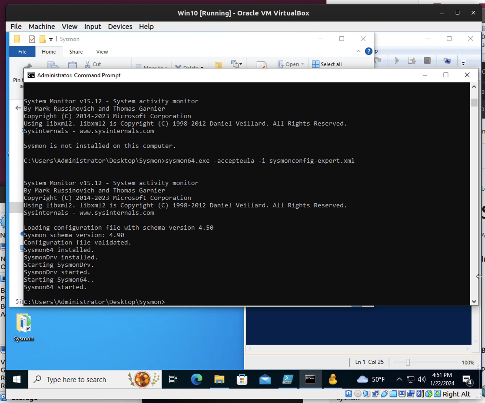
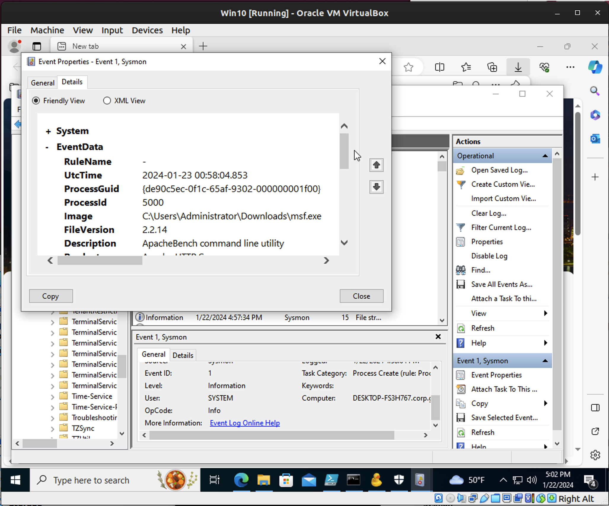

ADHD IP: 192.168.0.158
Win10 IP: 192.168.0.158

## Sysmon Install

## msf.exe event

# Incident Report

# Security Incident Report - Ops10

**Doc ID:** Ops Challenge 10

**Report Authors:** Andrew Carroll

## Incident Details

- **Incident Name: msf.exe** 
- **Incident Date Range: 1/22/24** 
- **Incident ID: ops10** 

## Postmortem

- **Owner Name and Title: Andrew Carroll** 
- **Date Completed: 1/22/24** 

## Incident Severity

- **Severity Level:** (High / Medium / Low / **Other**)
- **Comments:**  Lab environment.  The severity is difficult for me to determine. 

## Summary

- **What happened? Key point 1:** 
- **What happened? Key point 2:** 

## Incident Overview

- **Impact:** 
- **Trigger:** 
- **Root Cause:** 
- **Detection:** 
- **Response:** 
- **Resolution:** 

## Incident Timeline

- **Date, Time, Duration of Incident: 1/22/24, 1657hrs, 5 minutes** 
- **Date and Time of Discovery: lab environment, immediately** 

## Closure

- **Closure Date: 1/22/24** 
- **Explanation for Closure:** (resolved, false positive, **other**)

## Investigation and Response Timeline

| Date & Time | Owner | Event | Action |
|-------------|-------|-------|--------|
|             |       |       |        |
|             |       |       |        |

## Lessons Learned

- **What went well: Nothing really** 
- **What went poorly: My understanding of what is happening** 

## Post-Mortem Corrective Actions

| Date & Time | Type of Action | Action Item |
|-------------|----------------|-------------|
|             |                |             |
|             |                |             |

## Supporting Documentation

- **Doc name:** 
- **Doc name:** 
- **Doc name:** 
