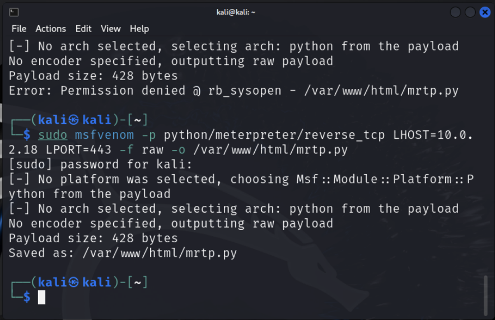

Ops Challenge 30 - Antivirus Evasion

Overview

The aspirational goal of any cyber attack design is for it to be FUD, or fully undetectable. It is important to understand how this is accomplished by the adversary, so as to increase your awareness of antivirus capabilities and more importantly, limitations.

In the late 1980s, a virus named Brain infected 100,000 devices, causing noticeable slowdowns on infected systems. A young John McAfee reverse engineered the Brain virus and created an application designed specifically to remove Brain, called VirusScan. Afterwards, McAfee the company would quickly become well-known for its agent-based anti-malware product lines.

Today you will create a FUD meterpreter payload with Python to learn one method which attackers might use to evade anti-malware detection. This will prepare you to study malware more in depth in the upcoming module of the course.

Resources

Instructions: [Antivirus Evasion with Python](https://medium.com/bugbountywriteup/antivirus-evasion-with-python-49185295caf1)

Software:

- Kali Linux
- [class-30-metasploitable3.ova (7 GB Download)](https://codefellows.github.io/ops-401-cybersecurity-guide/curriculum/#downloads-table)
- Windows 10

Requirements

Part 1: Staging

1. Download and import the Metasploitable 3 Windows 2008 OVA into VirtualBox.
2. Review hardware resource allocation.
3. Set network adapter to clear the error popup.
4. Login as vagrant/vagrant.
5. Launch the VM and select “Activate Later” to bypass the activation prompt.
6. Open the README file on the desktop.
   - README Content:  #Antivirus Evasion  Greetings human! Use this Metasploitable3 VM to help craft your payload.  > Remember to keep your VMs isolated from your home network.  > Metasploitable3 is a deliberately vulnerable, outdated instance of windows.  The following software have been preinstalled for you: Python 2.7.16 x86 for windows, Py2exe 32 bits for Python 2.7, Win32 OpenSSL v1.1.1h Light (Dependency: Microsoft visual C++ 2017 Redistributable (x86) - 14.16.27033).  These files have been left in the "Installation Files" folder on the desktop.  Make sure you have the following VMs on the same subnet:  Kali Linux, Windows 10 fully patched.  Good Luck on your challenge today!

Part 2: FUD Payload

Kali: 10.2.0.18
Metasploitable3: 10.0.2.15

Complete “Creating a FUD meterpreter payload with Python” from Antivirus Evasion with Python.

Note: The article has the following incorrect URL: http://www.virtutotal.com/, the correct URL is [VirusTotal](http://www.virustotal.com/).

Part 3: Custom FUD Payload

Now that you’ve tested the process, create your own customized FUD meterpreter payload! Document and submit how you accomplished this.
