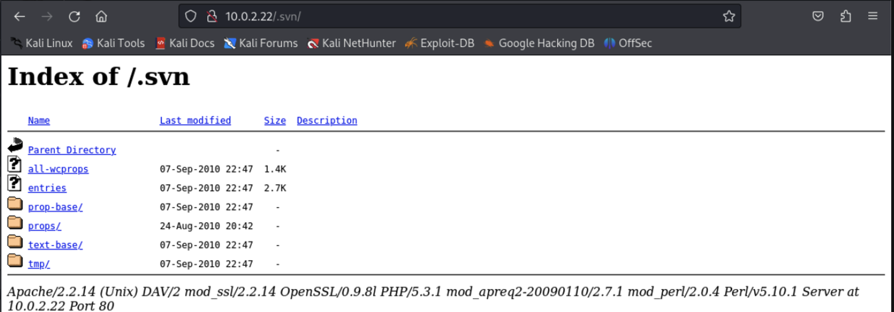
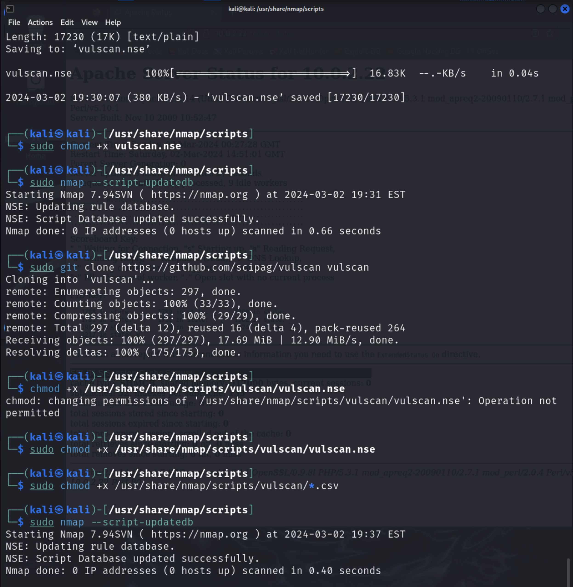

# Ops Challenge: Web Vulnerability Scanning with Nmap

## Overview
As security professionals, we are sometimes called upon to evaluate web applications for vulnerabilities. In fact, many companies have “bug bounty” programs to encourage ethical hackers to find vulnerabilities in their applications by rewarding them with monetary payouts for significant findings. Today's challenge will focus on experimenting with Nmap, a tool not traditionally known as a vulnerability scanner, to detect vulnerabilities on a vulnerable web server.

**Resources:**
- [Nmap Cheat Sheet](https://www.stationx.net/nmap-cheat-sheet/)
- [http-enum NSE Script](https://vulners.com/nmap/NMAP:HTTP-ENUM.NSE)
- [Get Started Writing Your Own NSE Scripts for Nmap](https://null-byte.wonderhowto.com/how-to/get-started-writing-your-own-nse-scripts-for-nmap-0187403/)
- [Lua Language Documentation](https://www.lua.org/manual/5.1/)
- [OVA Download](https://codefellows.github.io/ops-401-cybersecurity-guide/curriculum/#downloads-table)

## Part 1: Staging
- Your instructor will provide the class an OVA of the target system.
- Download and import the “class-35-webserv” OVA, insert the DVWA ISO, then boot from the ISO. Set it to NAT Network.
  - This OVA seems to have problems and doesn't want to play nice with my setup.
- Startup Kali Linux VM on the same NAT Network. Check that you can ping the web server and view its hosted page via browser.
- These are setup on the same NAT Network, so they should be able to communicate with each other.
- I bumped up the memory and processing alotment for each VM.

IP A on Both Systems:

**Kali IP:** `10.0.2.18`
**Web Server IP:** `10.0.2.22/24`

## Part 2: Basic Nmap Scans
Let’s first practice the fundamental Nmap commands from terminal against the target web server.
- Perform the highest intensity service and version scan against the target. 
  - What command did you use, and what was the outcome?
  - `nmap 10.0.2.0/24`
  - 
  - NMAP Scan for 10.0.2.22 (Web Server)
    - Shows open ports and services
  - NMAP Scan for 10.0.2.18 (Kali)
    - Shows open ports and services

  - `nmap -T4 -A 10.0.2.22`
    - `nmap` is the command
    - `-T4` is the timing template.  This is the aggressive timing template. It scans quickly but may be more conspicuous and may not be as accurate.  Sort of a balance.
    - `-A` This option enables OS detection, version detection, script scanning, and traceroute. It's like a combination of several other options that provide more detailed information about the target.
  - 
  - 

  - `nmap -T5 -sS -A -p- 10.0.2.22`
    - Shows open ports and services
    - Shows additinoal info about services detected, version numbers, and possible headers & SSL Certificates
    - OS detection: Linux 2.6.X
    - Traceroute shows network distance to the target
    - took 18.38 seconds
  - 
  - 

- Attempt to detect the operating system of the target. 
  - `nmap -O 10.0.2.22`
  - Do you think the findings are correct?
    - Yes.  It's a Linux system.
    - 
  - The scan reveals that the target system has several open ports, including FTP (port 21), SSH (port 22), HTTP (port 80), HTTPS (port 443), and MySQL (port 3306).
  - The MAC address of the target system is also provided (08:00:27:52:B6:36), indicating it's running in an Oracle VirtualBox environment.
  - The scan identifies the device type as a general-purpose device.
  - The running operating system is detected as Linux 2.6.X, with further details suggesting it's likely running a version of the Linux kernel between 2.6.17 and 2.6.36.
  - The network distance is reported as 1 hop, indicating that the target system is directly accessible on the same network segment.
  - The scan completes in approximately 1.60 seconds.

- Have Nmap perform a port scan of only the well-known port numbers. What command did you use?
  - `nmap -p 0-1023 10.0.2.22`
  - Starting Nmap 7.94SVN: Indicates the version of Nmap being used for the scan.
  - Nmap scan report for 10.0.2.22: Shows the IP address being scanned.
  - Host is up (0.00016s latency): Indicates that the target host is up and responsive, with a very low latency.
  - Not shown: 1020 closed tcp ports (reset): Indicates that 1020 TCP ports were found to be closed, meaning there was no response from the target system.
  - PORT STATE SERVICE: This line marks the start of the table displaying the open ports and their associated services.
  - 21/tcp open ftp: Indicates that port 21 (FTP) is open and accepting connections.
  - 22/tcp open ssh: Indicates that port 22 (SSH) is open and accepting connections.
  - 80/tcp open http: Indicates that port 80 (HTTP) is open and accepting connections.
  - 443/tcp open https: Indicates that port 443 (HTTPS) is open and accepting connections.
  - MAC Address: 08:00:27:52:B6:36 (Oracle VirtualBox virtual NIC): Displays the MAC address of the target system, indicating that it's running in an Oracle VirtualBox environment.
  - Nmap done: 1 IP address (1 host up) scanned in 0.27 seconds: Indicates that the scan is complete, showing that one IP address was scanned, with one host up, and it took 0.27 seconds to complete.
  - 

## Part 3: Scanning with the Nmap Scripting Engine (NSE)
The NSE allows us to extend Nmap’s capabilities far beyond a mere port scan, making it an effective tool for detecting vulnerabilities.
- Execute `http-title.nse` against the target using Nmap in NSE mode. 
  - What did you learn about the target web server?
  - - **Starting Nmap 7.94SVN:** Indicates the version of Nmap being used for the scan.
  - **Nmap scan report for 10.0.2.22:** Shows the IP address being scanned.
  - **Host is up (0.00016s latency):** Indicates that the target host is up and responsive, with a very low latency.
  - **Not shown: 1020 closed tcp ports (reset):** Indicates that 1020 TCP ports were found to be closed, meaning there was no response from the target system.
  - **PORT STATE SERVICE:** This line marks the start of the table displaying the open ports and their associated services.
  - **21/tcp open ftp:** Indicates that port 21 (FTP) is open and accepting connections.
  - **22/tcp open ssh:** Indicates that port 22 (SSH) is open and accepting connections.
  - **80/tcp open http:** Indicates that port 80 (HTTP) is open and accepting connections.
  - **443/tcp open https:** Indicates that port 443 (HTTPS) is open and accepting connections.
  - **MAC Address: 08:00:27:52:B6:36 (Oracle VirtualBox virtual NIC):** Displays the MAC address of the target system, indicating that it's running in an Oracle VirtualBox environment.
  - **Nmap done: 1 IP address (1 host up) scanned in 0.27 seconds:** Indicates that the scan is complete, showing that one IP address was scanned, with one host up, and it took 0.27 seconds to complete.
  - 

- Execute `http-enum.nse` against the target using Nmap in NSE mode. 
  - Post the output in your submission doc.
  - **Open Ports**: The scan reveals several open ports, including FTP, SSH, HTTP, HTTPS, and MySQL. Each open port represents a service that is actively running and accessible from the network.
  - **Service Versions**: For each open port, Nmap provides information about the service version, such as the FTP server version, SSH server version, and web server versions (Apache HTTPD).
  - **Web Server Enumeration**: The `http-enum` script has been used to enumerate directories and files accessible via HTTP and HTTPS. This can provide valuable information about the web server's configuration, potentially revealing sensitive directories or files, such as administrative interfaces, configuration files, or backup files.
  - **Potential Security Risks**: The presence of certain directories or files, such as `/phpmyadmin/`, `/config/`, and `/server-info/`, may indicate potential security risks, such as the exposure of sensitive information or misconfigurations that could be exploited by attackers.
  - **Network Services**: The presence of open ports like FTP, SSH, and MySQL suggests that the target system is likely used for various purposes, including file transfer, remote administration, and database services.
  - **Operating System Identification**: Although not explicitly mentioned in the provided output, Nmap can also attempt to identify the operating system running on the target system based on various characteristics observed during the scan.
  - 

- Access some of the enumerated files from Mozilla Firefox in Kali Linux. 
  - What did you find out about this web server?  *It has more holes than a fishing net.*
  - **80/tcp   open  http**
    - **http-enum:** 
      - **/login.php:** Possible admin folder
      - **/robots.txt:** Robots file
      - **/phpmyadmin/:** phpMyAdmin
      - **/.svn/:** Subversion folder
      - **/README.txt:** Interesting, a readme.
      - **/config/:** Potentially interesting directory w/ listing on 'apache/2.2.14 (unix) dav/2 mod_ssl/2.2.14 openssl/0.9.8l php/5.3.1 mod_apreq2-20090110/2.7.1 mod_perl/2.0.4 perl/v5.10.1'
      - **/docs/:** Potentially interesting directory w/ listing on 'apache/2.2.14 (unix) dav/2 mod_ssl/2.2.14 openssl/0.9.8l php/5.3.1 mod_apreq2-20090110/2.7.1 mod_perl/2.0.4 perl/v5.10.1'
      - **/external/:** Potentially interesting directory w/ listing on 'apache/2.2.14 (unix) dav/2 mod_ssl/2.2.14 openssl/0.9.8l php/5.3.1 mod_apreq2-20090110/2.7.1 mod_perl/2.0.4 perl/v5.10.1'
      - **/icons/:** Potentially interesting directory w/ listing on 'apache/2.2.14 (unix) dav/2 mod_ssl/2.2.14 openssl/0.9.8l php/5.3.1 mod_apreq2-20090110/2.7.1 mod_perl/2.0.4 perl/v5.10.1'
      - **/server-info/:** Potentially interesting folder
      - **/server-status/:** Potentially interesting folder
      - 
      - 
      - 
      - 
      - 
      - 

- Execute `vulscan.nse` against the target web server using Nmap in NSE mode. 
  - Setup the `vulscan` script on your Kali Linux machine.
    - `cd usr/share/nmap/scripts`
    - `sudo wget https://raw.githubusercontent.com/scipag/vulscan/master/vulscan.nse`
    - `sudo chmod +x vulscan.nse`
    - `sudo nmap --script-updatedb`
    - 

  - So...This didn't work and required further setup steps and a git clone
    - `sudo git clone https://github.com/scipag/vulscan/blob/master/vulscan.nse`
    - `sudo chmod +x /usr/share/nmap/scripts/vulscan/vulscan.nse`
    - `sudo chmod +x /usr/share/nmap/scripts/vulscan/*csv`
    - `sudo nmap --script-updatedb`
    - `ls -l /usr/share/nmap/scripts/vulscan`
  - 
  - `cat usr/share/nmap/scripts/vulscan/vulscan.nse`
  - 
  - 
  - 
  - 
  - 
  
  - Save the output to a file for easy viewing.

- Review the output for a CVE entry. Navigate your browser to the [CVE MITRE site](https://cve.mitre.org/) and look up the CVE. 
  - Explain the vulnerability in your own words.
  | CVE Code     | Vulnerability Description                                                                                        | Attack Vector                                                                               | Example                                                               | System    |
|--------------|---------------------------------------------------------------------------------------------------------------|---------------------------------------------------------------------------------------------|-----------------------------------------------------------------------|-----------|
| CVE-2009-3639 | Improper handling of a '\0' character in a domain name in the Subject Alternative Name field of an X.509... | Crafted certificate                                                                        | -                                                                     | ProFTPD   |
| CVE-2009-0542 | Execution of arbitrary SQL commands via a "%" (percent) character in the username                             | Remote exploitation via mod_sql                                                           | `USER %' --`                                                          | ProFTPD   |
| CVE-2008-7265 | Denial of service (CPU consumption) via the ABOR command during a data transfer                                 | Remote exploitation via data transfer                                                      | -                                                                     | ProFTPD   |
| CVE-2012-6095 | Modification of file ownership via a race condition and a symlink attack                                         | Local exploitation via UserOwner directive                                                  | -                                                                     | ProFTPD   |
| CVE-2011-4130 | Use-after-free vulnerability allowing execution of arbitrary code                                                 | Remote exploitation via FTP data transfer                                                   | -                                                                     | ProFTPD   |
| CVE-2011-1137 | Integer overflow leading to memory consumption and OOM kill                                                        | Remote exploitation via malformed SSH message                                               | -                                                                     | ProFTPD   |
| CVE-2010-4652 | Heap-based buffer overflow allowing denial of service and possible execution of arbitrary code                  | Remote exploitation via crafted username                                                    | -                                                                     | ProFTPD   |
| CVE-2010-4221 | Stack-based buffer overflows allowing execution of arbitrary code                                                 | Remote exploitation via TELNET IAC escape character                                          | -                                                                     | ProFTPD   |
| CVE-2010-3867 | Multiple directory traversal vulnerabilities allowing various malicious actions                                  | Remote exploitation via directory traversal sequences                                        | -                                                                     | ProFTPD   |
| CVE-2009-0543 | Bypass of SQL injection protection mechanisms via invalid, encoded multibyte characters                         | Remote exploitation via mod_sql_mysql and mod_sql_postgres                                  | `%dfg0`                                                               | ProFTPD   |
| CVE-2008-4242 | Conducting cross-site request forgery (CSRF) attacks and executing arbitrary FTP commands                       | Remote exploitation via long ftp:// URI leveraging an existing session from the FTP client | -                                                                     | ProFTPD   |
| CVE-2006-6563 | Stack-based buffer overflow allowing execution of arbitrary code                                                 | Local exploitation via pr_ctrls_recv_request function in mod_ctrls module                   | -                                                                     | ProFTPD   |

- Write your own `.nse` script that gathers some kind of information about the target. 
  - The script:
  - 
  - The output:
  - 

  - [Post your LUA-language `.nse` script to your public GitHub repository.](https://github.com/iAmAndrewCarroll/401ops/blob/main/challenge/ops35.nse)

## Part 4: Reporting
Answer the below discussion prompts in your own words:
1. **What are some of the biggest security concerns on the web server?**

   | CVE          | Vulnerability Description                                             |
   |--------------|-----------------------------------------------------------------------|
   | CVE-2009-3639 | Improper handling of domain names in X.509 certificates                |
   | CVE-2009-2408 | Cross-site scripting (XSS) vulnerability                               |
   | CVE-2009-0542 | SQL injection vulnerability                                            |
   | CVE-2008-7265 | Buffer overflow vulnerability                                          |
   | CVE-2012-6095 | Denial of Service (DoS) vulnerability due to excessive CPU consumption |
   | CVE-2011-4130 | Remote code execution vulnerability                                    |
   | CVE-2011-1137 | Insecure default configuration                                         |
   | CVE-2010-4652 | Information disclosure vulnerability                                    |
   | CVE-2010-4221 | Authentication bypass vulnerability                                    |
   | CVE-2010-3867 | Cross-site request forgery (CSRF) vulnerability                        |
   | CVE-2009-0543 | Cross-site scripting (XSS) vulnerability                               |
   | CVE-2008-4242 | Directory traversal vulnerability                                      |
   | CVE-2006-6563 | Arbitrary code execution vulnerability                                 |
   | CVE-2006-6270 | Integer overflow vulnerability                                         |
   | CVE-2006-5815 | SQL injection vulnerability                                            |
   | CVE-2005-4816 | Buffer overflow vulnerability                                          |
   | CVE-2005-2390 | Information disclosure vulnerability                                    |
   | CVE-2004-0529 | Denial of Service (DoS) vulnerability due to excessive memory consumption |

2. **Why might a security professional choose to use Nmap NSE for evaluating a web app target?**

   Using Nmap NSE can be a smart choice for security professionals assessing a web app target due to its ability to automate security testing tasks conveniently and flexibly. With Nmap NSE, security experts can swiftly scan for known vulnerabilities, misconfigurations, and weaknesses in web applications without having to manually execute each test. These scripts can detect common issues such as open ports, outdated software versions, default credentials, and more, allowing security professionals to efficiently evaluate the security stance of web applications and prioritize remediation efforts.

3. **In your opinion, how can adopting scripting and extensible defenses change the way security professionals handle operations?**

   Incorporating scripting and extensible defenses into security operations can revolutionize the way security professionals operate by enabling them to automate repetitive tasks, tailor security controls, and respond swiftly to emerging threats. Scripting capabilities empower security experts to craft custom tools and scripts tailored to their organization's unique security needs, enhancing efficiency and scalability. Extensible defenses allow security teams to integrate additional security features and enhancements into existing systems, bolstering resilience against evolving threats and vulnerabilities. Overall, scripting and extensible defenses empower security professionals to adapt rapidly to changing environments, streamline security operations, and fortify overall cybersecurity posture.

**Stretch Goals (Optional Objectives):**
- Achieve root user access to the web server. In your submission, explain how you accomplished this feat of hacking.
