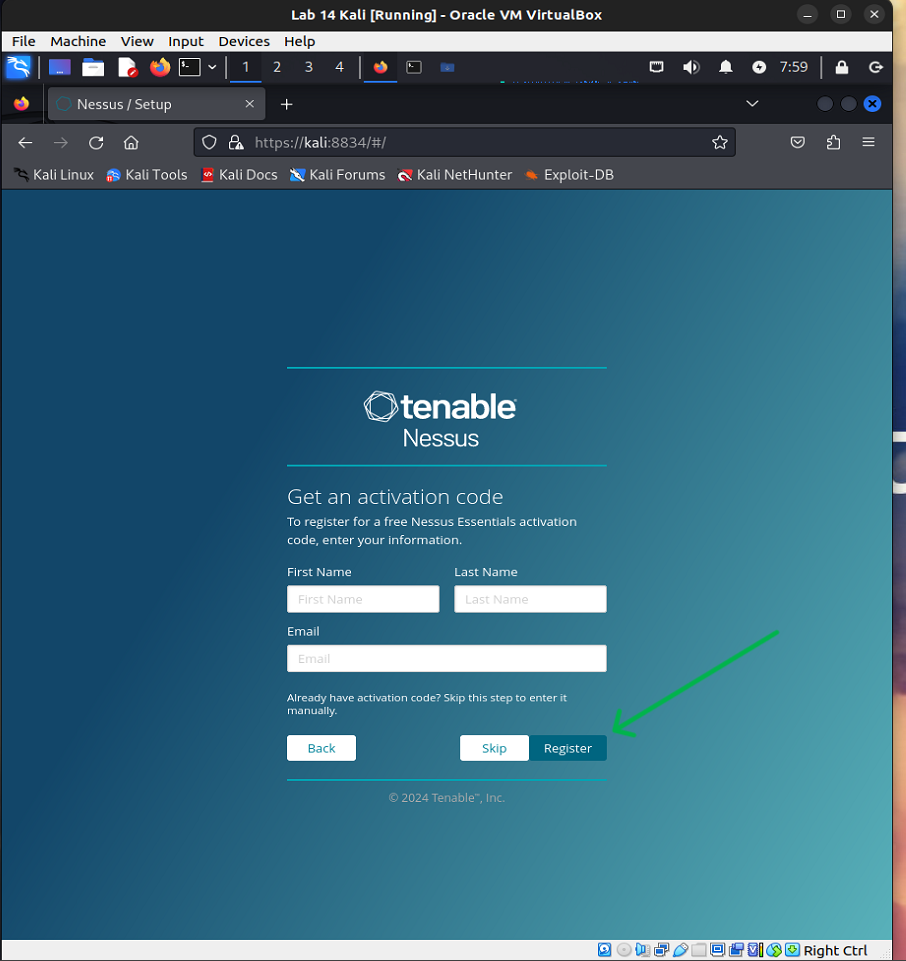
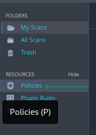
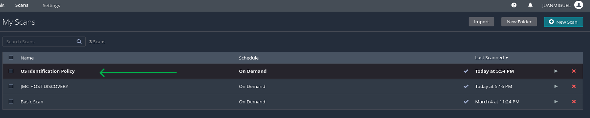
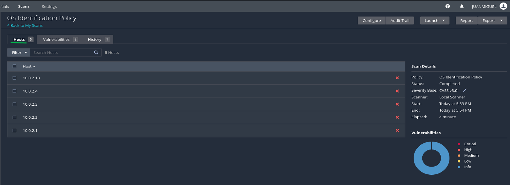
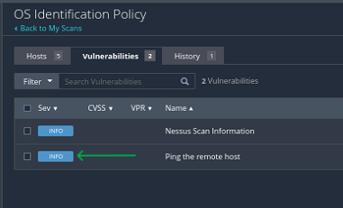
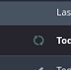

Ops Challenge: Vulnerability Scanning with Nessus
=================================================

Overview
--------

Tenable’s Nessus scanner tool is a big name in security for good reason. A highly scalable, enterprise-ready solution, Nessus is capable of highly sophisticated scanning.

Today, you’ll practice scan configuration and execution using Nessus Essentials.

Scenario
--------

Seattle Sounds, a local small business, recently launched a website and has purchased your services to evaluate the site for security vulnerabilities.

Resources
---------

* [Nessus Essentials Activation Code](https://www.google.com/url?q=https://www.tenable.com/products/nessus/nessus-essentials&sa=D&source=editors&ust=1710195693937181&usg=AOvVaw0Nc6MSrXHfKm7yAabPoNwT)
* [Nessus Documentation](https://www.google.com/url?q=https://docs.tenable.com/Nessus.htm&sa=D&source=editors&ust=1710195693937606&usg=AOvVaw0o8eDOzBEPuFHj8XmIN4GE)
* [Nessus: Configure and Scan](https://www.google.com/url?q=https://www.securityloops.com/nessus-vulnerability-scanner-tutorial-part-2-configure-and-scan/&sa=D&source=editors&ust=1710195693937936&usg=AOvVaw3iZtX2wZ1NmdoO3r5WU_f3)
* [Video: Nessus advanced scan. Overview of CVE, CWE, CVSS and Windows catalog update](https://www.google.com/url?q=https://www.youtube.com/watch?v%3DL6KiD0aGFQU%26ab_channel%3DMainakshSingh&sa=D&source=editors&ust=1710195693938217&usg=AOvVaw1BD1qZWr_ja1WFZ_r6oNpp)
* [PurpleSec Sample Vulnerability Assessment Report PDF](https://www.google.com/url?q=https://purplesec.us/wp-content/uploads/2019/03/Sample-Network-Security-Vulnerability-Assessment-Report-Purplesec.pdf&sa=D&source=editors&ust=1710195693938538&usg=AOvVaw0RPj_wkMEZO42Vn2aMV9oz)
* Juan Miguel Cano's Ops 40

Requirements
------------

Part 1: Staging
---------------

This lab requires a Kali VM and class-40-target.ova imported into your local Virtualbox.

* Import a Kali VM into your local Virtualbox Manager.
* Assign system resources. Suggested values:
* 4096MB RAM
* 4 CPUs
* 128MB Video Memory
* Network: NAT Network

* Import class-40-target.ova into your local Virtualbox Manager.
* Assign system resources. Suggested values:
* 1024MB RAM
* 1 CPU
* 12MB Video Memory
* Network: NAT Network

* Initialize the Kali VM. Credentials will be kali/kali.
* Navigate to the [Nessus Essentials](https://www.google.com/url?q=https://www.tenable.com/products/nessus/nessus-essentials&sa=D&source=editors&ust=1710195693940345&usg=AOvVaw10yHI6nxyaZ202iGsruleT) web portal.
* Obtain an activation code for Nessus Essentials. Activate your copy of Nessus and note the credentials for future reference.
* You should obtain an email containing the activation code and a link to download Nessus.

* Download Nessus for Linux - Debian - amd64.

* Once the download is complete, navigate to the Downloads directory and ensure it contains a Nessus-xx.x.x-debianxx\_amd64.deb file.

* Run sudo dpkg -i Nessus-xx.x.x-debianxx\_amd64.deb to install Nessus.

* Run sudo systemctl start nessusd.service to start Nessus.
* Check that the Nessus service is running by entering sudo systemctl status nessusd. You should see a status of “Active: active (running).” If you do not, you’ll need to initialize the Nessus service manually.

* Open a browser and navigate to https://kali:8834 to finish configuring Nessus.

* Now that you have Nessus working on a stable baseline copy of a Kali VM, this is probably a good time to take a VM snapshot with Virtualbox in case anything goes wrong later.

Part 2: Scanning the Target
---------------------------

Most of the pre-configured scans in Nessus are straightforward to execute, although as we begin to customize these scans the technical complexity will increase.

Scans take time. The bigger the scope and complexity of the scan, the longer it will take!

### Basic Network Scan

Perform a basic network scan to identify your target IP.

* What does the basic network scan do?
* A basic scan in Nessus assesses computers, networks, or applications for known vulnerabilities, misconfigurations, and potential security weaknesses using a predefined set of vulnerability checks.
* What is the IP address of your target system (class-40-target.ova)? 10.0.2.16

### Using Policies

Nessus has a feature called “policies,” which are essentially scan templates. You can configure and select from in advance to speed up your work. For each of these scans, include screenshots of the scan results.         ( I had to correct the grammar to understand the directions.)

* Create a new policy named “Host Discovery Policy”.

* Configure the policy to perform a host enumeration scan of the targeted network.
* Create and execute a new scan that uses this policy.

Once the scan is complete click on the bar of the scan to see the results / output:

Create two additional policies and execute new scans for each one:

* OS identification policy

You have to wait for it to finish loading.

Right Click on the OS Identification Policy Bar

* Port scan policy (common ports)

Click on the Port Scan Policy Bar:

Answer the following questions:

* How successful were your new scan policies?
* Very successful. The Host Enumeration Scan, OS Identification, and Port Scan policies accurately mapped network devices and open ports, aligning with our security objectives.
* Do you think the results were accurate?
* Yes, the results matched manual checks, reflecting Nessus Essentials’ reliability in network scanning.
* What tool does this remind you of that we’ve used in class before?
* It reminds me of Nmap, used for similar network scanning tasks but with a more command-line focus compared to Nessus’s comprehensive interface.

### Web Application Vulnerability Scan

Nessus is quite versatile in that it can be a web application vulnerability scanner as well as a general network or system vulnerability scanner. In this part of the lab, you will perform a web application vulnerability scan.

* Scan today’s target system, class-40-target.ova.

Wait for the Web Application Vulnerability Scan to finish.

Click on the Web Application Vulnerability Scan Bar to show the results:

* Identify the highest severity vulnerability and explain how it works in your own words.
* Vulnerability: CGI Generic SQL Injection (Plugin ID #11139)
* How it works:
* This vulnerability is due to improper sanitization of user-supplied input in CGI parameters. Data entered into a web form or URL parameter is sometimes passed directly to a database query. If the application does not properly ‘escape’ this input, an attacker can insert SQL commands that the database will execute, potentially allowing them to read, modify, or delete database contents or even execute commands on the host operating system.

* Include the risk factor, CVSS base score, CWE ID(s), and port number.
* Risk Factor: High
* CVSS v2.0 Base Score: 7.5
* CWE ID(s): 77,89 (CWE-77: Command Injection, CWE-89:SAL Injection)
* Port Number: 80/tcp(common HTTP port)
* What other vulnerabilities may exist on the target system’s web app?

* Generate an executive summary PDF report from Nessus and upload it to your Google Docs. Include a link to it in your submission doc.

[https://drive.google.com/file/d/1fONsfZcJzJ4ZNiyO2iNST0Jr1EiK0Ruh/view?usp=sharing](https://www.google.com/url?q=https://drive.google.com/file/d/1fONsfZcJzJ4ZNiyO2iNST0Jr1EiK0Ruh/view?usp%3Dsharing&sa=D&source=editors&ust=1710195693949563&usg=AOvVaw2UCC8bwhxdaZ4VVfHmVPF8)

### Advanced Dynamic Scan

Construct and perform an advanced dynamic scan that only scans for the vulnerability identified in the web application vulnerability scan. Include a screenshot of the configuration and its scan results.

This attempt to use the Plug-In ID gave me negative results and 0 vulnerabilities, so I tried CVE below.

The Advanced Dynamic Scan was not as successful as the previous scan results.

Part 3: Reporting
-----------------

Referencing the [PurpleSec Sample Vulnerability Assessment Report PDF](https://www.google.com/url?q=https://purplesec.us/wp-content/uploads/2019/03/Sample-Network-Security-Vulnerability-Assessment-Report-Purplesec.pdf&sa=D&source=editors&ust=1710195693951523&usg=AOvVaw3UtDbMPAKwHOv_1ofTkb5G), compose and submit a vulnerability assessment report of your findings.

CGI Generic SQL Injection Vulnerability:

Vulnerability: CGI Generic SQL Injection (Plugin ID #11139)

* Risk Level: High
* CVSS v2.0 Base Score: 7.5
* Affected System: Web server at 10.0.2.18, port 80/tcp
* Impact: Could allow an attacker to manipulate database queries, resulting in data leaks or loss of data integrity.
* Recommendation: Implement prepared statements, use stored procedures, and conduct regular code reviews to prevent SQL injection. Ensure all CGI scripts properly sanitize user input.

Executive Summary:

As part of my ongoing commitment to cybersecurity, I conducted a comprehensive vulnerability assessment focusing on web applications and network security. The assessment was carried out using the Nessues Essentials tool, which provided detailed insights into the security posture of the systems. The most critical finding was a CGI Generic SQL Injection vulnerability, indicating immediate remediation actions needed to secure our data and services.

Introduction:

This assessment aimed to identify vulnerabilities within our network with a particular focus on our web-facing services. The Nessus scans were conducted in accordance with industry best practices for vulnerability assessments.

Findings and Analysis:

My scan detected a high-severity vulnerability:

* Vulnerability Description: Nessus Plugin ID #11139 identified a CGI Generic SQL Injection vulnerability, which indicates that specially crafted parameters submitted to the CGI scripts could be misused to manipulate the backend database.
* Risk Level: The risk level is assessed as High, with a CVSS v2.0 score of 7.5, suggesting significant potential for exploitation.
* Impact: If exploited, this vulnerability could allow unauthorized access to sensitive data, undermine data integrity, and potentially permit an attacker to take control of the affected systems.
* Affected System(s): The vulnerability was found on the main web server, specifically at IP address 10.0.2.18 on port 80/tcp.

Recommendations:

I recommend the following immediate and long-term mitigation strategies:

* Implement prepared statements and parameterized queries to prevent SQL injection.
* Conduct regular code reviews and security audits of web applications.
* Update and patch all web application frameworks and dependencies.
* Educate the development team about secure coding practices.

Conclusion:

The discovery of the CGI Generic SQL Injection vulnerability underscores the critical need for stringent security measures and continuous monitoring. Addressing this issue promptly will mitigate the risk and enhance our resilience against potential cyber-attacks.

Appendix:

Included are Nessus scan configurations, plugin output details, and CWE references for further technical review.

Contact Information:

For further inquiries or assistance with the implementation of recommended security measures, please contact our security team at security@jmcambiguty.com

Stretch Goals (Optional Objectives)
-----------------------------------

Pursue these stretch goals if you are an advanced user or have remaining lab time.

### Credentialed Scan

Construct and perform a credentialed scan against a target to which you have administrator access, for example the DVWA, a Windows VM, or a VM running an OpenSSH server.

* How do the results differ from a non-credentialed scan?

Submission
----------

* Create a new blank Google Doc. Include above assignment submission text and images within this Google Doc.
* Name the document according to your course code and assignment.
* i.e. seattle-ops-201d1: Reading 01 or seattle-ops-201d1: Lab 04.
* Add your name & date at the top of the Google Doc.
* Share your Google Doc so that “Anyone with the link can view”.
* Paste the link to your Google Doc in the discussion field below and share an observation from your experience in this lab.

© Code Fellows 2024

