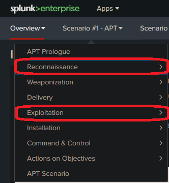

# Lab: Log Analysis with Splunk

## Overview

Now that we’ve established a basic foundation of how a SIEM is deployed and configured to ingest log data, the next step is to start making sense of the data and how it will aid us in our day-to-day security operations. Logs that the SIEM collects can contain telltale signs of malicious activity, or direct evidence of incident-related actions on systems. Finding such clues is like finding a “needle in a haystack” as you parse oceans of text in your investigation. Aspiring security operations professionals should practice log parsing, searching, and analysis often in order to derive value from a system like a SIEM.

## Scenario

Wayne Enterprises has been a long time client of your MSSP. Today reports of the below graphic come in from their user community when people visited the Wayne Enterprises website, and some of the reports reference “P01s0n1vy.” P01s0n1vy is an APT group that has targeted Wayne Enterprises. Your goal is to investigate the defacement, with an eye towards reconstructing the attack via the Lockheed Martin Kill Chain.

- 

## Objectives

- Complete Boss of the SOC (BOTS) Version 1, Scenario #1 - APT.
- Analyze the log data to reconstruct the cyber kill chain.
- Document and report your findings.

## Resources

- This VM is required for classes 11 through 13.
  - [Splunk Server](https://codefellows.github.io/ops-401-cybersecurity-guide/curriculum/#downloads-table)
- [Splunk Quick Reference Guide PDF](https://www.splunk.com/pdfs/solution-guides/splunk-quick-reference-guide.pdf)
- [Hunting with Splunk: The Basics](https://www.splunk.com/en_us/blog/security/hunting-with-splunk-the-basics.html)
- [Source repo for BOTSv1](https://github.com/splunk/botsv1)

## Tasks

### Part 1: Staging

1. Log into the same Splunk server you used yesterday and run the “Investigating with Splunk Workshop” app to access the lab instructions.
2. You’ll want to open a separate browser tab for querying data using the Search and Reporting app on this same Splunk server.

### Part 2: BOTSv1

Boss of the SOC is a blue-team CTF workshop that lets participants practice hunting and analysis skills. You will use Splunk and other tools to answer questions about security incidents that have occurred in a realistic but fictitious enterprise environment. It’s designed to emulate how real security incidents look in Splunk and the type of questions analysts must answer. The idea is to recreate the life of a security analyst facing down an adversary at all stages of an attack.

**Note**: This dataset contains evidence captured during actual computer security incidents, or from realistic lab recreations of security incidents. As such, the dataset may contain profanity, slang, vulgar expressions, and/or generally offensive terminology. If the possibility of encountering this type of offensive material is a concern to you or to any audience with whom you plan to share the dataset, please stop now and do not continue.

- Run the Splunk app, Investigating with Splunk Workshop.
- Work on completing the following sections in Boss of the SOC (BOTS) Version 1, Scenario #1 - APT:
  - Reconnaissance
  - Exploitation
- 
- Document your operations with attention to:
  - Function of each SPL query.
  - Reasons for running each SPL query.
  - How you obtained the requested information.

### Part 3: Reporting

Explain in your own words:

1. **What kind of attack was taking place on Wayne Enterprises systems?**
2. **Describe your findings for these stages of the kill chain:**
   - Reconnaissance
    **Query 1: Search for Events Related to a Domain**
    - Syntax: `index=botsv1 imreallynotbatman.com`
    - Function: This query searches the "botsv1" index for events related to the domain "imreallynotbatman.com."
    - Reason: It retrieves all events associated with the specified domain, which can be useful for monitoring and analyzing activity related to that domain.

    **Query 2: Narrow Down to HTTP Stream Events**
    - Syntax: `index=botsv1 imreallynotbatman.com sourcetype=stream:http`
    - Function: This query further narrows down the search to events with the sourcetype "stream:http" related to the domain "imreallynotbatman.com" in the "botsv1" index.
    - Reason: It focuses specifically on HTTP stream events for the given domain, allowing for more detailed analysis of web traffic.

    **Query 3: Identify Events from a Specific IP Address**
    - Syntax: `index=botsv1 imreallynotbatman.com src=40.80.148.42 sourcetype=suricata`
    - Function: This query looks for events with the source IP address "40.80.148.42" and the sourcetype "suricata" related to the domain "imreallynotbatman.com" in the "botsv1" index.
    - Reason: It identifies events originating from a specific IP address and related to the specified domain, which can help in tracking and analyzing potential security or network issues.

    **Query 4: Summarize Requests by Source IP**
    - Syntax: `index=botsv1 imreallynotbatman.com sourcetype=stream* | stats count(src_ip) as Requests by src_ip | sort - Requests`
    - Function: This query first searches for events with sourcetypes starting with "stream" related to the domain "imreallynotbatman.com" in the "botsv1" index. Then, it calculates the count of source IP addresses and sorts the results by the count in descending order.
    - Reason: It provides a summary of the number of requests made by different source IP addresses to the specified domain. This can help identify potential sources of traffic or attacks.

    **Query 5: Analyze HTTP Stream Events from a Specific IP**
    - Syntax: `index=botsv1 src=40.80.148.42 sourcetype=stream:http`
    - Function: This query focuses on events with the source IP address "40.80.148.42" and the sourcetype "stream:http" in the "botsv1" index.
    - Reason: It specifically looks at HTTP stream events originating from the specified IP address, which can be useful for analyzing web traffic patterns or potential issues.

    **Query 6: Monitor HTTP Stream Events to a Destination IP**
    - Syntax: `index=botsv1 dest=192.168.250.70 sourcetype=stream:http`
    - Function: This query searches for events with the destination IP address "192.168.250.70" and the sourcetype "stream:http" in the "botsv1" index.
    - Reason: It focuses on HTTP stream events destined for the specified IP address, allowing for analysis of traffic directed to a particular server.

    **Query 7: Analyze Successful HTTP Requests to a Destination**
    - Syntax: `index=botsv1 dest=192.168.250.70 sourcetype=stream:http status=200 | stats count by uri | sort - count`
    - Function: This query looks for HTTP stream events with the destination IP address "192.168.250.70," the sourcetype "stream:http," and a status code of 200 in the "botsv1" index. It then calculates the count of requests by URI and sorts the results by the count in descending order.
    - Reason: It provides a breakdown of successful (status code 200) HTTP requests to the specified destination IP address, allowing for analysis of the most accessed URIs.

    **Query 8: Gather Unique URIs from Successful IIS Requests**
    - Syntax: `index=botsv1 sourcetype=iis sc_status=200 | stats values(cs_uri_stem)`
    - Function: This query searches for events with the sourcetype "iis" and a status code of 200 in the "botsv1" index. It then retrieves unique values of the "cs_uri_stem" field.
    - Reason: It gathers information about successful HTTP requests (status code 200) captured with the "iis" sourcetype, specifically focusing on the URIs accessed.

   - Exploitation
    **Query 1: Search for All HTTP Stream Events**
    - Syntax: `index=botsv1 sourcetype=stream:http`
    - Function: This query searches for all HTTP stream events in the "botsv1" index.
    - Reason: It retrieves all HTTP stream events, which can be useful for a broad analysis of web traffic.

    **Query 2: Filter HTTP Stream Events to a Specific Destination IP**
    - Syntax: `index=botsv1 sourcetype=stream:http dest="192.168.250.70"`
    - Function: This query narrows down the search to HTTP stream events with the destination IP address "192.168.250.70" in the "botsv1" index.
    - Reason: It focuses specifically on HTTP stream events directed to the specified destination IP address.

    **Query 3: Filter HTTP Stream Events to a Specific Destination IP and HTTP Method POST**
    - Syntax: `index=botsv1 sourcetype=stream:http dest="192.168.250.70" http_method=POST`
    - Function: This query further refines the search to HTTP stream events with the destination IP address "192.168.250.70" and an HTTP method of POST in the "botsv1" index.
    - Reason: It specifically looks at POST requests directed to the specified destination IP address.

    **Query 4: Extract and Display Form Data Containing Username and Password**
    - Syntax: `index=botsv1 sourcetype=stream:http dest="192.168.250.70" http_method=POST form_data=*username*passwd* | table form_data`
    - Function: This query extracts and displays the form data containing both "username" and "passwd" fields from HTTP stream events with the destination IP address "192.168.250.70," an HTTP method of POST, and specific form data in the "botsv1" index.
    - Reason: It helps in identifying and analyzing form data with username and password fields.

    **Query 5: Count the Occurrences of Source IPs in Query 4**
    - Syntax: `index=botsv1 sourcetype=stream:http dest="192.168.250.70" http_method=POST form_data=*username*passwd* | stats count by src`
    - Function: This query counts the occurrences of source IP addresses in the results obtained from Query 4.
    - Reason: It provides a count of how many times each source IP address submitted form data with username and password fields in the specified context.

    **Query 6: Extract and Display Form Data and Time**
    - Syntax: `index=botsv1 sourcetype=stream:http form_data=*username*passwd* | table _time form_data`
    - Function: This query extracts and displays the form data containing both "username" and "passwd" fields along with the timestamp from all HTTP stream events in the "botsv1" index.
    - Reason: It helps in examining the form data and associated timestamps for a wide range of events.

    **Query 7: Reverse Order of Results from Query 6**
    - Syntax: `index=botsv1 sourcetype=stream:http form_data=*username*passwd* | table _time form_data | reverse`
    - Function: This query reverses the order of results obtained from Query 6.
    - Reason: It presents the results in reverse chronological order, allowing for a different perspective on the data.

    **Query 8: Extract and Display Password Using Regular Expression**
    - Syntax: `index=botsv1 sourcetype=stream:http http_method=POST | rex field=form_data "passwd=(?<userpassword>\w+)" | search userpassword=* | reverse | head 1 | table userpassword`
    - Function: This query extracts and displays the password field using a regular expression from HTTP stream events with an HTTP method of POST. It searches for entries with a userpassword field, reverses the order, selects the first entry, and displays the userpassword field.
    - Reason: It extracts and displays the password field from relevant events.

    **Query 9: Reverse Order of Results from Query 7**
    - Syntax: `index=botsv1 sourcetype=stream:http form_data=*username*passwd* | table _time form_data | reverse`
    - Function: This query reverses the order of results obtained from Query 7.
    - Reason: It presents the results in reverse chronological order, similar to Query 7.

    **Query 10: Extract and Display First 10 Passwords Using Regular Expression**
    - Syntax: `index=botsv1 sourcetype=stream:http form_data=*username*passwd* | rex field=form_data "passwd=(?<userpassword>\w+)" | head 10 | table userpassword`
    - Function: This query extracts and displays the first 10 passwords using a regular expression from HTTP stream events with form data containing "username" and "passwd" fields.
    - Reason: It provides a list of the first 10 extracted passwords.

    **Query 11: Extract and Display First 10 Passwords and Their Length Using Regular Expression**
    - Syntax: `index=botsv1 sourcetype=stream:http form_data=*username*passwd* | rex field=form_data "passwd=(?<userpassword>\w+)" | eval lenpword=len(userpassword) | head 10 | table userpassword lenpword`
    - Function: This query extracts and displays the first 10 passwords along with their lengths using a regular expression from HTTP stream events with form data containing "username" and "passwd" fields.
    - Reason: It provides a list of the first 10 extracted passwords and their corresponding lengths.

    **Query 12: Extract and Display Passwords with Length 6 Using Regular Expression**
    - Syntax: `index=botsv1 sourcetype=stream:http form_data=*username*passwd* | rex field=form_data "passwd=(?<userpassword>\w+)" | eval lenpword=len(userpassword) | search lenpword=6 | table userpassword lenpword`
    - Function: This query extracts and displays passwords with a length of 6 characters using a regular expression from HTTP stream events with form data containing "username" and "passwd" fields.
    - Reason: It identifies passwords with a specific length for further analysis.

    **Query 13: Input Lookup from cp.csv**
    - Syntax: `| inputlookup cp.csv`
    - Function: This query inputs data from the "cp.csv" lookup table.
    - Reason: It retrieves data from an external lookup table for further analysis.

    **Query 14: Convert and Display Songs to Lowercase from Lookup Table**
    - Syntax: `| inputlookup cp.csv | eval song=lower(Songs) | fields song`
    - Function: This query converts the "Songs" field from the lookup table to lowercase and displays only the "song" field.
    - Reason: It standardizes the case of song titles for consistency.

    **Query 15: Match Passwords to Songs from Lookup Table**
    - Syntax: `index=botsv1 sourcetype=stream:http form_data=*username*passwd* | rex field=form_data "passwd=(?<userpassword>\w+)" | eval lenpword=len(userpassword) | search lenpword=6 | eval password=lower(userpassword) | lookup coldplay.csv song as password OUTPUTNEW song | search song=* | table song`
    - Function: This query matches passwords (converted to lowercase) with song titles from the "coldplay.csv" lookup table.
    - Reason: It identifies songs associated with specific passwords that meet certain criteria.

    **Query 16: Match Passwords to Songs from Lookup Table and Display Passwords**
    - Syntax: `index=botsv1 sourcetype=stream:http form_data=*username*passwd* | rex field=form_data "passwd=(?<userpassword>\w+)" | eval lenpword=len(userpassword) | search lenpword=6 | eval password=lower(userpassword) | lookup coldplay.csv song as password OUTPUTNEW song | table song password`
    - Function: This query matches passwords (converted to lowercase) with song titles from the "coldplay.csv" lookup table and displays both the song titles and passwords.
    - Reason: It provides a list of songs associated with specific passwords that meet certain criteria.

    **Query 17: Count Password Occurrences and Sort by Count**
    - Syntax: `index=botsv1 sourcetype=stream:http form_data=*username*passwd* dest_ip=192.168.250.70 | rex field=form_data "passwd=(?<userpassword>\w+)" | stats count by userpassword | sort - count`
    - Function: This query counts the occurrences of user passwords extracted from HTTP stream events with specific form data and destination IP address. It then sorts the results by count in descending order.
    - Reason: It helps identify the most commonly occurring passwords in the specified context.

    **Query 18: Count Password Occurrences and Sort by Count, Including Source IPs**
    - Syntax: `index=botsv1 sourcetype=stream:http form_data=*username*passwd* dest_ip=192.168.250.70 | rex field=form_data "passwd=(?<userpassword>\w+)" | stats count values(src) by userpassword | sort - count`
    - Function: This query counts the occurrences of user passwords extracted from HTTP stream events with specific form data, destination IP address, and includes the source IP addresses associated with each password. It then sorts the results by count in descending order.
    - Reason: It provides a detailed view of password occurrences along with the source IPs in the specified context.

    **Query 19: Extract Password and Other Details with Additional Filters**
    - Syntax: `index=botsv1 sourcetype=stream:http form_data=*username*passwd* dest_ip=192.168.250.70 src=40.80.148.42 | rex field=form_data "passwd=(?<userpassword>\w+)"| search userpassword=* | table _time uri userpassword`
    - Function: This query extracts the user password using a regular expression from HTTP stream events with specific form data, destination IP address, and source IP address filters. It then displays the timestamp, URI, and user password fields.
    - Reason: It provides a specific subset of data related to user passwords in the specified context.

    **Query 20: Calculate Average Length of Passwords in POST Requests**
    - Syntax: `index=botsv1 sourcetype=stream:http http_method=POST | rex field=form_data "passwd=(?<userpassword>\w+)" | search userpassword=* | eval mylen=len(userpassword) | stats avg(mylen) as avg_len_http | eval avg_len_http=round(avg_len_http,0)`
    - Function: This query calculates the average length of passwords in HTTP POST requests. It uses a regular expression to extract passwords, searches for entries with a userpassword field, calculates the length of passwords, and then computes the average length.
    - Reason: It provides insight into the average length of passwords in POST requests.

    **Query 21: Extract Passwords and Source IPs with Specific User Password**
    - Syntax: `index=botsv1 sourcetype=stream:http  | rex field=form_data "passwd=(?<userpassword>\w+)" | search userpassword=batman | table _time userpassword src`
    - Function: This query extracts passwords and their associated source IPs using a regular expression from all HTTP stream events. It then filters the results to display entries where the user password is "batman" and includes the timestamp, user password, and source IP fields.
    - Reason: It identifies specific occurrences of the user password "batman" along with source IPs in the data.

    **Query 22: Calculate Duration of User Password Transactions**
    - Syntax: `index=botsv1 sourcetype=stream:http | rex field=form_data "passwd=(?<userpassword>\w+)" | search userpassword=batman | transaction userpassword | table duration`
    - Function: This query calculates the duration of transactions for user passwords. It uses a regular expression to extract passwords, searches for entries where the user password is "batman," and then groups them into transactions. It finally displays the duration of each transaction.
    - Reason: It measures the duration of activities involving the user password "batman."

    **Query 22: Calculate Duration of User Password Transactions**
    - Syntax: `index=botsv1 sourcetype=stream:http | rex field=form_data "passwd=(?<userpassword>\w+)" | search userpassword=batman | transaction userpassword | table duration`
    - Function: This query calculates the duration of transactions for user passwords. It uses a regular expression to extract passwords, searches for entries where the user password is "batman," and then groups them into transactions. It finally displays the duration of each transaction.
    - Reason: It measures the duration of activities involving the user password "batman."

    **Query 23: Count Occurrences of User Passwords**
    - Syntax: `index=botsv1 sourcetype=stream:http | rex field=form_data "passwd=(?<userpassword>\w+)" | stats count(userpassword)`
    - Function: This query counts the occurrences of user passwords extracted using a regular expression from HTTP stream events.
    - Reason: It provides a simple count of how many times each user password appears in the data.

    **Query 24: Count Unique User Passwords**
    - Syntax: `index=botsv1 sourcetype=stream:http | rex field=form_data "passwd=(?<userpassword>\w+)" | stats dc(userpassword)`
    - Function: This query counts the unique user passwords extracted using a regular expression from HTTP stream events.
    - Reason: It provides the count of unique user passwords present in the data.

3. **How could the kill chain have been disrupted to prevent the attacker from progressing?**

To disrupt the kill chain and prevent the attacker from progressing, several strategies and measures could have been implemented at various stages of the attack. Here are some ways to disrupt the kill chain:

**Reconnaissance Phase:**
- Implement strong access controls: Restrict access to sensitive information and systems, making it more challenging for attackers to gather information about potential targets.
- Monitor for suspicious domain queries: Employ DNS monitoring to detect unusual or malicious domain name queries, which can help identify reconnaissance attempts.

**Weaponization Phase:**
- Email filtering: Implement advanced email filtering and antivirus solutions to detect and block malicious attachments or links in emails.
- User training: Educate employees about phishing and social engineering attacks to reduce the chances of them opening malicious attachments or clicking on links.

**Delivery Phase:**
- Network segmentation: Segment the network to limit lateral movement and isolate potential compromises.
- Email filtering: Continue to monitor and filter emails for malicious content, including executable files and scripts.

**Exploitation Phase:**
- Patch management: Regularly apply security patches and updates to close known vulnerabilities, making it harder for attackers to exploit them.
- Intrusion detection/prevention systems (IDS/IPS): Employ IDS/IPS solutions to detect and block exploitation attempts in real-time.

**Installation Phase:**
- Endpoint detection and response (EDR): Utilize EDR solutions to detect and respond to malicious activity on endpoints, preventing the installation of malware.
- Application whitelisting: Implement application whitelisting to allow only trusted applications to run on endpoints, blocking unauthorized installations.

**Command and Control (C2) Phase:**
- Network monitoring: Continuously monitor network traffic for unusual patterns and outgoing connections to known malicious IP addresses.
- Firewall rules: Adjust firewall rules to block outbound traffic to suspicious or known C2 servers.

**Actions on Objectives Phase:**
- User privilege management: Limit user privileges to the minimum necessary for their roles, reducing the impact of compromised accounts.
- User and entity behavior analytics (UEBA): Employ UEBA solutions to detect anomalous behavior that may indicate an attacker's presence.

**Exfiltration Phase:**
- Data loss prevention (DLP): Implement DLP solutions to monitor and block the unauthorized transfer of sensitive data.
- Encrypted communication monitoring: Monitor encrypted traffic for signs of data exfiltration or unusual patterns.

**Persistence Phase:**
- Endpoint protection: Utilize endpoint protection solutions to prevent attackers from establishing persistent access to systems.
- Regular system audits: Conduct regular audits to identify and remove unauthorized accounts or configurations.

**Reconnaissance (Again) Phase:**
- Continuously monitor for signs of reconnaissance activities, such as repeated DNS queries or scanning attempts, and take proactive measures to block or alert on them.

**Reporting and Exfiltration (Again) Phase:**
- Data classification: Classify sensitive data and implement additional security controls around it.
- Incident response plan: Develop and maintain an effective incident response plan to quickly detect, contain, and mitigate any incidents.

Disrupting the kill chain requires a combination of proactive security measures, user awareness, and continuous monitoring. It's important to have a holistic cybersecurity strategy that addresses each phase of the kill chain to minimize the attacker's chances of success.

**If you enjoyed today’s lab, find other blue team labs at CyberDefenders. Another blue team workshop similar to this is SANS DFIR NetWars.**

## Submission Instructions

- Create a new blank Google Doc.
- Include the above assignment submission text and images within this Google Doc.
- Name the document according to your course code and assignment.
- Add your name & date at the top of the Google Doc.
- Share your Google Doc so that “Anyone with the link can view”.
- Paste the link to your Google Doc in the discussion field below and share an observation from your experience in this lab.
