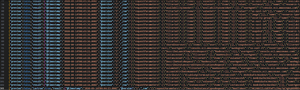
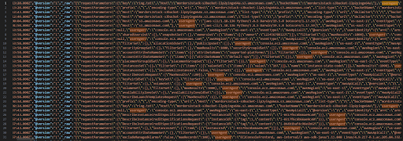
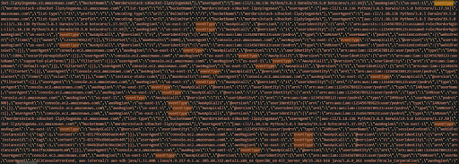
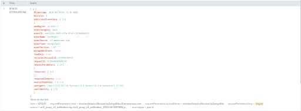

# Lab: Reconstructing a Cloud Attack Using Log Data

## Overview
With the rapid adoption of cloud storage technologies, an aspiring security practitioner should be well-versed in how to analyze cloud system logs in addition to traditional systems such as servers and endpoints. Many such cloud systems utilize application programming interfaces (API) to facilitate modern levels of automation, which are often susceptible to attack.

## Scenario
At Wayne Enterprises, an attacker was able to abuse a misconfigured EC2 reverse proxy to obtain instance profile keys and eventually exfiltrate confidential data files from an S3 bucket. You’ve been called in to analyze the logs and reconstruct the attack in detail.

## Objectives
- Using Splunk, analyze the data set to answer the question prompts.
- Explain in your own words your findings.

## Resources
- This VM is required for classes 11 through 13.
  - [Splunk Server](https://codefellows.github.io/ops-401-cybersecurity-guide/curriculum/#downloads-table)
- [Attack Data Set in JSON Format](https://github.com/OTRF/Security-Datasets/blob/master/datasets/atomic/aws/collection/ec2_proxy_s3_exfiltration.zip)
- [Amazon S3 API Reference](https://docs.aws.amazon.com/AmazonS3/latest/API/API_Operations.html)
- [CloudTrail Log Event Reference](https://docs.aws.amazon.com/awscloudtrail/latest/userguide/cloudtrail-event-reference-record-contents.html)
- [Splunk Quick Reference Guide](https://www.splunk.com/pdfs/solution-guides/splunk-quick-reference-guide.pdf)

## Tasks
### Part 1: Staging
- This lab uses the same OVA created during Class 11.
- The JSON file from GitHub AWS collection ec2_proxy_s3_exfiltration.zip has already been loaded into Splunk.
- Search `index="mordor_aws"` in Splunk to complete the rest of the assignment.
**confirmed 103 results**

### Part 2: Log Analysis
- The data set you’ll be analyzing today is now imported into Splunk as the index name of mordor_aws. Access the full index using `index="mordor_aws"` and paste the first log you see into your submission.

- Open the JSON file in VS Code. Compare it to the same data set in Splunk. What do you observe?

- How is the attacker accessing the company’s AWS systems? Check the `userAgent` and `eventType` attributes.

- Find evidence that the following tactics were utilized, and paste the logs into your submission:
  - [TA0001](https://attack.mitre.org/tactics/TA0001/)
  - [TA0003](https://attack.mitre.org/tactics/TA0003/)
  - [TA0004](https://attack.mitre.org/tactics/TA0004)
  - [TA0005](https://attack.mitre.org/tactics/TA0005)
  - [TA0009](https://attack.mitre.org/tactics/TA0009)
- Find evidence that the following techniques were utilized, and paste the logs into your submission (may overlap with previous findings in “tactics” section):
  - [T1078.004](https://attack.mitre.org/techniques/T1078/004)
  - [T1530](https://attack.mitre.org/techniques/T1530)
  - 

### Part 3: Reporting
- Summarize in your own words how the attacker was able to exfiltrate data from the S3 bucket. Be sure to include:
  - When did the attack take place?
    - ~ 1320Z 14.9.2020 from IP 1.2.3.4 (trc to Australia, likely spoofed)
  - How was the attacker interacting with AWS?
    - login via MordorNginxStack-BankingWAFRole-9S3E0UAE1MM0 from the userAgent: [aws-cli/1.18.136 Python/3.8.5 Darwin/19.5.0 botocore/1.17.59]
  - Did you find any information about the attacker/attack origin?
    - Possibly Australia but unlikely
