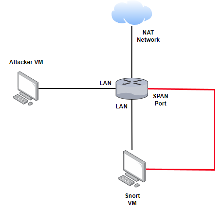
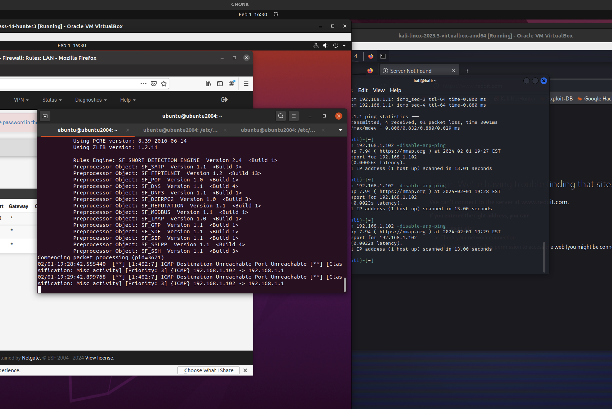
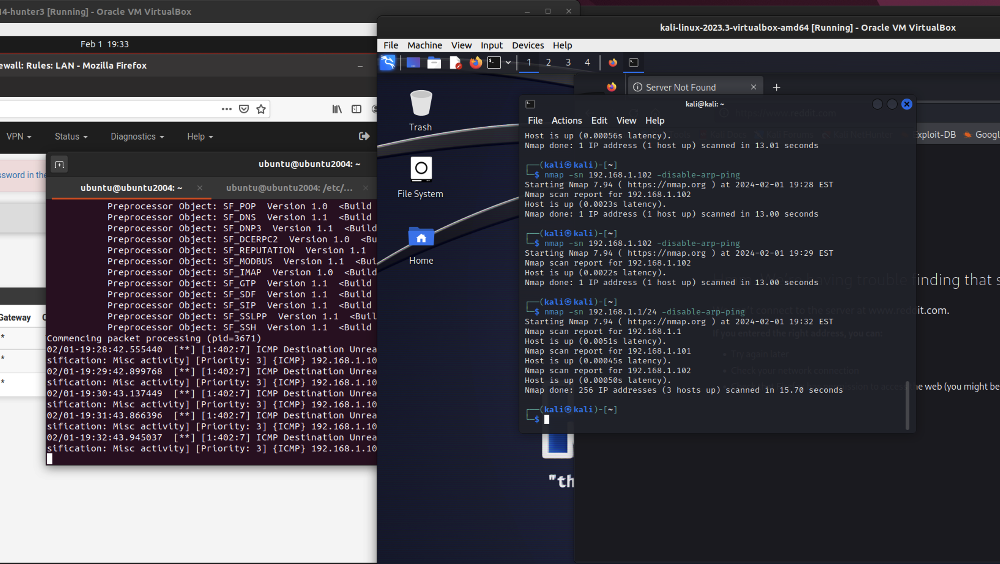
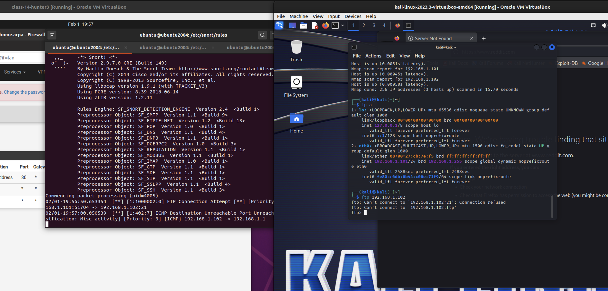
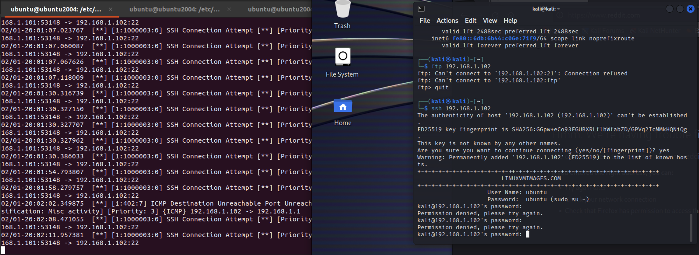
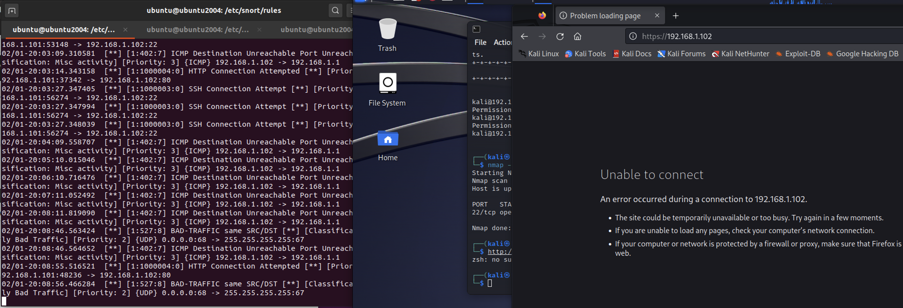

# Lab: Intrusion Detection and Prevention Systems (IDS/IPS)

## Overview
IDS/IPS administration and operation are essential duties in the modern security operations center (SOC). These defensive systems allow us to detect in real time a computer system's intrusion. Today you will deploy Snort, an open-source NIDS, in your long-term threat detection ecosystem on VirtualBox.

## Objectives
- Prepare your long-term threat detection lab environment to mirror traffic on pfSense using a span port.
- Augment your threat detection lab environment with an IDS by deploying Snort to a Ubuntu Linux VM.
- Create and test Snort rules to detect:
  - ICMP echo requests
  - FTP connection requests
  - SSH connection requests
  - HTTP connection requests
  - Nmap scans

## Resources
- [Class-14-hunter3.ova 4GB Download](https://codefellows.github.io/ops-401-cybersecurity-guide/curriculum/#downloads-table)
  - This is mostly a normal Ubuntu Desktop VM, although it has an additional network interface prepared to be used by Snort for sniffing.
  - Any Ubuntu Desktop 20.10 with two network interfaces can be used for this lab.
- [Basic Snort Rules Syntax and Usage](https://resources.infosecinstitute.com/topic/snort-rules-workshop-part-one/)
- [Snort Home Page](https://snort.org/)
- [Snort Video Resources](https://snort.org/resources)
- [How to Use the Snort Intrusion Detection System on Linux](https://www.cloudsavvyit.com/6424/how-to-use-the-snort-intrusion-detection-system-on-linux/)

## Tasks
### Part 1: Staging Traffic Mirroring, Snort
Reference this desired network topology:

For this lab, you'll need a pfSense VM with a span port that mirrors traffic from the LAN port. This was configured in Ops 301. If you kept that pfSense VM, you should be all set to move onto the next part of this lab. Otherwise, it is presumed that you are familiar with span port configuration in pfSense and will need to configure that now before proceeding.

Ensure the following interfaces are set to Promiscuous Mode: Allow All in VirtualBox:
- LAN port on pfSense
- SPAN port on pfSense
- Adapter 2 on Hunter VM (Snort on Ubuntu)

You'll also need Kali Linux deployed to the LAN port of pfSense within the corporate network. We'll be using Kali to test whether Snort is detecting malicious network traffic.

Next, you'll need to deploy Snort to a Ubuntu Linux Desktop VM. Make sure there are two network interfaces on the Ubuntu VM, one plugged into the LAN port of pfSense and the second interface plugged into the SPAN port of pfSense.
1. Run `sudo apt update`
2. Run `sudo apt upgrade`
3. Run `sudo apt-get install snort`
4. Snort's installer will prompt you for network information so that it can stage the snort.conf file for you.
5. You can initialize Snort with `sudo snort -c snort.conf -A console -i [network interface name]`, note that you need to specify your network interface name accordingly.

Snort Running:

6. Review the snort.conf file and make sure your network settings are correct.

### Part 2: Detecting Network Activity with Custom Snort Rules
For this portion of the lab, you'll be writing and testing your own Snort rules in an effort to detect specific types of traffic that will help alert the defender to intruder activities such as Nmap enumeration attempts.

**Write a Snort Rule:** `cd /etc/snort/rules`.  
- Use `sudo nano rulename.rules` to create a new rule file.
  - Example rule: `alert icmp any any -> [Snort Host IP] any (msg:"ICMP packet detected"; sid:1000001;)`
  - save this new rule.
- `cd ..` to return to the snort directory.
- `sudo nano snort.conf` to add the new rule to the snort.conf file.
  - Add the following line to the end of the file: `include $RULE_PATH/rulename.rules`
  - Save the file.

Write and test a Snort rule that detects when ICMP packets transmitted to its IP from the internet and raises an alert to the console.
- Issue the nmap test command: `nmap -sn [Snort host IP] -disable-arp-ping`.
- Include a screenshot of this and the alert in your submission.
- Issue the nmap test command: `nmap -sn [network IP with CIDR block] -disable-arp-ping`.
- Observe Snort alerts. What are you seeing, and what is happening?

Write and test a Snort rule that detects when Kali Linux VM attempts an FTP connection to another local PC and raises an alert to the console.
- Issue the Kali Linux console test command: `ftp [target host IP]`.
- Include a screenshot of this and the alert in your submission.

Write and test a Snort rule that detects when Kali Linux VM attempts an SSH connection to another local PC and raises an alert to the console.
- Test the command using Kali Linux console command.
- Include a screenshot of this and the alert in your submission.
- Test the command using Nmap command.
- Include a screenshot of this and the alert in your submission.

Write and test a Snort rule that detects when Kali Linux VM attempts an HTTP connection to another local PC and raises an alert to the console.
- Test the rule using a web browser in Kali Linux.
- Include a screenshot of this and the alert in your submission.

### Part 3: Detecting Network Activity with Premade Snort Rules
Now that you're confident in writing custom Snort rules, try using the pre-made rulesets.

- Register at snort.org, then download the "Registered" rules package at Snort downloads.
- Load the rules pack into Snort.
- Using nmap on Kali, run various scans against the PC hosting Snort.
- Document your results, including what was detected VS not detected.

### Part 4: Reporting
Answer the below discussion prompts in your own words:

**1. How does Snort differ from a LAN firewall appliance?**
- **Snort**: Primarily a Network Intrusion Detection System (NIDS), it monitors network traffic for suspicious activity and logs or alerts based on predefined rules. It focuses on analyzing traffic and identifying potential threats.
- **LAN Firewall Appliance**: Primarily concerned with controlling access to a network by allowing or blocking traffic based on predefined security rules. It acts as a barrier at the network's entry points to prevent unauthorized access.

**2. Why would a security team deploy a NIDS (Network Intrusion Detection System) solution?**
- **Detection of Intrusions**: To monitor network traffic for signs of malicious activity or policy violations.
- **Security Posture Analysis**: To gain insights into the network's security status and identify potential vulnerabilities.
- **Compliance and Forensics**: To meet regulatory compliance requirements and aid in forensic analysis during or after a cyber incident.

**3. What are some limitations/shortcomings of a NIDS solution? In other words, what malicious activity would a NIDS not detect?**
- **Encrypted Traffic**: NIDS often cannot inspect the contents of encrypted traffic (like HTTPS), potentially missing malicious activity within it.
- **Evasion Techniques**: Attackers can use sophisticated evasion techniques (like fragmenting packets) to bypass detection.
- **High Volume of False Positives/Negatives**: NIDS can generate false alarms (flagging benign activities as malicious) or miss actual threats, requiring careful tuning and constant updates.
- **Internal Network Threats**: Limited in detecting malicious activity originating from within the network, especially if the traffic does not cross the NIDS monitoring point.
- **Resource Intensive**: Monitoring and analyzing all network traffic can be resource-intensive and may lead to performance issues.

Stretch Goals (Optional Objectives)
Pursue these optional objectives if you are an advanced user or have remaining lab time.

- For each nmap pre-made command, write a custom Snort rule that detects it.
- Test your rule. Include screenshots of nmap and Snort console.
