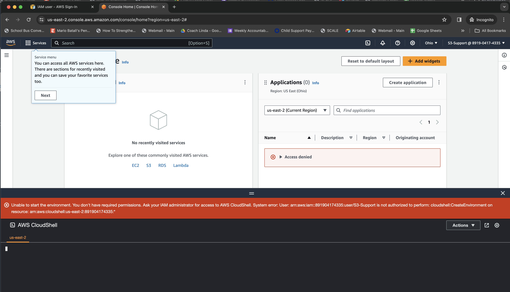
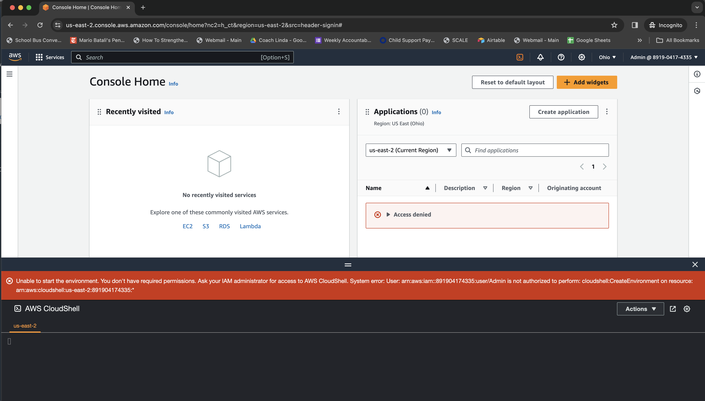

# Lab 16: Cloud Identity and Access Management (IAM) with AWS

## Overview

AWS Identity and Access Management (IAM) facilitates the management of users and user permissions. With IAM, you’re able to centrally manage users, security credentials like access keys, and permissions such as what resources a user may access on the AWS cloud.

## Objectives

Using the AWS CLI, create and configure users and groups in your AWS account according to these specs:

| User    | In Group     | Permissions                           |
| ------- | ------------ | ------------------------------------- |
| user-1  | S3-Support   | Read-Only access to Amazon S3         |
| user-2  | EC2-Support  | Read-Only access to Amazon EC2        |
| user-3  | EC2-Admin    | View, Start and Stop Amazon EC2 instances |

Using the AWS GUI, test and validate each user is correctly cleared for the appropriate permissions by attempting unauthorized operations.

## Resources

- [AWS Identity and Access Management User Guide](https://docs.aws.amazon.com/IAM/latest/UserGuide/introduction.html)
- [AWS CLI Command Reference](https://docs.aws.amazon.com/cli/latest/reference/iam/index.html)
- [Adding a new IAM User with AWS CLI](https://www.blinkops.com/blog/adding-a-new-iam-user-with-aws-cli)

## Tasks

### Part 1: Users and Groups

You’ll need an AWS account for this lab along with AWS CLI installed to your computer. Using your favorite shell, utilize AWS CLI to perform the below operations. Be sure to capture screenshots of each successful execution in your shell terminal.

1. Check S3 to see if you have an S3 bucket with data in it.
   If not, create a bucket and put a text file with a line of data in it for testing access later on in this lab.

2. Create the following groups with the appropriate permissions to perform their named roles:
   - EC2-Admin
     - Attach an Inline Policy that permits the group to view (Describe) information about Amazon EC2 and Start or Stop instances.
   - EC2-Support
     - Attach the Managed Policy, AmazonEC2ReadOnlyAccess.
   - S3-Support
     - Attach the Managed Policy, AmazonS3ReadOnlyAccess.

3. Create the following users:
   - user-1
   - user-2
   - user-3
   For each user, create a password and grant them management console access.
   Add users to their corresponding groups, refer to the table in the Objectives section.

### Part 2: Testing and Validation

For this part, feel free to use the AWS web GUI.

1. Test and validate user permissions.
   Sign in as each user using a new incognito (Chrome)/inPrivate (Firefox) window on your browser.
   Note: You need to do this in an incognito window so that your session isn’t saved and you can login as a different user.

2. For each user, attempt to perform the following operations:
   - View the contents of an S3 bucket
   - Start/Stop an EC2 instance
   
   
   

### Part 3: Reporting

- How did your testing go? None of the users could access anything. The AWS CLI was disabled on all users. I checked the admin settings and inline policies and nothing came of it.
- Did you catch any misconfigurations and need to alter users or groups? I didn't catch any misconfigurations, but I'm not very clear on what I'm supposed to be seeing here, to be honest.
- Why is proper IAM important on the cloud? IAM is a critical step in a process of plugging holes in a sinking ship. The more we dive into cybersecurity, the more I realize that this is all like a never-ending game of whack-a-mole. It's wild.
