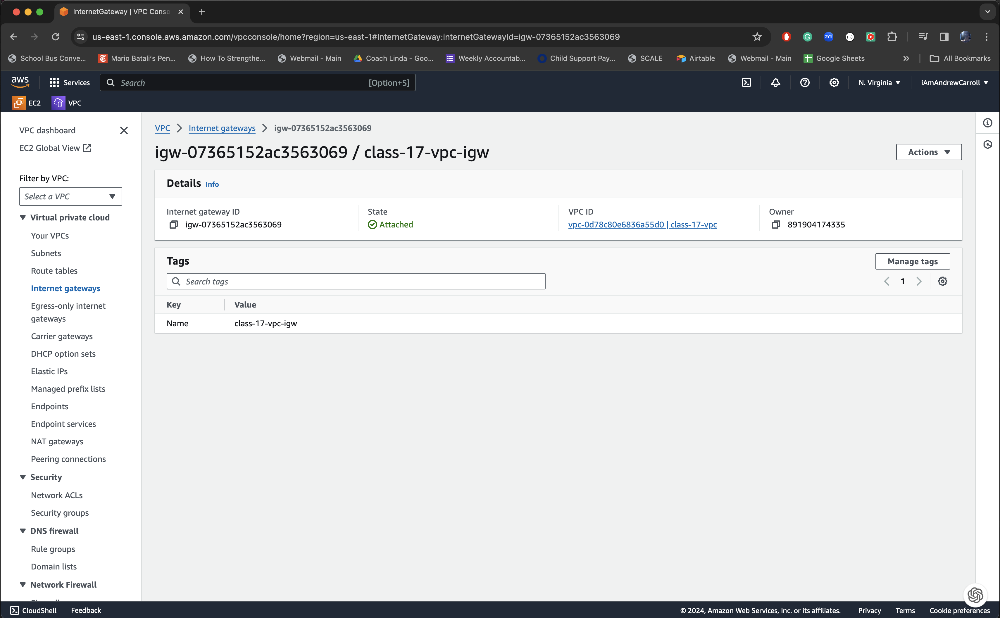
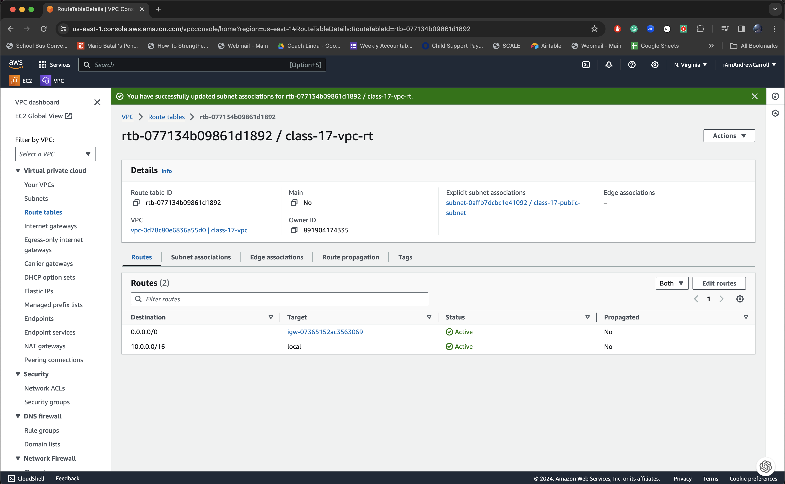
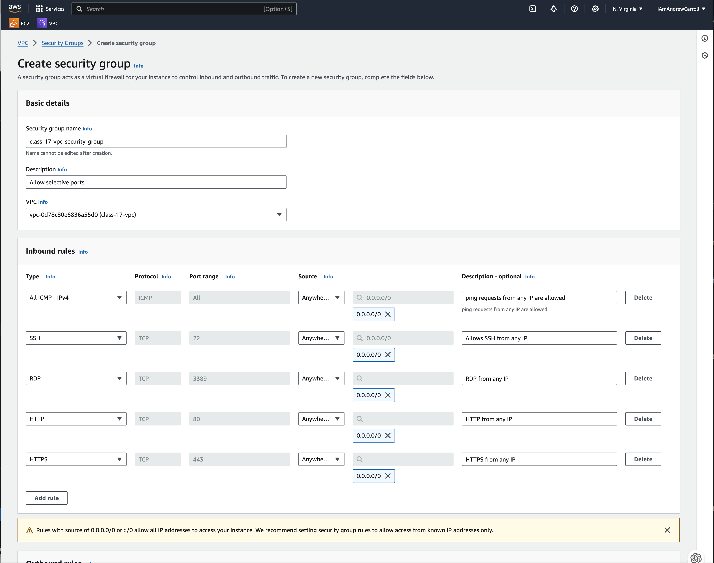
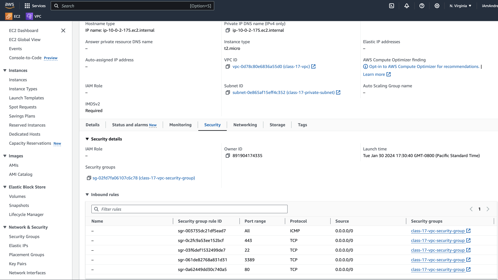
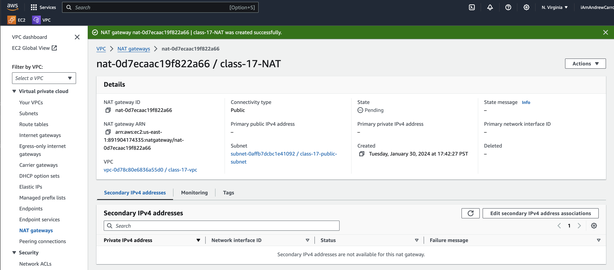
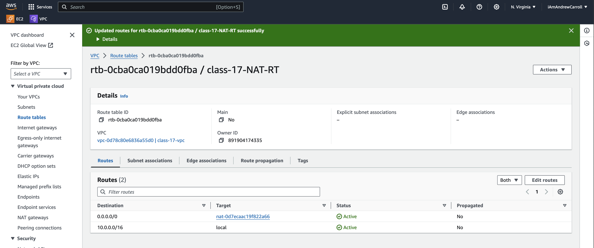
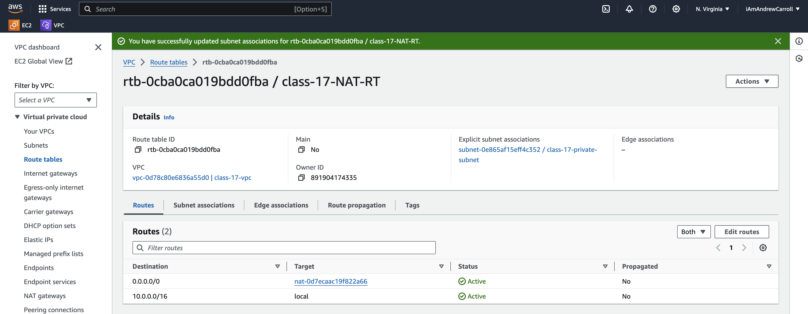

# Lab 17: Cloud Network Security

## Overview
Networking in the AWS cloud differs substantially from traditional on-prem LAN. Facilitating secure access, privacy, and firewalling of an AWS VPC is important in understanding how to defend the network infrastructure of a cloud topology compared to a brick and mortar LAN.

## Objectives
- Create a VPC
- Create a public and a private subnet
- Create a security group
- Create an internet gateway
- Create a NAT gateway
- Deploy an Ubuntu Server instance in EC2 to the VPC in the public subnet
- Deploy an Ubuntu Server instance in EC2 to the VPC in the private subnet

## Resources
- [What is Amazon VPC?](https://docs.aws.amazon.com/vpc/latest/userguide/what-is-amazon-vpc.html)
- [Default VPC and default subnets](https://docs.aws.amazon.com/vpc/latest/userguide/default-vpc.html)
- [VPC with public and private subnets (NAT)](https://docs.aws.amazon.com/vpc/latest/userguide/VPC_Scenario2.html)
- [How do I set up a NAT gateway?](https://aws.amazon.com/premiumsupport/knowledge-center/nat-gateway-vpc-private-subnet/)
- [Draw.io AWS Icon Library](https://app.diagrams.net/?libs=aws2)
- [Example AWS topology](https://randops.org/2016/12/18/aws-diagrams-with-draw-io/)

## Tasks
### Part 1: VPC and Subnets Creation
AWS provides you a “default VPC” whenever you launch an EC2 instance. In this first step of the lab, you’ll create and customize your own VPC.

- Login to your AWS Management Console and click the “Services” dropdown. Add VPC and EC2 to favorites, you’ll need quick access to them throughout today’s lab.

- Navigate to VPC Management Console.
- Create a VPC named `class-17-vpc` with an IPv4 CIDR block of `10.0.0.0/16`. Ensure that the tag `class-17-vpc` is created for this VPC object.

- Create the following subnets and associate them with class-17-vpc:
  - **class-17-public-subnet**
    - Select an appropriate IPv4 CIDR block that is within the scope of the VPC network, but does not take up the whole network. This subnet should accommodate at least 250 hosts.
    - What did you select and why?  You may need to calculate subnets with online tooling to assist with making a determination here.

  - **class-17-private-subnet**
    - Once again, select an IPv4 CIDR block that is within the scope of the VPC network but does not overlap with class-17-public-subnet. This subnet should accommodate at least 250 hosts.
    - What did you select and why?
    - Did you leave room for additional subnets in the future to be added?  How many could potentially be added?

- On the VPC console page for subnets:
  - Select the public subnet you just created in the previous steps.
  - Choose `Action` and under `Edit subnet settings`.
  - Select `Enable auto-assign public IPv4 address` and choose `Save and Close`.

Just lovely **Subnets**

### Part 2: Create an Internet Gateway
Instead of physical router appliances, in the cloud we use objects called internet gateways instead. Whenever you have a public subnet in a VPC, you’ll need to deploy an internet gateway. An **internet gateway (IGW)** is a virtual router that connects a VPC to the internet.

- In the VPC Management Console, navigate to Internet gateways and create a new one named `class-17-vpc-igw`.
  - Apply a name tag.
  - While the internet gateway is created, it is not yet attached to your VPC. You can click the “Attach to a VPC” popup to do so.
  - Select `class-17-vpc`.
  - What is the AWS CLI command corresponding to this action?

You should get a success message and see the State changed to “Attached.”

Now that we created an Internet gateway, we need to create a route to the Internet.

**Configure Route Table for Internet Gateway:**
  - In the left navigation pan, choose Route Tables and Create Route Table
  - Apply a name tag:
    - VPC: class-17-vpc-rt
    - Choose Create and close.

  - Select the newly created route table, choose Action then Edit Route
  - Choose Add Route:
    - Destination: 0.0.0.0/0
    - Target: class-17-vpc-igw
    - Choose Save Route.

  - Continue to click on Action, then Edit Subnet Association.
  - Select `class-17-public-subnet` and click Save.

Route Tables

### Part 3: Security Groups
A **security group** is a virtual firewall that determines what network traffic can pass into and out of your instance. You’ll need to create, configure, and assign one to your new VPC. Whenever you launch a new EC2 instance, you’ll need to check and make sure the correct security group is associated.

- In the VPC Management Console, you’ll need to select Security Groups and create a new security group with the following parameters:
  - Name: `class-17-vpc-security-group`
  - Description: `Allow selective ports`
  - VPC: `class-17-vpc`
  - Create inbound rules that allow the following:
    - All ICMP (IPv4) from anywhere
    - All SSH from anywhere
    - All RDP from anywhere
    - All HTTP from anywhere
    - All HTTPS from anywhere
  - On the outbound, permit all traffic to anywhere.
  - Create an optional tag:
    - Key: `Name`
    - Value: `class-17-vpc-security-group`
  - If successful, you’ll see “Security group (name) was created successfully.” If you ran into issues, troubleshoot until resolved.
  - Include a screenshot of your “Inbound Rules” table in your submission. It should have exactly five entries.

Security Groups

### Part 4: Instance Deployment
Switch back to EC2 and launch the following instances:

- Ubuntu Server 20.04 LTS (HVM), SSD Volume Type to `class-17-public-subnet`
  - In Step 3: Configure Instance Details, you can assign the instance to your new VPC and subnet under Network and Subnet dropdown menus.
  - Remember to specify `class-17-vpc-security-group` from step 3.
  - AWS should warn you with something like this:
    - Improve your instances’ security. Your security group, `class-17-vpc-security-group`, is open to the world. Your instances may be accessible from any IP address. We recommend that you update your security group rules to allow access from known IP addresses only. You can also open additional ports in your security group to facilitate access to the application or service you’re running, e.g., HTTP (80) for web servers.
  - Note: At this point you can test ping and SSH from Internet to this instance and it should work.

  - Is this a concern, or does it fit with the goals of your cloud architecture?
    - This is a concern under normal circumstances but this is just a lab assignment so I'm not concerned about it.  What delightfully glaring security holes we have here!

  - As a stretch goal, change the security group to only allow traffic from your computer’s public IP address. Re-attempt launching the EC2 instance and see if this warning is cleared.

- Ubuntu Server 20.04 LTS (HVM), SSD Volume Type to `class-17-private-subnet`
  - In Step 3: Configure Instance Details, you can assign the instance to your new VPC and subnet under Network and Subnet dropdown menus.
  - Remember to specify `class-17-vpc-security-group` from step 3.
  - AWS may warn you with the same prompt as before.
  - Is this a concern, or does it fit with the goals of your cloud architecture?
  - Note: At this point you can test pinging google from this instance and it should not work.

Instance Creation

### Part 5: NAT Gateway
Normally, a NAT gateway translates IPs to allow communication between two networks. In AWS, however, a NAT Gateway is an object that provides communication between different subnets within a VPC.

- Deploy a NAT gateway between your private and public subnet that allows the Ubuntu Server in your private subnet to access the internet without exposing itself.
- Here’s some helpful documentation:
  - To create a NAT gateway, you must specify the public subnet in which the NAT gateway should reside. For more information about public and private subnets, see Subnet routing. You must also specify an Elastic IP address to associate with the NAT gateway when you create it. The Elastic IP address cannot be changed after you associate it with the NAT Gateway. After you’ve created a NAT gateway, you must update the route table associated with one or more of your private subnets to point internet-bound traffic to the NAT gateway. This enables instances in your private subnets to communicate with the internet. -AWS VPC
- In the left navigation pane, choose NAT Gateways
- Choose Create NAT Gateway:
  - Subnet: `class-17-public-subnet`
  - Allocate an `Elastic IP`
  - Choose Add Tag:
    - Key: Name
    - Value: `class-17-NAT`
  - Choose Create a NAT Gateway

NAT Gateway

### Part 6: Configure Route Table for NAT Gateway
In the left navigation pan, choose Route Tables and Create Route Table
- Apply a name tag:
  - Name tag: `class-17-NAT-RT`
  - VPC: `class-17-vpc`
- Choose Create and close.
- Select the newly created route table, choose Action then Edit Route
- Choose Add Route:
  - Destination: `0.0.0.0/0`
  - Target: `class-17-NAT`
- Choose Save Route.
- Continue to click on Action, then Edit Subnet Association.
- Select `class-17-private-subnet` and click Save.

NAT Gateway

Note: At this point you can test pinging google from this instance and it should work.

### Part 7: Wrap Up
Shut down your two Ubuntu instances and NAT gateway to avoid incurring cloud charges.
