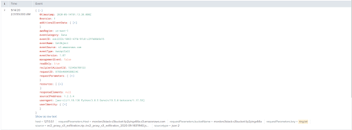

# Lab 18: Cloud Logging and Monitoring Overview

## Overview
AWS CloudTrail can capture logs for monitoring and learning of possible anomalous behaviors in an AWS environment. By connecting CloudTrail to CloudWatch, we can audit logs or set up real-time notifications for suspicious activity.

## Objectives
- Activate AWS CloudTrail to begin capturing event logs
- Configure Amazon CloudWatch to ingest log data from CloudTrail
- Create a rule in Amazon CloudWatch that triggers an event
- Create a VPC flow log

## Resources
- [Analyzing AWS CloudTrail in Amazon CloudWatch](https://aws.amazon.com/blogs/mt/analyzing-cloudtrail-in-cloudwatch/)
- [Amazon CloudWatch Events](https://docs.aws.amazon.com/AmazonCloudWatch/latest/events/WhatIsCloudWatchEvents.html)
  - [Creating a Rule That Triggers on an Event](https://docs.aws.amazon.com/AmazonCloudWatch/latest/events/WhatIsCloudWatchEvents.html)
  
## Tasks

### Part 1: Create a Trail with AWS CloudTrail
AWS CloudTrail is an AWS service that helps you enable governance, compliance, and operational and risk auditing of your AWS account. Actions taken by a user, role, or an AWS service are recorded as events in CloudTrail. Let’s get to know this service by creating our first “trail” object and initialize some logging.

- Access AWS CloudTrail by typing “cloudtrail” into the AWS Management Console search box.
- Using Quick trail create, create a trail for logging management events.
  - Note that an S3 bucket will be created to store your logs. Pay attention to the cost implications of this action.
- [Create a trail in the CloudTrail console](https://aws.amazon.com/blogs/mt/analyzing-cloudtrail-in-cloudwatch/)

- Access the trail object and note its state of “Logging”; you can start/stop logging from this screen.
- In CloudTrail console, access event history. Note that CloudTrail records the last 90 days of events for free. Change the time window to something more reasonable like 30m or 1h, then download both a JSON and a CSV of the events to your computer. 
  - Take a look at both; which is more useful for post-incident analysis?
    - This depends on what I'm using the data for and in what system.  If I'm programming in Python then I'm likely going to use the JSON.  If I have to review on my own without extensions in vsCode I'm going to look at the CSV.

- Open the S3 bucket that’s capturing your management logs from CloudTrail. Drill down into the folders until you can see the logs as .GZ compressed archives. Grab a screenshot of this. It’s always good to know where you’re saving logs.
  - `Amazon S3 > Buckets > aws-cloudtrail-logs-891904174335-e9248959 > AWSLogs > 891904174335 > CloudTrail > us-east-1 > 2024 > 01 > 31/`
  - [Here be the .gz files](https://us-east-2.console.aws.amazon.com/s3/buckets/aws-cloudtrail-logs-891904174335-e9248959?region=us-east-1&bucketType=general&prefix=AWSLogs/891904174335/CloudTrail/us-east-1/2024/01/31/&showversions=false)

This is a brief introduction to the capabilities of AWS CloudTrail. Take a look around and get to know this service and its documentation well. Next, let’s make use of this trail.

### Part 2: Ingest a Trail with Amazon CloudWatch
Amazon CloudWatch Events can schedule automated actions that trigger when conditions are met. This can be a powerful defensive control to protect you against specific types of activity.

- We’ll need to configure Amazon CloudWatch to ingest log data from CloudTrail, specifically the new Trail you created. Access [this helpful blog](https://aws.amazon.com/blogs/mt/analyzing-cloudtrail-in-cloudwatch/) and complete the sections, “Create a trail in the CloudTrail console” and “Analyzing CloudTrail logs in CloudWatch”. You don’t need to create a new trail, just use the trail you already have.
- As a stretch goal, consider completing more activities presented in the blog to gain more expertise in CloudWatch.

This should give you a rough idea of how CloudTrail feeds data into CloudWatch for analysis.

### Part 3: Create a CloudWatch Rule
CloudWatch doesn’t just “watch” the action. It can trigger an “event” that can lead to additional automation in our environment.

- Open the CloudWatch console.
- In the navigation pane, choose Events, Create rule.
- For Event source, do the following:
- Choose Event Pattern, Build event pattern to match events by service.
- For Service Name, choose the service that emits the event to trigger the rule.
- For Event Type, choose the specific event that is to trigger the rule. If the only option is AWS API Call via CloudTrail, the selected service does not emit events and you can only base rules on API calls made to this service. For more information about creating this type of rule, see Creating a CloudWatch Events Rule That Triggers on an AWS API Call Using AWS CloudTrail.
- Depending on the service emitting the event, you may see options for Any… and Specific…. Choose Any… to have the event trigger on any type of the selected event, or choose Specific… to choose one or more specific event types.
- For Targets, choose Add Target and choose the AWS service that is to act when an event of the selected type is detected.
- In the other fields in this section, enter information specific to this target type, if any is needed.
- For many target types, CloudWatch Events needs permissions to send events to the target. In these cases, CloudWatch Events can create the IAM role needed for your event to run:
- To create an IAM role automatically, choose Create a new role for this specific resource.
- To use an IAM role that you created before, choose Use existing role.
- Optionally, repeat steps 4-6 to add another target for this rule.
- Choose Configure details. For Rule definition, type a name and description for the rule.
- The rule name must be unique within this Region.
- Choose Create rule.

### Part 4: Create a VPC Flow Log
VPC Flow Logs is a feature that facilitates the capture of IP traffic on VPC network interfaces. We can publish flow log data to Amazon CloudWatch Logs and Amazon S3. In this part of today’s lab, you’ll configure a VPC flow log.

- Under Services > Networking & Content Delivery > VPC > Your VPCs, select your VPC > Flow Logs tab.
- Create a flow log using `security-book-peering` as the trail name.
  - Select the filter type and maximum aggregation interval.
- Send the flow logs to an S3 bucket by typing `arn:aws:s3:::<YOUR BUCKET NAME>` in the S3 bucket ARN field.
- Test and validate IP traffic is being captured using a flow log.
  - CloudWatch > Log Groups > There will be logs and events here

### Part 5: Wrap Up
Delete and disable anything you don’t need at this point, to keep charges down. Pay attention to S3 buckets in particular.
