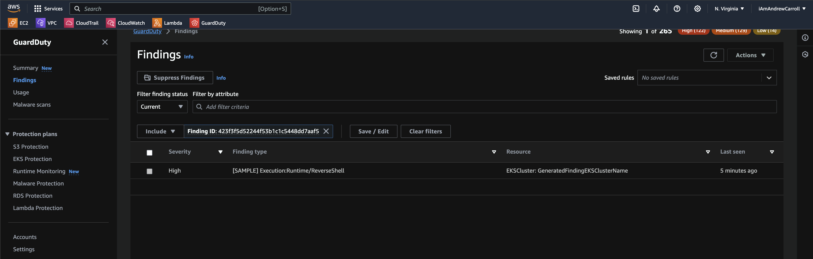
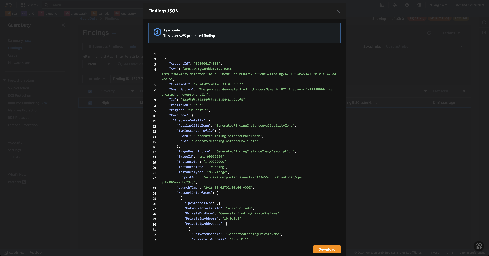

# Lab 19: Cloud Detective Controls

## Overview
Amazon GuardDuty is a threat detection service that continuously monitors for malicious activity and unauthorized behavior to protect AWS accounts, workloads, and data stored in Amazon S3, whereas AWS Security Hub provides a comprehensive view of the security state in AWS and helps check the environment against security industry standards and best practices. Now that we have logs being generated and ingested by CloudWatch, we can activate GuardDuty and Secure Hub to actively detect security issues such as IAM misconfigurations.

## Resources
- [Amazon GuardDuty](https://aws.amazon.com/guardduty/)
- [Generating Findings with GuardDuty](https://codefellows.github.io/ops-401-cybersecurity-guide/curriculum/class-19/lab/docs.aws.amazon.com/guard-duty/latest/ug/guardduty_findings.html#guardduty_findings/scripts)
- [Getting started with AWS Security Hub](https://aws.amazon.com/security-hub/getting-started/)

## Objectives
- Create a simple function in AWS Lambda and execute a test run
- Use Amazon GuardDuty to generate sample findings
- Analyze the sample findings in Security Hub

## Tasks

### Part 1: Create an AWS Lambda Function
In the previous class we triggered Events with CloudWatch. AWS Lambda is an important element in automating responses to security events in your cloud environment, with its support for serverless functions. For example, we can use Lambda functions to raise alerts in response to certain conditions detected by AWS. For now, let’s just deploy and test a simple Lambda for the first time.

- In AWS Management Console, type “Lambda” into the search and access the Lambda service dashboard.
- Create an AWS Lambda function from a blueprint named “hello-world-python”


- Before you can test your new Lambda function, you’ll need to create a test event if you don’t have an existing event to work with. Name it “testevent1” and save it.
- Run a test of your Lambda function, hello-world-python, using testevent1.
- Copy and paste the log output into your submission.
```
Test Event Name
testevent1

Response
"value1"

Function Logs
START RequestId: 4e7f8072-42a5-4236-b886-75fe006472ea Version: $LATEST
value1 = value1
value2 = value2
value3 = value3
END RequestId: 4e7f8072-42a5-4236-b886-75fe006472ea
REPORT RequestId: 4e7f8072-42a5-4236-b886-75fe006472ea	Duration: 1.28 ms	Billed Duration: 2 ms	Memory Size: 128 MB	Max Memory Used: 37 MB

Request ID
4e7f8072-42a5-4236-b886-75fe006472ea
```


- Locate the corresponding CloudWatch log group and paste the ARN of this log group into your submission.
- In CloudWatch, click the “Log Stream” within this log group. Keeping this open, execute your Lambda function again with a test. Refresh the log stream. What do you see?
  - This should give you a basic sense of how Lambda functions are triggered by events, and how CloudWatch keeps a close eye on said log stream. As a stretch goal, consider taking the next leap into event source mapping. A cloud security professional will want certain events to trigger Lambda-based alerts.


Now that we’ve tinkered with automated responses to events in the cloud, let’s take a look at threat detection with Amazon GuardDuty.

### Part 2: Enable Amazon GuardDuty
- Open the Amazon GuardDuty Management Console.
- Enable GuardDuty.
- In the Setting section, generate sample findings.
- Review the findings and find one that looks interesting to you. Select a high priority (red triangle) finding to analyze.
  - Identify the Finding ID value. In GuardDuty Findings, filter your view to that specific Finding ID and grab a screenshot.
  

  - [Download the raw JSON of this finding and paste it into a shareable GitHub gist.](json/lab19.json) Link to the gist in your submission. Take a moment to analyze the JSON for useful details as to what may have occurred.
  

  - View the “Full description” and “Remediation recommendations” for this event and explain in your own words what took place, and how the company should remediate.
  - What resource is being targeted (being sample data it won’t necessarily exist on your cloud)?
    - Resource Role:  TARGET
    - Resource Type: EKSCluster
  - What is the action type and source IP address?
    - Runtime/ReverseShell
    - Source IP: 198.51.100.0 (maybe...)
  - Review the networking information on this finding; what does this tell you about what happened?
    - The source IP is a known malicious IP address...maybe
  - Is there a MITRE ATT&CK® TTP we could map this to?
    - Not that I am seeing.

### Part 3: Log Analysis with AWS Security Hub
- Open the AWS Security Hub Management Console.
- Enable Security Hub. Select CIS and AWS Foundational security standards.
- In the Security Standards menu, check account compliance.
- Confirm in Findings that the sample findings from GuardDuty were also reported in AWS Security Hub.
  - What details were provided for these findings?
    - None, because I was unable to get GuardDuty to talk to Security Hub.
- Navigate the Insights page.
  - What instance had the most findings?  I am not sure 
  - What security issues are there?  I see a lot of high priority malicious and unauthorized activity to create backdoors and shells and such.
  - What should the company address first and why? All the high severity findings.
    - **I can't answer any of these questions because I was unable to get GuardDuty to talk to Security Hub.  I got help from a tutor and other members of the class.**

Security Hub No Results


### Part 4: Wrap Up
- GuardDuty can be disabled from GuardDuty Console > Settings > Disable GuardDuty.
