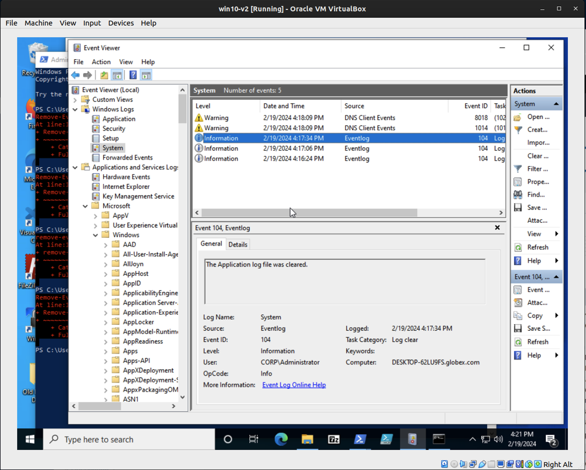
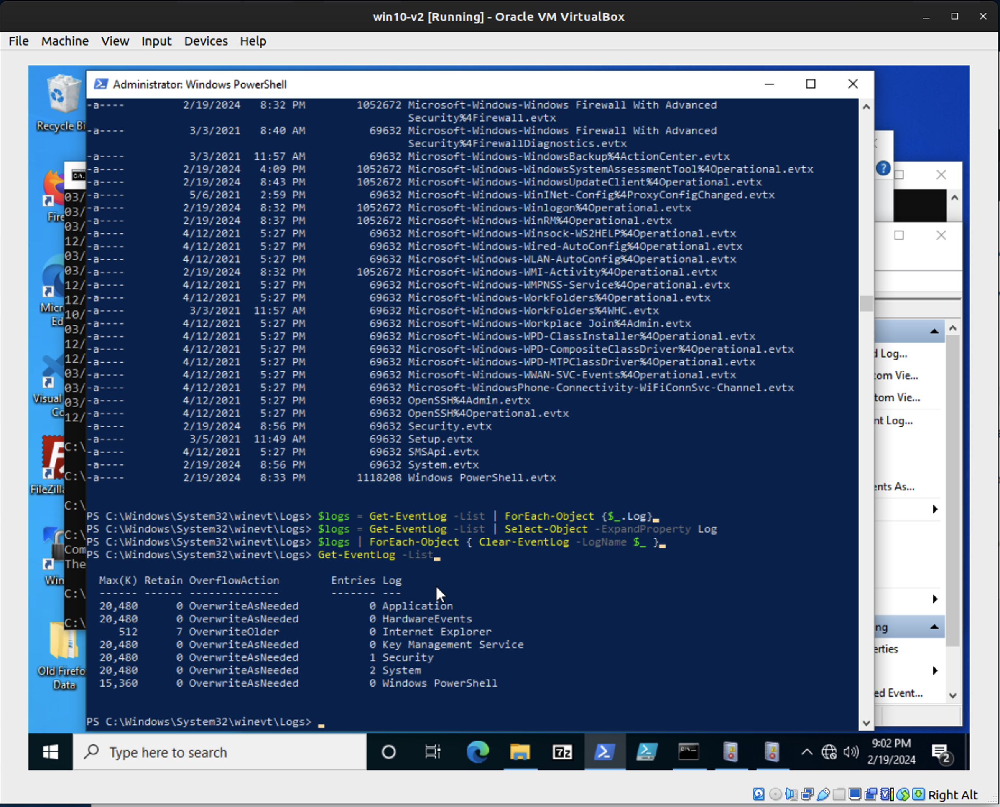

# Lab: Log Clearing

## Overview
Defense evasion as documented in TA0005 is an important tactic used by threat actors to avoid detection by defensive systems. By damaging the integrity of event logs, threat actors hope to not only avoid detection but may also seek to avoid prosecution and accountability for their actions on objectives. T1070 tells us that threat actors will often go to great lengths to cover their tracks by deleting evidence of their actions. One such method is log clearing, which we’ll explore today as our sample technique to which we’ll apply the Atomic Testing Cycle.

## Scenario
In today’s Zoom call, Director Dyson seemed optimistic. “I’ve reviewed your report on the threat reproduction, great work. Some news has come to light from our own DFIR specialist who notified me last night that several critical log files were deleted during the security incident. This explains why my analyst teams have been struggling to produce evidence of the attack. I’d like you to model out what it takes to do something like this, and recommend some detective controls for this.”

## Objectives
- Reproduce a log clearing attack (T1070.001)
- Implement countermeasures against it

## Resources
- [Atomic Red Team T1070.001](https://github.com/redcanaryco/atomic-red-team/blob/master/atomics/T1070.001/T1070.001.md)
- [Atomic Testing Cycle](https://medium.com/sseblah/how-to-use-the-atomic-red-team-tests-7519f6d9ebd4)

## Tasks

### Part 1: Staging
You’ll need a Windows 10 VM that is forwarding logs to Splunk using Universal Forwarder. All of this is pre-staged in [Term2-baseline-lab-v3.zip](https://example.com/term2-baseline-lab-v3.zip) (25 GB).

### Part 2: Log Clearing
At Cyberdyne Systems, an intruder with administrator clearance attempted to “cover their tracks” by removing indicators of their activities. Let’s reproduce one of the common techniques used by such adversaries in order to formulate defenses against them for our client.

- Execute both of the following Atomic Tests as documented in the Atomic Red Team repo, entry T1070.001:
  - Atomic Test #1 - Clear Logs
  - Atomic Test #2 - Delete System Logs Using Clear-EventLog

- Document the steps you took and your findings.
  - [Followed the instructions found here: Atomic Test Commands](https://github.com/redcanaryco/atomic-red-team/blob/master/atomics/T1070.001/T1070.001.md)
  - However, use the PowerShell commands below to clear the logs for test 1:
    - `Clear-EventLog -LogName "System"`
    - `Clear-EventLog -LogName "Security"`
    - `Clear-EventLog -LogName "Application"`
  - Use the following commands to clear log for test 2:
    - `$logs = Get-EventLog -List | Select-Object -ExpandProperty Log`
    - `$logs | ForEach-Object { Clear-EventLog -LogName $_ }`
    - `Get-EventLog -List`

- Verify that your log clearing operation was successful in Win10.



- Check whether this impacted the logs stored on your SIEM
  - The log clearing activities on the Windows 10 VM would not impact logs already forwarded to the SIEM (Splunk). Logs stored on the SIEM remain intact even after local log clearing.

- Analyze the event log(s) generated by your test
  - **Type of Event Log**: The logs are generated by **Sysmon (System Monitor)**, as indicated by the provider name ‘Microsoft-Windows-Sysmon’.
  - **Nature of the Event Log**: These event logs are in the category of **process tracking/creation**, logging the execution of the `wevtutil.exe` command for log clearing.
  - **User Account Indication**: The user account executing the log clearing is shown in the `<Data Name='User'>` field, e.g., ‘CORP\Administrator’. Additional details about the user session are provided in the `<Data Name='LogonGuid'>` and `<Data Name='LogonId'>` fields.

### Atomic Test #3 - Clear Event Logs via VBA
- Take a look at Atomic Test #3 - Clear Event Logs via VBA and explain how this test works. Why does it require MS Word, and what about MS Word does it exploit?
- [This link from chatGPT 4.0:](https://chat.openai.com/share/729794f4-c2c8-468d-b4ab-2deca0860fdf)

- **Explanation of How the Test Works**:
  - **Use of VBA**: The test uses Visual Basic for Applications (VBA) in Microsoft Word to automate the execution of Windows Management Instrumentation (WMI) commands.
  - **WMI Utilization**: Through VBA, the script clears specific event logs (Security and Backup) on the system using WMI.
  - **Execution via PowerShell**: It involves running a PowerShell command to download and execute a Word document containing a malicious macro, which in turn runs the VBA script for log clearing.

- **Requirement of MS Word and Its Exploitation**:
  - **Macro Feature Exploitation**: The test requires MS Word for its capability to run VBA macros, which can automate not just document-related tasks but also system interactions.
  - **Ease of Delivery and Execution**: Word documents are a common vector for such attacks due to their widespread use and the level of trust users place in them. The test exploits this trust and the powerful functionality of VBA macros in Word.

### Part 3: Detection

#### Detection of Log Clearing Activity in Splunk
  - **Evidence in Splunk**: Search for specific event IDs indicative of log clearing (e.g., Windows event ID 1102).
  - **Lack of Logs**: Absence of expected log entries during the test period may indicate log clearing.
  - **Sysmon Logs**: Check for Sysmon logs capturing the execution of log clearing commands (`wevtutil`, `Clear-EventLog`).

#### Security Defenses Bypassed
  - **Local Log Management**: This technique bypasses local log management; cleared logs cannot be retrieved unless backed up or forwarded.
  - **Event Logging Mechanism**: Exploits the ability of administrators to clear logs, impacting incident response and investigations.
  - **Detection Mechanisms**: Hinders security tools that rely on log analysis for malicious activity detection.
  - **Account Misuse/Privilege Abuse**: Highlights the importance of monitoring administrative privileges, as elevated rights are required.


### Part 4: Choose Your Adventure
Explore the Atomic Red Team repository in conjunction with MITRE ATT&CK and select an interesting TTP.
Perform a full Atomic Testing Cycle as you did above.

[Atomic Red Team Repository Item T1056.001 - Key Logger](https://github.com/redcanaryco/atomic-red-team/blob/master/atomics/T1056.001/T1056.001.md)

### Atomic Test #4 - Get-Keystrokes

**Function Description**:
`Get-Keystrokes` is a PowerShell function designed to log keys pressed, the time, and the active window. It's a part of PowerSploit, authored by Chris Campbell, Matthew Graeber, and revised by Jesse Davis. This function does not require dependencies and is supported on Windows platforms.

**Parameters**:
- `LogPath`: Specifies the path for logging key details. Default is `%TEMP%\key.log`.
- `Timeout`: Time interval in minutes to capture keystrokes. By default, it captures indefinitely.
- `PassThru`: Returns the keylogger's PowerShell object for manipulation or testing.

**Execution Example**:
```
Get-Keystrokes -LogPath C:\key.log
Get-Keystrokes -Timeout 20
```

**Prerequisites**:
- The function attempts to create a COM object for Word.Application and closes it. If unsuccessful, it indicates Microsoft Word is not installed.
- The `Get-Prereq Commands` suggests manual installation of Microsoft Word if not present.

**Function Mechanics**:
1. The script uses various Windows API calls through PowerShell to set up a low-level keyboard hook, capturing keystrokes.
2. It checks for key state changes and records keystroke details along with the active window title.
3. The data is logged to the specified path or by default to a temporary log file.

**Security Implications**:
This function demonstrates how keystroke logging can be implemented using PowerShell, highlighting the risks associated with malicious scripts that can capture sensitive information without the user's knowledge.

**Atomic Testing Cycle for the Keylogger**:
1. **Execute Test**: Implement the `Get-Keystrokes` function on a controlled environment to log keystrokes.
2. **Collect Evidence**: Monitor and collect the logged data, including keystrokes and active window details.
3. **Develop Detection**: Configure security tools to detect unusual PowerShell activity or suspicious API calls related to keyboard hooking.
4. **Review and Discuss Mitigations**: Implement strict PowerShell execution policies, user behavior analytics, and endpoint detection and response (EDR) solutions to mitigate the risk of keyloggers.

### Part 5: Reporting
Report on all completed Atomic Testing Cycles using the chosen Atomic Test. Describe in today’s submission the following stages of the Atomic Testing Cycle:
- Execute Test
- Collect Evidence
- Develop Detection
- Review and discuss the suggested mitigations on MITRE ATT&CK for each technique.

## Report on Completed Atomic Testing Cycles

### Atomic Test: Get-Keystrokes

#### Execute Test
- Implemented the `Get-Keystrokes` function in a controlled environment.
- This function sets up a low-level keyboard hook to log keystrokes and active window details.

#### Collect Evidence
- Monitored and collected data including all keystrokes and the titles of active windows.
- The logs were stored in the specified file path, with timestamps for each keystroke.

#### Develop Detection
- Configured security monitoring tools to detect anomalous PowerShell activities and suspicious API calls.
- Focused on identifying patterns indicative of keyboard hooking and unauthorized PowerShell script executions.

#### Review and Discuss Mitigations
- Reviewed MITRE ATT&CK mitigations such as:
  - **Execution Policy**: Enforcing strict PowerShell execution policies to prevent unauthorized script execution.
  - **User Behavior Analytics**: Implementing solutions to monitor and analyze user behavior for signs of compromise or unusual activities.
  - **Endpoint Detection and Response (EDR)**: Utilizing EDR tools to detect, investigate, and respond to potential security incidents involving keylogging or other malicious activities.
  - **User Training**: Educating users about the risks of enabling macros in documents from unknown sources and the importance of maintaining operational security.


## Stretch Goals (Optional Objectives)
Run further Atomic Tests to increase your exposure to MITRE ATT&CK and Atomic Red Team. If you’ve thought of an interesting Atomic Test of your own, consider contributing to the project.


siem VM: runs in the background, collects logs from the Windows 10 VM
windows 10 VM: universal fowarder
WinServer: Splunk

## Steps

## Tasks

### Part 1: Staging
1. [Download `Term2-baseline-lab-v3.zip`](https://example.com/term2-baseline-lab-v3.zip) and set up a Windows 10 VM.
2. Configure the VM to forward logs to Splunk using Universal Forwarder.

### Part 2: Log Clearing

#### Execution Steps
1. **Access the Windows 10 VM.**
2. **Navigate to T1070.001 in the Atomic Red Team repository.**
3. **Atomic Test #1 - Clear Logs:**
   - Open Command Prompt as an administrator.
   - Run the command provided in the Atomic Red Team documentation to clear logs.
4. **Atomic Test #2 - Delete System Logs Using Clear-EventLog:**
   - Open PowerShell as an administrator.
   - Execute the `Clear-EventLog` cmdlet as per the test instructions.
5. **Document each action performed during these tests.**

#### Verification and Analysis
1. Use Event Viewer in Windows 10 to verify if the logs are cleared.
2. Check Splunk to see if the log clearing reflects there.
3. **Analyze the generated event logs:**
   - Determine the type (Sysmon or regular Windows logs).
   - Categorize the nature of the event log.
   - Identify the user account involved in the log clearing from the logs.

#### Understanding Atomic Test #3
1. Review **Atomic Test #3 - Clear Event Logs via VBA**.
2. Explain the procedure and the necessity of MS Word.
3. Discuss the exploited feature or vulnerability in MS Word.

### Part 3: Detection
1. Investigate Windows 10 and Splunk logs for evidence of log clearing activities.
2. Discuss the security defenses this technique bypasses with elevated privileges.

### Part 4: Choose Your Adventure
1. Select a TTP from Atomic Red Team and MITRE ATT&CK.
2. Conduct a full Atomic Testing Cycle with the chosen test:
   - Execute the test.
   - Collect and analyze evidence.
   - Develop detection strategies.
   - Document each step.

### Part 5: Reporting
1. Compile a detailed report on all completed Atomic Testing Cycles.
2. Include sections on Test Execution, Evidence Collection, Detection Development.
3. Review and discuss the suggested mitigations from MITRE ATT&CK for each technique.

## Stretch Goals (Optional Objectives)
- Engage in more Atomic Tests for a broader understanding of MITRE ATT&CK.
- If you have an idea for a new Atomic Test, consider contributing it to the project.
