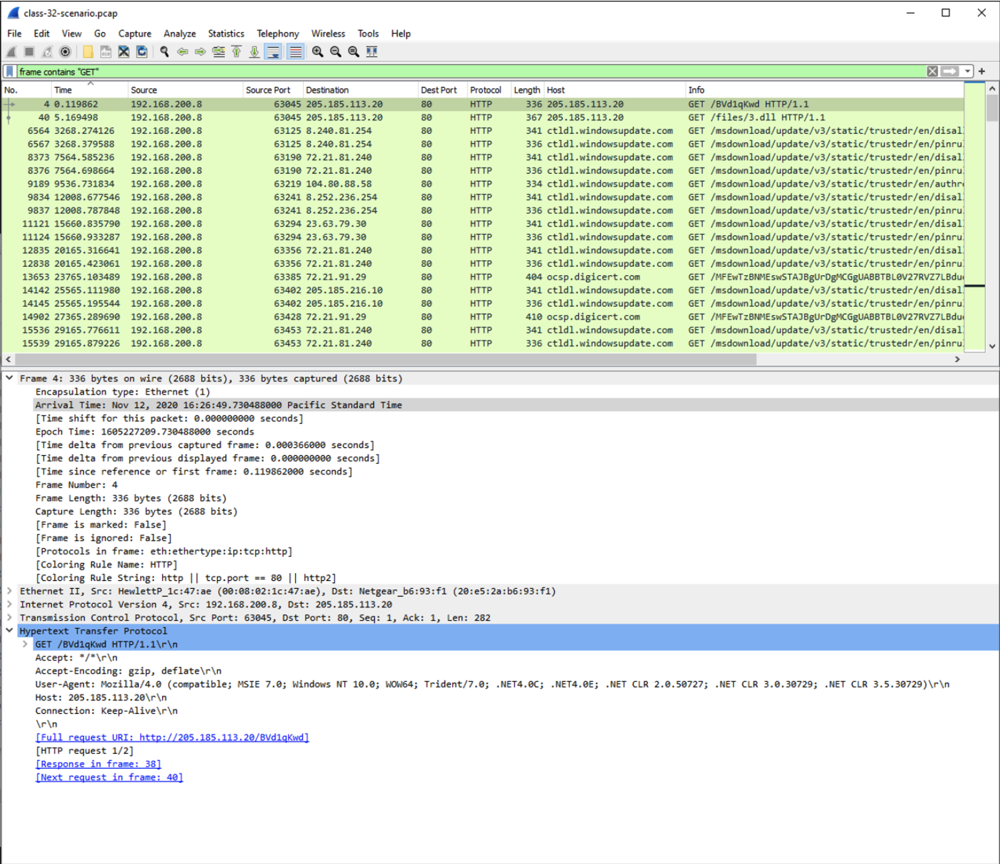

### Lab: Malware Traffic Analysis with Wireshark

#### Overview

Malware analysts use sandboxed lab environments to study malware behavior. You need not be a dedicated malware researcher to be tasked with the same; oftentimes post-incident activities necessitate an investigation activity in which you scrutinize all minutiae of evidence in an effort to better prepare for next time.

“In June 2017, there were 1,726 job postings for malware analysts for which only 52 candidates applied. This is because malware analysis is an arduous process, requiring a wealth of knowledge, a lot of patience, and, occasionally, disruptive thinking.” -Toolbox.com

#### Objectives

- Download a set of data from a scenario
- Analyze the data to determine what took place
- Write an incident report

#### Resources

This lab requires FLARE VM on an isolated subnet. Review the below articles to brush up on your Wireshark skills for this lab.

- [Wireshark Tutorial: Changing Your Column Display](https://unit42.paloaltonetworks.com/unit42-customizing-wireshark-changing-column-display/)
- [Wireshark Tutorial: Identifying Hosts and Users](https://unit42.paloaltonetworks.com/using-wireshark-identifying-hosts-and-users/)
- [Wireshark Tutorial: Display Filter Expressions](https://unit42.paloaltonetworks.com/using-wireshark-display-filter-expressions/)
- [Wireshark Tutorial: Exporting Objects from a Pcap](https://unit42.paloaltonetworks.com/using-wireshark-exporting-objects-from-a-pcap/)
- [Wireshark Cheat Sheet](https://cdn.comparitech.com/wp-content/uploads/2019/06/Wireshark-Cheat-Sheet-1.jpg)

#### Tasks

##### Part 1: Staging

Time to figure out what really took place based on the evidence we have available.

- Disable Windows Defender Antivirus in FLARE VM
  - Virus & threat protection > Manage settings > Real-time protection > Off
- Open the evidence package named “class-32-traffic.7z” on your FLARE VM desktop using password “malwareinside” to open.
  WARNING: Part of this package contains live malware. Ensure that you download this into a sandboxed VM that is isolated from the host PC and the rest of your network. You have been warned.
  - NAT Network so you have internet access OR you can leave network adapters unattached but you will not have internet access.

Taking a snapshot of the VM:

Some modifications to the staging and default display of the pcap table in wireshark that provide more insight into the information provided in the lab.  Setting column preferences and ordering to show source and destination ports and IP addressess and protocols:

##### Part 2: Malware Traffic Analysis

Refer to this information about the environment:

- LAN segment range: 192.168.200.0/24 (192.168.200.0 through 192.168.200.255)
- Domain: quiethub.net
- Domain controller: 192.168.200.8 - Quiethub-DC
- LAN segment gateway: 192.168.200.1
- LAN segment broadcast address: 192.168.200.255

Evaluate the evidence; use the tools you’ve learned thus far to piece together the details of what took place. In order to complete this lab, you’ll need to use critical thinking and careful analysis to reconstruct the events that took place.
- Open the packet capture file in Wireshark.
- Open the alerts.txt file
- Now start digging...
- Notice that local environment info for the Flare VM and we can see that the IP 25.185.113.20 is a rogue connection!  An external connection.

Forensic analysis of data files can be tedious, dry, tiresome, and even frustrating! If you ever get stuck, start with the most obvious signals and let those clues guide your next steps. Ask yourself: “Did the evidence lead me here?” If the answer is no, go back to the beginning and rethink your approach.

Screenshots of some of the staging and analysis steps:

class-32-scenario.pcap > search `ip.addr==192.168.200.0/24` > statistics > protocol hierarchy

class-32-scenario.pcap > search `ip.addr==192.168.200.0/24` > statistics > protocol hierarchy > Hypertext Transfer Protocol > right click > apply filter > selected

Further modification steps:

##### Part 3: Reporting

Export the suspicious files from pcap:

**Run Powershell as admin**

`Get-FileHash C:\Users\labuser\3.dll -Algorithm SHA256`

Antivirus flagged so we manually shut 'er down:
`Set-MpPreference -DisableRealtimeMonitoring $true`

Run the hash grabber again (3.dll):
3.dll Hash: DDCF95D87542F2DF67AFF8941FCD92C71CC704698B00923791E21285F82BB01A
`Get-FileHash C:\Users\labuser\3.dll -Algorithm SHA256`

3.dll VirusTotal

Run the hash grabber again (winnit.exe):
winnit.exe Hash: 7801B75F545C24CF7FBA8E98DC4505D21C1A11FD228D04685F714D2A0BEF83F0
`Get-FileHash C:\Users\labuser\winnit.exe -Algorithm SHA256`

winnit.exe VirusTotal

**Now that we have the hashes and the virusTotal handled we can turn antivirus back on in powerShell: `Set-MpPreference -DisableRealtimeMonitoring $false`**

Digging through the search for `ip.addr==205.185.113.20` we find the following:

Digging through `frame contains "GET"` we find the following:
We could also search for `http.request.uri contains "3.dll"`

This leads us to the GET /files/3.dll HTTP/1.1 request:

And we right click > follow > TCP Stream to find the following:

Repeat the above for winnit.exe and we find the following:
Search for `http.request.uri contains "winnit.exe"`

Write an incident report based on your findings. Include the following components:

- Executive Summary: Include when, who, and what happened.
- Details: Include details of the victim such as hostname, IP address, MAC address, Windows user account name.
- Indicators of Compromise (IOCs): Include SHA256 hashes and details of the malware and/or artifacts, IP addresses, domains and URLs associated with the infection.

Take care not to accidentally transmit malware. All artifacts should remain on your FLARE VM.

### Incident Report

#### Executive Summary:

On the evening of February 20, 2024, our network defenses spotted a security hiccup. Specifically, at 6:00 PM, two files with a not-so-friendly vibe, ‘3.dll’ and ‘wininit.exe’, were downloaded onto our system. These files came from two separate IP addresses, which is a red flag in our digital world. I put on my detective hat and used Wireshark to confirm this wasn't just a random event but a legit breach. The culprits? IP addresses ‘205.185.113.20’ and ‘185.141.24.71’.

#### Detailed Findings:

**Infected Files and Their Hashes:**

- ‘3.dll’ with SHA256 hash: ‘DDCF9D587542FDF67AFF8941FCD92C17CC0469B8800923791E21285F82B80B1A’.
- ‘Wininit.exe’ with SHA256 hash: ‘7801B75F545C24C7FFBA8E98CD405520D1C11A1FD2280D4685F714D2A08EF83F0’.

**Download Source:**

- ‘3.dll’ was downloaded from ‘205.185.113.20’.
- ‘Wininit.exe’ was downloaded from ‘185.141.24.71’.

**Network Transactions:**

- GET request for ‘3.dll’ indicated a successful file transfer from a server running ‘nginx’.
- GET request for ‘wininit.exe’ also showed a successful transfer, confirming the download from the noted IP.

**Indicators of Compromise (IOCs):**

**IP Addresses:**

- Infected machine: ‘192.168.200.8’.
- Malicious external server for ‘3.dll’: ‘205.185.113.20’.
- Malicious external server for ‘wininit.exe’: ‘185.141.24.71’.

**File Hashes:**

- ‘3.dll’: ‘DDCF9D587542FDF67AFF8941FCD92C17CC0469B8800923791E21285F82B80B1A’.
- ‘Wininit.exe’: ‘7801B75F545C24C7FFBA8E98CD405520D1C11A1FD2280D4685F714D2A08EF83F0’.

#### Recommendations:

1. We need to jump into action and kick these malicious files off our system, pronto.
2. Let's give our entire network a thorough scan to hunt for any other signs of this digital intruder.
3. It's time to beef up our security game. This means updating our firewall rules to block these shady IPs and domains.
4. Let's crank up our monitoring and logging to catch any oddball activity that might hint at a compromised system.

#### Summary:

In a nutshell, we caught a security issue where known malicious files dropped in from a suspicious IP address. Our analysis pinpointed the file ‘3.dll’ coming from ‘205.185.113.20’, with our own machine's IP at ‘192.168.200.8’ being the target. We've already taken steps to manage this threat, but we're also looking at beefing up our defenses to stay a step ahead of these digital troublemakers. The investigation is ongoing to fully scope out this breach and check for any other systems or data that might have been affected.
