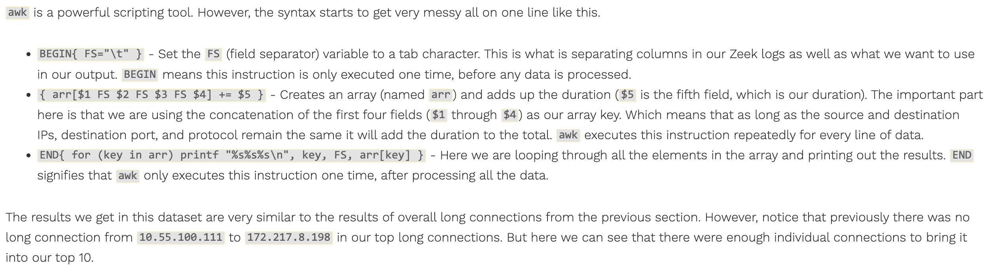
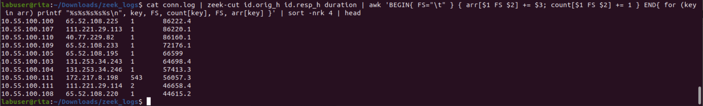

### Lab: Threat Hunting with Zeek, RITA

#### Overview

Many organizations now employ security teams that proactively search for cyber threats on the company network. We can use the capabilities of tools like RITA to actively hunt for threats in our systems.

#### Objectives

- Complete all four of the Active Countermeasures Threat Hunting Labs: [Active Countermeasures Threat Hunting Labs](https://activecm.github.io/threat-hunting-labs/)

#### Resources

- [Rita VM](https://codefellows.github.io/ops-401-cybersecurity-guide/curriculum/#downloads-table)
- [Active Countermeasures Threat Hunting Labs](https://activecm.github.io/threat-hunting-labs/)
- [Analyzing pcap files](https://tshark.dev/analyze/packet_hunting/packet_hunting/)
- [A guide to using tshark](https://linuxhint.com/wireshark-command-line-interface-tshark/)

#### Tasks

##### Part 1: Staging

The lab today utilizes the following tools:

- Wireshark
- tshark
- Zeek
- Rita
- LibreOffice Calc

Use the Rita VM provided which already has Zeek and Rita installed for you.

[Active CounterMeasures Exercises: Long Connections](https://activecm.github.io/threat-hunting-labs/long_connections/)

### WireShark

- To determine how long a connection stays open, we first need to define what constitutes the start or end of a connection.
- For TCP, a typical connection starts with a **3-way handshake (SYN, SYN/ACK, ACK) and ends with a 4-way handshake (FIN, ACK, FIN, ACK)**
- This means that it is easy to tell when a TCP connection starts and ends. However, stateless protocols (namely UDP) do not have the same property. There is no official opening to a UDP connection, and the term “connection” can be tricky to apply to UDP at all. What firewalls and most packet analysis tools do is define a time window (typically 30-60 seconds) during which UDP packets using the same IPs and port numbers are considered part of the same “session”. Each time a new packet is seen the session window TCPtimer is reset. This means that a session is considered started when the first UDP packet is seen and ended when no more UDP packets have been seen for the duration of the time window. The terms “session” and “connection” are often used interchangeably.
- The following information must remain the same across packets to be considered part of the same session. Though the IP and ports will swap between source and destination depending on which direction the packet is going. * source and destination IP addresses * source and destination ports * protocol
- Collectively, these pieces of information are commonly referred to as a 5-tuple and used to distinguish individual sessions.

Longest TCP Conversations

- From here you can see which TCP connections were held open for the longest. In the image above we have a connection from 10.55.100.100 to 65.52.108.255 on port 443 (HTTPS) that was open for 86,222 seconds, or 23.95 hours. This is a very long time for a TCP connection to be open and is likely indicative of a problem. It is possible that the connection was held open by a misconfigured firewall or a piece of malware.

Longest UDP Conversations

- Here we have a UDP packets from 192.168.88.2 to 216.299.4.69 on port 123 (NTP) for a duration of 86,217 seconds, or 23.95 hours.
- However, recall the discussion above about how UDP does not have real “start” and “end” times. Some tools will use a time window to determine when a UDP connection ends. We can see that Wireshark most likely does not do this by looking at the second entry. If you take the total duration (86,209) and divide it by the total number of packets sent (6) we see that there was on average a delay of 14,368 seconds (or about 4 hours) between packets. A time window that broad is useless and it is safe to assume that Wireshark is showing us “conversations” with data from the entire timespan of the packet capture.

### Zeek

Filepath: labuser@rita:~/Downloads
- `mkdir zeek_logs` > cd zeek_logs
- `mv ../sample-200.pcap .`; repeat for all pcap files
  - 

- now run `zeek -r sample-200.pcap`
  - This can take some time so chill, maybe grab a drink or get a little movement in.
- confirm the new logs have been created with `ls`
  - 

- ensuring you are in the zeek_logs directory > `head conn.log`
  - 
  - Not that the readability is quite poor

- clean up the output with `head conn.log | zeek-cut -c id.orig_h id.orig_p id.resp_h id.resp_p proto service duration`
  - 
  - A little better but it only processes the first few lines of the file.  Use `cat` instead of `head` to process the entire file.

- `cat conn.log | zeek-cut -c id.orig_h id.orig_p id.resp_h id.resp_p proto service duration`
  - 
  - next we will sort it out

- `cat conn.log | zeek-cut id.orig_h id.orig_p id.resp_h id.resp_p proto service duration | sort -nrk 7 | head`
  - 
  - This is a much better output.  We can see the longest connections and the services they are using.
  - however, I seem to be getting mac addresses and not IP addressess and such...hmmmm.  The proper command that will return ip addresses...

- Fix the output: `cat conn.log | zeek-cut id.orig_h id.orig_p id.resp_h id.resp_p proto service duration | sort -n -r -k 7 | head`
  - 
  - This is much better.  We can see the longest connections and the services they are using.

- We are piping the contents of `conn.log` into `zeek-cut` which is reducing the number of fields to only show the ones we care about. Next we are using `sort` to sort the lines by the duration. And finally we are using `head` to only show us the top 10 entries.
- From here you can see which TCP connections were held open for the longest. In the output above we have a connection from 10.55.100.100 to 65.52.108.255 on port 443 that was open for 86,222 seconds, or 23.95 hours.
- Note that the conn.log shows connections for TCP, UDP, and ICMP all in the same file. So the above command is giving us the longest connections across all these protocols. If we wanted to filter out and see only the longest UDP connection, we use `grep` before the `sort`.
- `cat conn.log | zeek-cut id.orig_h id.orig_p id.resp_h id.resp_p proto service duration | grep udp | sort -nrk 7 | head`
  - 

**cummulative long connections**

**`cat conn.log | zeek-cut id.orig_h id.resp_h id.resp_p proto duration | awk 'BEGIN{ FS="\t" } { arr[$1 FS $2 FS $3 FS $4] += $5 } END{ for (key in arr) printf "%s%s%s\n", key, FS, arr[key] }' | sort -nrk 5 | head`**
- What does this command do?
  - `cat conn.log` - This command reads the contents of the conn.log file and sends it to the standard output.
  - `zeek-cut id.orig_h id.resp_h id.resp_p proto duration` - This command reduces the number of fields in the conn.log file to only show the ones we care about.
  - `awk 'BEGIN{ FS="\t" } { arr[$1 FS $2 FS $3 FS $4] += $5 } END{ for (key in arr) printf "%s%s%s\n", key, FS, arr[key] }'` - This command uses the awk programming language to sum the duration of all connections that have the same source IP, destination IP, destination port, and protocol. It then prints the source IP, destination IP, destination port, protocol, and the sum of the duration.
  - `sort -nrk 5` - This command sorts the output of the previous command by the duration in descending order.
  - `head` - This command shows us the top 10 entries.
- 
- 

- Modifying the command to remove protocols and ports:
  - `cat conn.log | zeek-cut id.orig_h id.resp_h duration | awk 'BEGIN{ FS="\t" } { arr[$1 FS $2] += $3; count[$1 FS $2] += 1 } END{ for (key in arr) printf "%s%s%s%s%s\n", key, FS, count[key], FS, arr[key] }' | sort -nrk 4 | head`
  _ Cummulative long connections w/o ports and protocols
  - 

### Rita

**`rita import zeek_logs demo`**

**`rita show-beacons demo`**

- Prints hosts that show signs of beaconing behavior.

**`rita show-exploded-dns demo`**

- Prints DNS queries and responses.

**`rita show-long-connections demo`**

- Prints long connections.

**`rita show-strobes demo`**

- Prints hosts that show signs of strobe behavior.

**`rita show-useragents demo`**

- Prints user agents.

**`rita --help`**
- 
- This command will show you all the options available to you when using Rita.

**`rita show-long-connections -H --limit 10 sample`**

**`rita html-report demo`**

- This command will generate an HTML report of the data in the demo database.
**Beacons**

**Long Connections**

**User Agents**

### Beacons

Open sample-500.pcap in Wireshark
- ip.src==192.168.88.2&&ip.dst==165.227.88.15
- right click anywhere > Column Preferences > Add new > Time Delta, Custom, frame.time_delta_displayed

**Tshark: The command line equivalent of Wireshark.**  We can use it to process pcaps and pull out different fields using its protocol dissectors. This is useful if we want to use other tools to manipulate the data. [ActiveCM GitHub Pages](https://activecm.github.io/threat-hunting-labs/long_connections/.)

`sudo apt install tshark`

`tshark -r sample-500.pcap -T fields -e ip.src -e ip.dst -e udp.dstport -e frame.time_delta_displayed 'ip.src==192.168.88.2 && ip.dst==165.227.88.15' | head -25`

**the arguments**

**Install LibreOffice Calc via the terminal**
- `sudo apt install libreoffice-calc`
  - export the data from Rita and use LibreOffice Calc to organize and analyze it.
  - `tshark -r sample-500.pcap -T fields -E separator=, -e ip.len -e frame.time_delta_displayed 'ip.src==192.168.88.2 && ip.dst==165.227.88.15' > sample-500.csv`
  - build a table of data points from the exported .csv file
    - 

**Rita stuff**
`rita show-beacons sample | head`

`rita show-beacons sample > sample.csv`

##### Part 2: Active Countermeasures Labs

Complete all four of the Active Countermeasures Threat Hunting Labs.
Take notes as you work through the AC lab segments. Document your experiences in your submission today.

NOTE: The large pcap files from the labs may cause Wireshark to crash, if this occurs, perform the exercise using tshark.