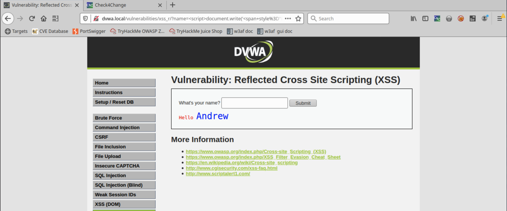
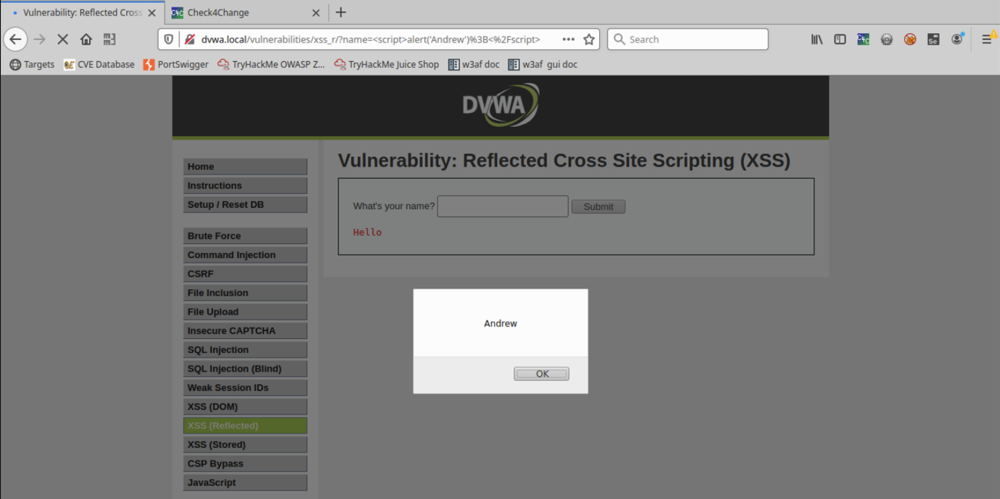
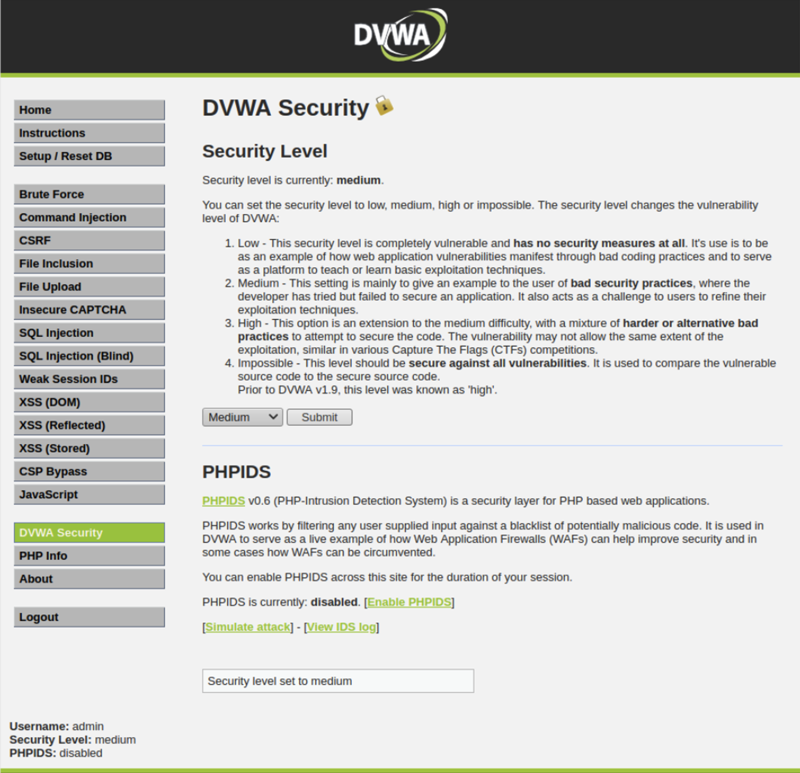

# Lab: XSS with w3af, DVWA

## Overview

XSS allows attackers to execute scripts in the victim’s browser which can hijack user sessions, deface web sites, or redirect the user to malicious sites. Web Security Dojo allows us study XSS in action, then learn how web application vulnerability analysis can be automated using the open source scanning tool, w3af, to detect vulnerabilities like XSS.

> In 2019, 75% of large companies in Europe and North America were hit by XSS attacks. In the same year, XSS attacks comprised a whopping 40% of all cyber attacks! Turns out injecting malicious code into a web site is a favored attack technique by cyber criminals. We'd better learn a thing or two about it! (Source: [Fudzilla](https://www.fudzilla.com/news/50014-cross-site-scripting-xss-were-a-huge-chunk-of-2019-cyber-attacks){:target="_blank"})

## Objectives

- Practice the XSS (Reflected) lab in DVWA
- Use w3af to scan a separate web app for vulnerabilities and document them

## Resources

- [Web Security Dojo VM OVA 5.82 GB Download](https://codefellows.github.io/ops-401-cybersecurity-guide/curriculum/#downloads-table){:target="_blank"}
- [W3AF](https://w3af.org/){:target="_blank"}
- [Tips for Creating a Strong Vulnerability Assessment Report](https://blog.rsisecurity.com/tips-for-creating-a-strong-vulnerability-assessment-report/){:target="_blank"}

## Tasks

### Part 1: Staging

This lab requires Web Security Dojo OVA.

### Part 2: XSS on DVWA

Login to DVWA as the administrator. For each successful outcome achieved, include the string you typed into the field and a screenshot of the outcome.
- admin / password

- Set DVWA Security to "Low"

- Perform the following XSS (Reflected) exploits:
  - Have the site return your name as a larger font
  - ``
  - 

  - Have the site return your name in a different color
  - ``
  - 

  - Have the site return your name in a popup box
  - ``
  - 

- Set DVWA Security to "Medium"
- 

- Perform the following XSS (Reflected) exploits:
  - Have the site return your name in a popup box
  - ``
  - `&lt;script&gt;alert(&#39;Andrew&#39;);&lt;/script&gt;`
  - 

  - ``
  - 
  - 

    > Hint: How do you think the site is detecting your script command? Perhaps its defenses are not as "sensitive" as they seem! *well, it seems like there is some kind of input validation runnning in the code.  Enough to strip the script tags rendering the alert ineffective.*

  - Have the site return the session cookie in a popup box
  - ``
  - 

    > Hint: How did you get a popup box to appear last time?

If you are pursuing the stretch goal, set DVWA Security to "High" and try to get an alert popup in XSS (Reflected).
- `<svg/onload=alert('Andrew')>`
- 

### Part 3: Evaluating InsecureWebApp with w3af

In this next part we will scan InsecureWebApp with w3af.

- Launch w3af (GUI version)
- Scan <http://insecure.local:8080/insecure/public/Login.jsp>
  - *As usual the lab instructions are vague trash.  The initial scan of http://insecure.local:8080/insecure/public/Login.jsp returned nothing because EVEN THOUGH A BLUE CHECKBOX WAS CLEARLY MARKED DIFFERENT FROM THE UNCHECKED BOXES THERE WAS NO INSTRUCTION IN THIS LAB TO ACTUALLY CHECK THAT BOX.*
  - **You must check the box CRAWL.  You must check the box for OUTPUT > CONSOLE.**

- Include a screenshot of the rendered response of the XSS vulnerability as discovered in w3af GUI that is associated with the "Forgot Login" page
  - **Where is this supposed to be?**

- Include a screenshot of the results of the web crawler.
  - 
  - 
  - 
  - 

- After like 6 times running this super slow scan and not being able to replicate the results of my classmates I finally got the "expected output" so to speak.  Expected in that it sort of matches what others got.
- 
- 

For the discovered XSS vulnerability, document in your submission:

### Vulnerability 1: Web Backdoor (cmd.jsp)
- **Name of the vulnerability**: Web Backdoor (cmd.jsp)
- **Date of the discovery**: March 2, 2024
- **Score based on CVE databases**: N/A
- **Detailed Description of the Vulnerability**: This vulnerability involves the discovery of a web backdoor named "cmd.jsp" on the server. A backdoor allows unauthorized access to the server, potentially leading to various malicious activities such as executing arbitrary commands.
- **Detailed Description of the Affected Systems**: The affected system is the web server hosting the vulnerable application. Any data or services hosted on this server could be at risk of compromise.
- **Process to Correct the Vulnerability**:
  1. Remove the backdoor file "cmd.jsp" from the server immediately.
  2. Conduct a thorough security audit to identify any other signs of compromise.
  3. Patch and update the server software to the latest version to mitigate the vulnerability.
  4. Implement strong access controls and monitoring mechanisms to prevent future unauthorized access.
  5. Educate users and administrators about best practices for maintaining server security.

### Vulnerability 2: Web Backdoor (cmd.jspx)
- **Name of the vulnerability**: Web Backdoor (cmd.jspx)
- **Date of the discovery**: March 2, 2024
- **Score based on CVE databases**: N/A
- **Detailed Description of the Vulnerability**: Similar to the first vulnerability, this involves the discovery of a web backdoor named "cmd.jspx" on the server. This backdoor also allows unauthorized access to the server, potentially leading to various malicious activities.
- **Detailed Description of the Affected Systems**: The affected system is the same web server hosting the vulnerable application. Any data or services hosted on this server could be at risk of compromise.
- **Process to Correct the Vulnerability**: 
  1. Remove the backdoor file "cmd.jspx" from the server immediately.
  2. Conduct a thorough security audit to identify any other signs of compromise.
  3. Patch and update the server software to the latest version to mitigate the vulnerability.
  4. Implement strong access controls and monitoring mechanisms to prevent future unauthorized access.
  5. Educate users and administrators about best practices for maintaining server security.

### Vulnerability 3: Content Negotiation Disabled
- **Name of the vulnerability**: Content Negotiation Disabled
- **Date of the discovery**: March 2, 2024
- **Score based on CVE databases**: N/A
- **Detailed Description of the Vulnerability**: The remote web server has content negotiation disabled. Content negotiation allows the server to serve different versions of a resource based on the client's preferences. Disabling it may lead to security vulnerabilities such as information disclosure or denial of service.
- **Detailed Description of the Affected Systems**: The affected system is the web server hosting the vulnerable application. Disabling content negotiation may impact the server's ability to serve content securely and correctly.
- **Process to Correct the Vulnerability**:
  1. Enable content negotiation on the web server to allow it to properly handle requests for different content types.
  2. Review and update the server's security configuration to ensure that content negotiation is enabled securely.
  3. Test the server's configuration thoroughly to ensure that content negotiation is functioning correctly and securely.
  4. Implement regular maintenance and monitoring of the server to detect and address any configuration changes or issues that may impact security.

### Part 4: Reporting

Answer the below prompts in your own words:

- **What is XSS, and why is it a security threat?**
  XSS, or Cross-Site Scripting, is a type of security vulnerability found in web applications. It occurs when attackers inject malicious scripts into web pages viewed by other users. These scripts can execute in the context of the victim's browser, allowing attackers to steal information, manipulate content, or perform other malicious actions. XSS is a significant security threat because it can lead to unauthorized access, data theft, and compromise of sensitive information.

- **What is a session cookie?**
  A session cookie is a small piece of data stored on the client-side (usually in the user's browser) by a web server. It is used to maintain session state and track a user's activity on a website during a browsing session. Session cookies typically contain a unique identifier that allows the server to recognize and associate the user with their session data.

- **How can a session cookie be abused by an attacker?**
  A session cookie can be abused by an attacker through various methods such as session hijacking or session fixation. In session hijacking, the attacker steals a user's session cookie, allowing them to impersonate the user and gain unauthorized access to the user's account or sensitive information. In session fixation, the attacker sets a known session ID in the user's browser, enabling them to predict the session ID and hijack the session once the user logs in. Additionally, if session cookies are not properly secured or encrypted, they can be intercepted and manipulated by attackers through techniques like packet sniffing or man-in-the-middle attacks.

### Stretch Goal (Optional Objectives)

- Complete DVWA XSS (Reflected) on "High" security mode.
- Execute the XSS vulnerability on InsecureWebApp.
  - Include in your submission the POC (proof of concept) of the vulnerability for the InsecureWebApp