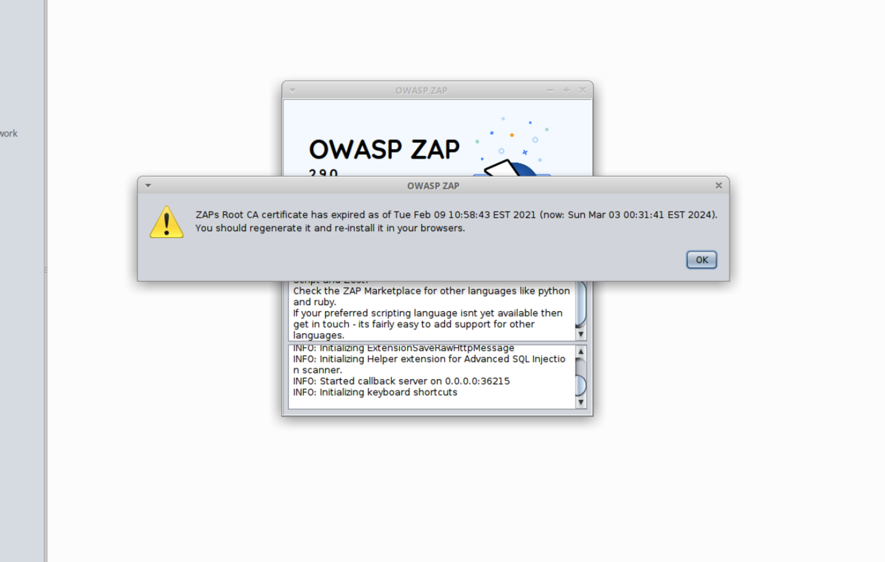
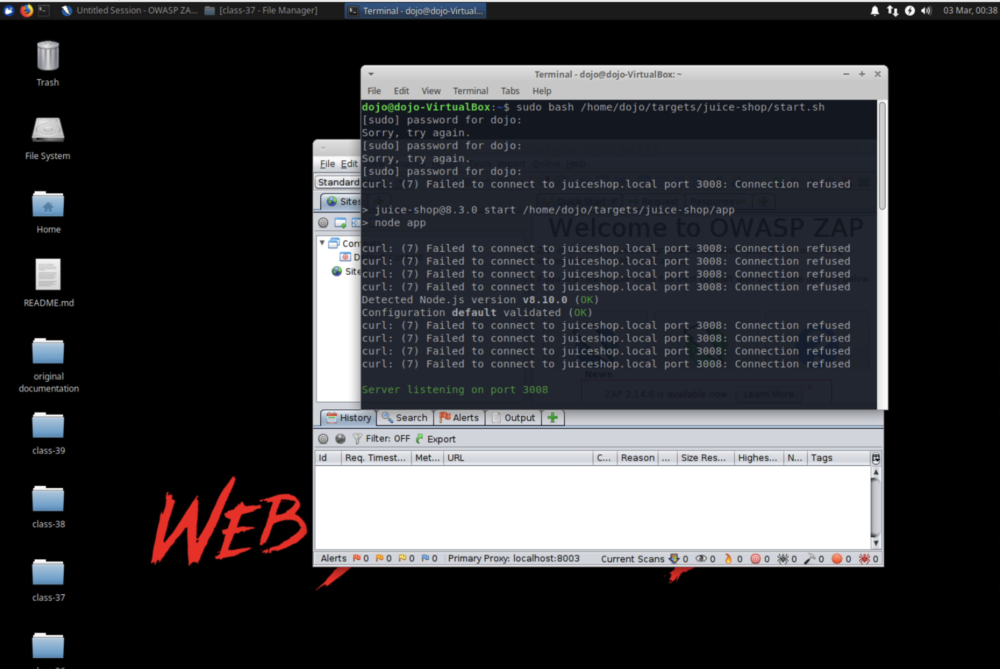
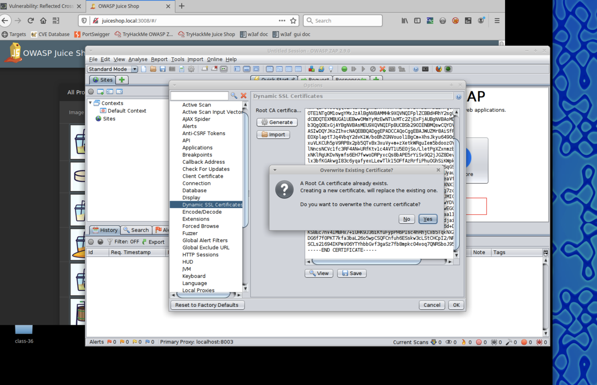
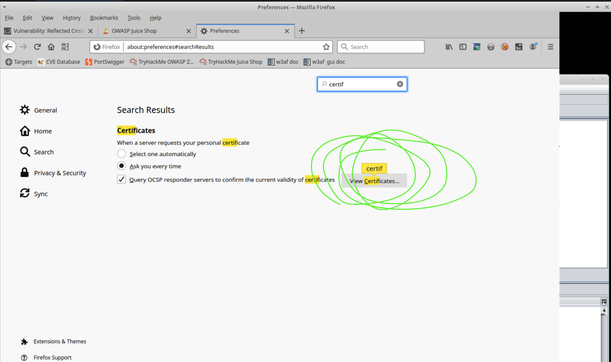
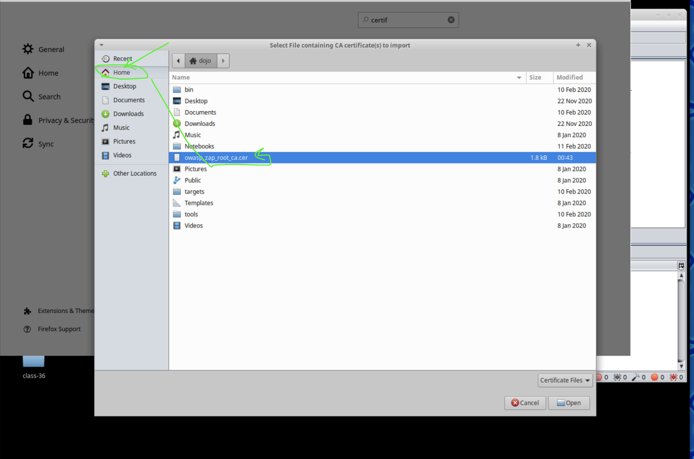
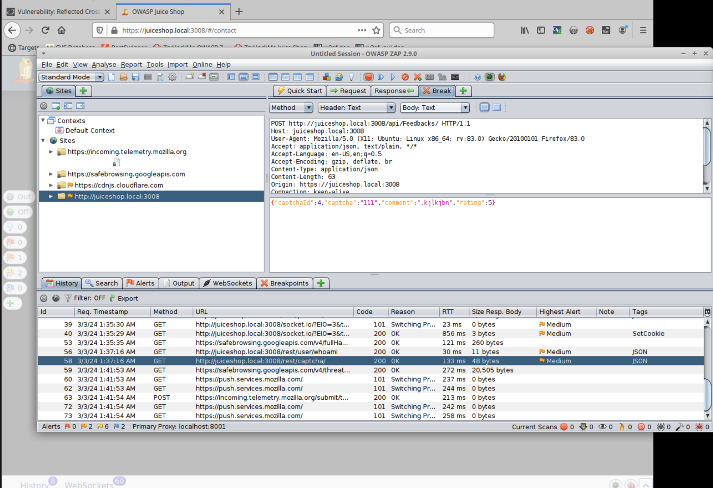

### Lab: Automated AppSec with OWASP ZAP

#### Overview:

The Zed Attack Proxy (ZAP) is an open-source web app pentesting tool that can act as a powerful intermediary between your browser and the target web server.

Today you’ll practice using OWASP ZAP against the DVWA by performing the following operations:

- Automated Scan
- Directory Bruteforce
- Authenticated Scan
- Login Page Bruteforce
- Install ZAP Extensions

#### Objectives:

Complete TryHackMe’s tasks 4-10 using the Web Security Dojo.

#### Resources:

- [ZAP Documentation](https://www.zaproxy.org/docs/)
- [TryHackMe Introduction to OWASP ZAP](https://tryhackme.com/room/learnowaspzap)
- [Bugcrowd HUNT GitHub repo](https://github.com/bugcrowd/HUNT)

#### Tasks:

##### Part 1: Staging

This lab requires Web Security Dojo VM.

##### Part 2: Test DVWA using ZAP

For this part of the lab, access [TryHackMe Introduction to OWASP ZAP.](https://tryhackme.com/room/learnowaspzap)

**fire up the following in terminal on class-36-39-security-dojo: `sudo bash /home/dojo/targets/juice-shop/start.sh` with credentials dojo / dojo**

dojo IP: 10.0.2.23/24 the vm keeps dropping the connection and getting a new ip address

- Complete TryHackMe’s tasks 4-10 using the Web Security Dojo. Document the things you learn in your submission for the day.
  - Tasks 1-3: These are not necessary since we’re using Web Security Dojo. Skip these steps.
  - Task 4: AJAX Spider is already installed in ZAP. Run AJAX Spider in conjunction with the original spider to perform a crawl of DVWA. Paste your AJAX Spider scan output in your submission.

  - Task 5: Configure ZAP as a proxy server in your browser (typically Firefox).
    - Describe the steps taken to establish proxy connectivity.
    - 
    - 
    - 

    **OR** *you can use the Foxy Proxy extension in Firefox to make this easier.*
    - 
    - 
    
    - Include a screenshot of the traffic updating in ZAP as you are navigating via a proxied Firefox window.
    - 
    - 
    - 
    - 
    - 
    - 

    - **Finally getting a scan to run.  http://dvwa.local/:
    - 
    - 

    - Scan DVWA login page and include a screenshot of the results.
    - 
    - 
    - 
    - 
    - 
    - 

  - Task 6: This time scan DVWA as an **authenticated user** admin / password and include a screenshot of the results.
    - How did you establish an authenticated session as ZAP?
    - **How do you scan DVWA like this?**  I logged in and ZAP does "things" but mine seems to be missing a 10th alert that other students got that is the **`dvwa.local brute`**.  I'm not sure what I did wrong.
  
  - Task 7: Brute force DVWA with a word list. Include the results.
  - Task 8: Use ZAP to bruteforce the DVWA ‘brute-force’ page. What’s the password?
  - Task 9: Install the [bugcrowd HUNT extensions for OWASP ZAP](https://github.com/bugcrowd/HUNT). Inlude a screenshot of the installed HUNT scripts.
  - Task 10: Bookmark the provided links as resources to continue your ZAP training in the future.

##### Part 3: Report Your Findings

Take stock of your findings and perform the following reporting tasks:

- Examine your findings. What are the most severe vulnerabilities present on the DVWA and why?
- Select an interesting vulnerability you’d like to research from the list of findings.
- Follow the [OWASP Vulnerability Template](https://owasp.org/www-community/vulnerabilities/Vulnerability_template), complete a comprehensive description of this vulnerability in your submission doc. You may wish to also include this in your public-facing GitHub repo.
