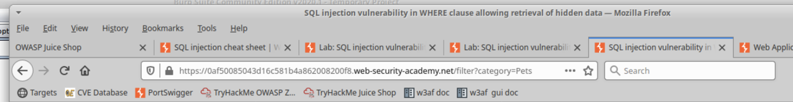

# Lab: SQLi with Burp Suite, Web Goat

## Overview
SQL injection is a prominent attack technique. By exploiting known deficiencies in web app code, an attacker can compromise the confidentiality of the attached database and manipulate the input to extract desirable information such as user names and passwords.

Today you will study SQL injection in action and complete various tasks and challenges using Burp Suite in Portswigger and OWASP Web Goat.

**Objectives:**
- Access Web Goat and complete the basic SQL lab
- Access [Portswigger Academy](https://portswigger.net/web-security/all-labs) and complete at least three of the SQL labs
- Answer the reporting prompts

**Resources:**
- [Portswigger Academy](https://portswigger.net/web-security/all-labs)
- [Juan Miguel Cano's Lab 39](https://docs.google.com/document/d/1H5qsL6m7Dhg2xJXMP3WfVvXlfR7BM9t4qcVLq6w1q_4/edit#heading=h.ga6ad1j324t2)
- Course Video
- ChatGPT

## Tasks

### Part 1: Staging
This lab requires Web Security Dojo VM with an internet connection (NAT mode is recommended).

### Part 2: OWASP Web Goat
OWASP Web Goat comes preinstalled on Web Security Dojo.
- Web Goat does not start automatically in Security Dojo. You'll need to start it manually from command line. Open a terminal in Security Dojo and enter `sudo bash /home/dojo/targets/bin/webgoat-ng-Start.sh` to initialize Web Goat.
- In Firefox browse to `http://webgoat.local:8081/WebGoat/` and **login as guest, password guest**. If you encounter an "Unable to connect" error in Firefox, it means either Web Goat did not initialize correctly or the address was incorrectly typed.
- On the left pane you'll see various topics to explore (if you do not, Web Goat did not initialize correctly and you'll need to `sudo reboot now` and try the above launch steps again). Navigate to Injection Flaws and complete the following sections:
  - String SQL Injection
  - LAB: SQL Injection
     - Stage 1: String SQL Injection
     - Stage 3: Numeric SQL Injection
- Turn on your proxy in your browser, and **make sure Intercept** is on in Burp Suite.
- If you get stuck, click "Show Hints" and click the arrow button repeatedly to view additional hints.
- Summarize what you did and learned in your submission.

Another lab that makes no sense to me.  Seriously.  These instructions and stuff are so bad.

Screenshots of the ambiguous route I took to get to the end of this section:

### Part 3: Portswigger
Portswigger is the company that created Burp Suite. They also happen to have a free training resource for web security students.

- Access [Portswigger Academy](https://portswigger.net/web-security/all-labs) and complete at least three of the SQL labs.
- Answer any questions/prompts in your submission doc, as well as explain the concept and what you did in each lab in detail.
- Clearly indicate why and how your solution works for the lab.

PortSwigger Screens:

### Part 4: Reporting
Answer the below questions in your own words:!

1. **What is SQL injection?**
   SQL injection is like a sneaky attack on a website's database. Imagine you have a form on a website where users can input information. If a hacker types in something clever in that form, like a snippet of SQL code, they can manipulate the website's database. This could allow them to view, modify, or delete data, which is bad news for the website owner and its users.

2. **How is SQL injection detected?**
   Think of it like a security guard for your website. One way to detect SQL injection is by checking the input fields on your website. If you notice strange characters or unexpected commands in the input, it could be a sign that someone is trying to pull off a SQL injection attack. There are also automated tools and software that can scan your website for vulnerabilities and flag any suspicious activity.

3. **How can a web app developer defend against SQL injection?**
   To stop SQL injection attacks, developers need to beef up their website's defenses. They can do this by using something called parameterized queries or prepared statements. It's like putting a lock on your database doors. By using these methods, the website can separate user input from SQL commands, making it much harder for hackers to sneak in malicious code. Regular security audits and keeping software up-to-date are also important to stay one step ahead of potential attacks.

### Stretch Goals (Optional Objectives)
Complete additional Web Goat and/or Portswigger labs.
