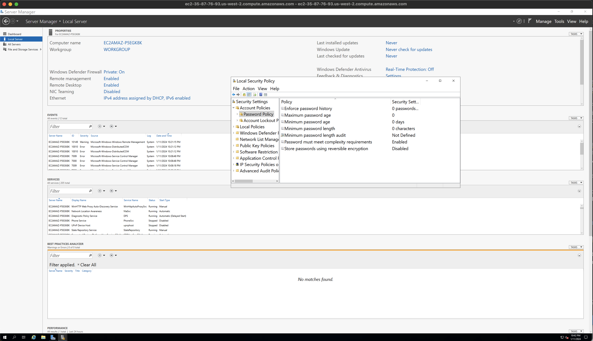
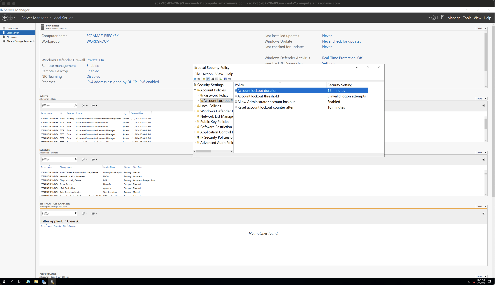
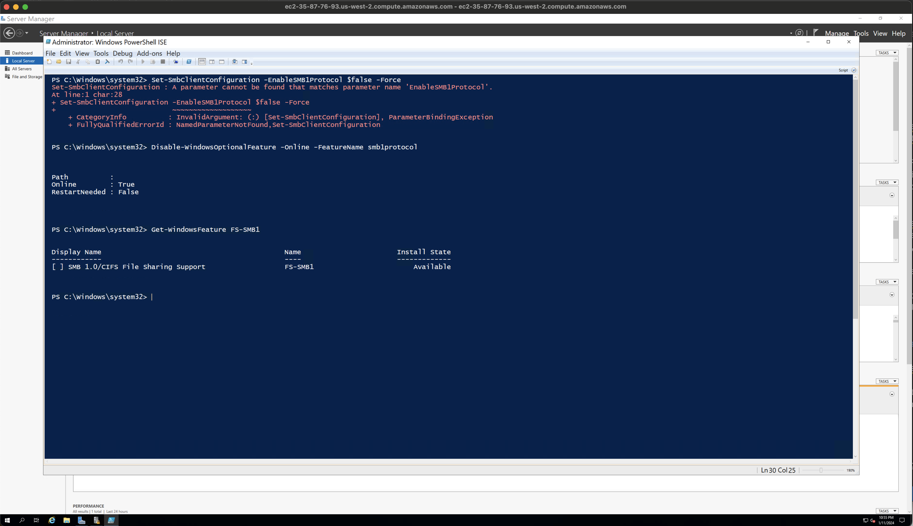
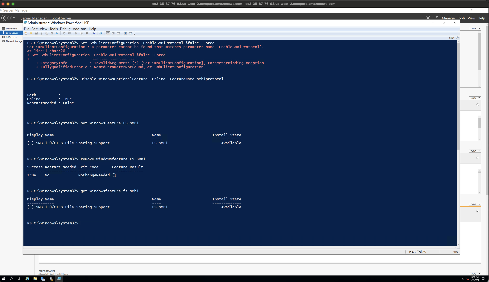
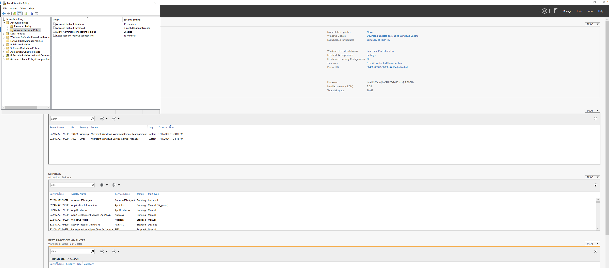

# Lab 4: Systems Hardening with CIS Standards

## Overview
IT and cybersecurity professionals use system hardening to reduce the number of vulnerabilities that malicious actors can exploit. Secure configuration of systems is one of many key strategies in helping a company mitigate cyber risk. The Center for Internet Security (CIS) provides useful standards that can be used to this end, as well as pre-made AMI systems for cloud users.

## Scenario
Thanks to your CSP analysis and recommendations, Initrobe selected a cloud IaaS provider and will be deploying instances to AWS EC2. First, however, the CTO asked you to review the configuration of the Windows Server AMI prior to deployment. “This is a key asset in our infrastructure,” the CTO writes. “The loss of this system to malware or intrusion would be devastating. Let’s make this one airtight!”

Your task today will be to explore various methods for preemptive systems hardening on AWS.

## Objectives
- On AWS, deploy Microsoft Windows Server 2019 Base as an EC2 instance
- Manually harden the OS using six benchmarks from its corresponding CIS systems hardening documentation
- Deploy a pre-configured CIS AMI of Microsoft Windows Server 2019, then test and verify the six benchmarks are also achieved using the pre-configured AMI
- Scan your environment for CIS compliance using AWS Security Hub

## Resources
- CIS benchmark list
- System Hardening Script

## Tasks
### Part 1: Staging
For this lab you’ll need an AWS account with free tier hours available.

1. Enable AWS Config.
2. Enable AWS Security Hub. Allow two hours for it to setup before use.
3. Windows Server 2019 Setup:
    - In the free tier of EC2, launch a new instance of Windows Server 2019.
    - In order to ensure you stay within the free tier, select t2.micro under instance type.
    - Establish remote connectivity to your new instance via RDP, this will require you give your instance an Elastic IP (public IP address)
    - Download the system-hardening.ps1 script to your Windows Server 2019 instance.
    - Use a chatbot to breakdown for you what the system-hardening.ps1 script is doing.
    - Disable Windows Defender and set the execution policy to allow the script to run using the following commands:
        ```
        Set-MpPreference -DisableRealtimeMonitoring $True
        Set-ExecutionPolicy Bypass -Force
        ```
    - Run PowerShell as administrator and navigate to the directory containing the system-hardening.ps1 script
    - Run the script with the `.\system-hardening.ps1` command
    - The script will run and restart your instance (you will lose connection)
    - The script will create an admin account with the following credentials:
        - Username: zuko
        - Password: R0cks!
    - RDP to your instance using these credentials and complete the lab

### Part 2: Manual EC2 instance hardening with CIS
Note: There are CIS-compliant AMIs that are prehardened, but for this part of the lab use regular AMIs.

- Select the following six benchmarks from your AMI’s benchmark document in the CIS Microsoft Windows Server 2019 Benchmark v2.0.0 and reconfigure your Windows Server instance, using the GUI via RDP, to achieve the standard indicated.
    
    - 1.1.5 (L1)
    - 1.1.6 (L1)

    
    - 1.2.1 (L1)
    - 1.2.2 (L1)

    
    - 18.4.3 (L1)
    - 18.4.4 (L1)


- Include a screenshot of each configuration change in your instance session, including a full description of the requirement as indicated in the CIS document.



### Part 3: Automating the Configuration
In some scenarios, you may need to harden an existing machine. Automating the process will save you a great deal of time in the long run.

- Reverse your configuration changes to:
    - 1.1.5 (L1)
    - 18.4.3 (L1)
- Write a PowerShell script that automates the configuration of the required settings:
    - 1.1.5 (L1)
    - 18.4.3 (L1)
- Test and validate it works as desired.
- Copy it to your public GitHub repo as a new entry. Link to it in your submission.

[Automation Script for 1.1.5 & 18.4.3](https://github.com/iAmAndrewCarroll/401ops/blob/main/lab/scripts/lab4.ps1)

### Part 4: Pre-hardened EC2 instance deployment
Now let’s compare this to a pre-hardened AMI.

- Deploy a pre-hardened AMI in AWS EC2. Ideally selected the hardened version of the OS you just worked on.
- Access the CIS standards and verify the six benchmarks are achieved on the hardened instance:
    - 1.1.5 (L1)
    - 1.1.6 (L1)

    
    - 1.2.1 (L1)
    - 1.2.2 (L1)


    - 18.4.3 (L1)
    - 18.4.4 (L1)


- Take a screenshot verifying each benchmark in your pre-hardened instance.
- Does the hardened instance achieve the security standard on deployment?

### Part 5: Scanning for CIS Benchmarks
Next, navigate to Security Hub and post the CIS dashboard in your submission doc.

- Both AMIs should be running.
- Wait for an automated CIS scan.
- Paste your findings (security score visual and output table) into your submission doc.
- Assess your findings. Make at least one change that improves the result of your CIS scan.
- Report on your efforts (assessment, action, result), and recommend an SOP for company usage of EC2.
- Note: There is no way to force Security Hub to run a scan. Security Hub runs the standard checks within 2 hours after enabled and checks again automatically within 12 hours from the latest scan.


### Part 6: Wrap-up
Stop AWS resources deployed today in order to avoid charges. We will, however, be using AWS Security Hub (and other AWS tools) again in this course.
