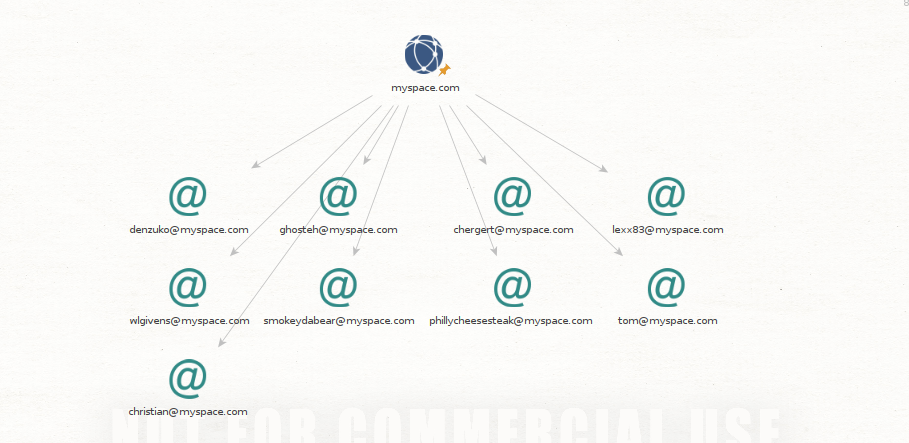

Lab: Reconnaissance with Maltego
================================

Overview
--------

This week, we’ll learn about all the stages of a penetration test. The first stage of a penetration test involves reconnaissance.

Today you will use reconnaissance techniques to gather information about your target with Maltego.

As described in the book [Permanent Record](https://www.google.com/url?q=https://www.amazon.com/Permanent-Record-Edward-Snowden/dp/1250237238/ref%3Dsr_1_2?crid%3D2SBI75SULSU7M%26dchild%3D1%26keywords%3Dpermanent%2Brecord%2Bedward%2Bsnowden%26qid%3D1606880873%26sprefix%3Dpermanent%2Brecord%2Bed%252Caps%252C201%26sr%3D8-2&sa=D&source=editors&ust=1710198239914441&usg=AOvVaw16E7UugCscb5vEr_Mwui_K) by Edward Snowden, the internet is like a vast database that maintains histories of our every activity, often unbeknownst to the everyday user. OSINT tools like Maltego can dig up a surprisingly vast amount of information by strictly querying public resources such as DNS servers and public APIs. What you are about to learn is incredibly powerful. Remember we have a duty to live up to the utmost ethical standards, so use this kind of power responsibly!

Objectives
----------

* Use various Maltego transformations to profile an APT group
* Use various Maltego transformations to profile a company

Resources
---------

* [Maltego Desktop Documentation](https://www.google.com/url?q=https://docs.maltego.com/support/solutions/articles/15000008831-home-page&sa=D&source=editors&ust=1710198239915971&usg=AOvVaw2oJTJ6lrpnFzVD5tVoSZxs)
* [Maltego Tutorials](https://www.google.com/url?q=https://www.maltego.com/maltego-essentials/&sa=D&source=editors&ust=1710198239916612&usg=AOvVaw2YWH4x4YFp0aCEonP4tHV2)
* [Beginner’s Guide to Maltego](https://www.google.com/url?q=https://wondersmithrae.medium.com/a-beginners-guide-to-osint-investigation-with-maltego-6b195f7245cc&sa=D&source=editors&ust=1710198239917302&usg=AOvVaw33_LhTpBfUgFfZGi1lfwYp)
* [Investigate TA505 Threat Actor Group Using Maltego](https://www.google.com/url?q=https://www.maltego.com/blog/investigate-ta505-threat-actor-group-using-maltego/&sa=D&source=editors&ust=1710198239917938&usg=AOvVaw18F7NQ0fCnNX9e8127NA5V)
* [Mandiant APT41 Threat Report](https://www.google.com/url?q=https://www.mandiant.com/sites/default/files/2022-02/rt-apt41-dual-operation.pdf&sa=D&source=editors&ust=1710198239918560&usg=AOvVaw1vRXEm4CgJyGkNGHm5dDrU)
* [VirusTotal](https://www.google.com/url?q=https://www.virustotal.com/&sa=D&source=editors&ust=1710198239919012&usg=AOvVaw3x1XnSenKByEQw5pWx2wM8)
* [Hybrid Analysis](https://www.google.com/url?q=https://www.hybrid-analysis.com/&sa=D&source=editors&ust=1710198239919412&usg=AOvVaw174m9rFajSPS83zxXroTOi)
* Labs completed by several peers

Tasks
-----

### Part 1: Staging

This lab requires a Kali VM.

If you have not yet done so, create accounts on the following sites in order to use their public APIs:

* [VirusTotal](https://www.google.com/url?q=https://www.virustotal.com/&sa=D&source=editors&ust=1710198239920392&usg=AOvVaw2_1fHVI_lJn4IgvCphmSgS)
* [Hybrid Analysis](https://www.google.com/url?q=https://www.hybrid-analysis.com/&sa=D&source=editors&ust=1710198239920941&usg=AOvVaw0HL5SUYIo2-1p-bDVst7_A)

Remember to keep your API keys a secret. A password manager can help you track all this.

### Part 2: Profiling an APT Group

While known for its investigatory powers, Maltego is not strictly an offensive pentesting tool. It can also be used to profile an APT in order for your organization to defend against that APT’s TTPs. Resources like [Fire Eye’s APT Group List](https://www.google.com/url?q=https://www.fireeye.com/current-threats/apt-groups.html&sa=D&source=editors&ust=1710198239922266&usg=AOvVaw1DQa9x1pMoVoC-GZ2Yw1I0) keep track of the most notorious active APTs. While you’re more likely to be hit by the everyday phishing scam than an international APT, you’ll want to know about these if you end up working for a major well-known enterprise.

* Download the threat report for APT41.
* 
* Generally speaking, what TTPs does APT41 use (e.g. “lateral movement”)?
* Targeting the same victim organization 31 days apart.
* Identify and discuss at least one signature TTP, hash, or domain used by APT41. How can this knowledge help us protect against APT41?
* HIGHNOON is a backdoor that may consist of multiple components.

“TA505 is a financially motivated threat group that has been active since at least 2014. The group is known for frequently changing malware and driving global trends in criminal malware distribution.” -MITRE ATT&CK®

Let’s start with investigating the TA505 threat actor group and see what we can do to protect our organization against them.

* Use VirusTotal transformations to identify IP addresses associated with the following domains:
* Filesharess[.]com
* 
* Live-en[.]com
* 
* See-back[.]com
* 
* Include a screenshot of the resulting graph in your submission.
* 
* What can your organization do to defend its networks and users against these known malicious IP addresses? Name at least one specific tool or system you’d use.
* We could try and block them or watch for incoming and outgoing traffic.

Next, let’s identify the hashes of known IOCs affiliated with these TA505 domains.

* Use Hybrid Analysis “Query Domain” transformation to identify the hashes and URLs of known IOCs associated with these malicious domains.

* Include this screenshot in your submission.
* Upload a hash to VirusTotal. Did this result in a positive?
* Why or why not might an IOC hash result in a positive on VirusTotal?
* What can your organization do to defend its networks and users against these known malicious artifacts? Name at least one specific tool or system you’d use.

Be careful not to accidentally browse to these malicious sites.

The Maltego transform, “To Snapshots [Wayback Machine],” can help you trace back the source of the threat.

* Execute To Snapshots [Wayback Machine] Transform against the three malicious domains and include screenshots of the results.

* What are these results?
* What do these results tell us about TA505?

### Part 3: Profiling a Company with Maltego Transforms and Machines

Maltego can be used to research a target organization to learn more about it in advance of an attack, such as a pentest.

* Identify the MX record associated with myspace.com.
* 
* What is an MX record, and how does it affect mail server traffic for the domain, myspace.com?
* 
* If we wanted to disrupt the company’s mail server traffic, how could this information be useful to us as an attacker performing recon?

DNS can tell us a lot about a company, if the WHOIS records are not obfuscated by the domain owner.

* Identify the email address(es) of the domain’s owner.
* Identify the phone number(s) of the domain’s owner.
* Where does the domain owner live? Include a screenshot of their Myspace page.
* How can this information be used by an attacker?

The “Machines” in Maltego perform automated investigations for us.

* Use the “Company Stalker” Machine against myspace.com.
* What was returned on the graph?
* Explain how Maltego was able to retrieve this information using the Company Stalker Machine. In other words, what does the Company Stalker Machine do?
* Pull up the Myspace page for one of the email addresses on the graph and include a screenshot of it (keep it work-appropriate!).

Next, let’s try to find associated web entities to myspace.com.

* Using Machines, perform a Level 1 Footprint against the domain, myspace.com.
* Include a screenshot of the results. What did this return?
* Identify the mail servers associated with myspace.com. How did Maltego determine this relationship? (Hint: How does the internet work?)
* Identify cities associated with the results. Why is Maltego displaying cities? (Hint: How does IP addressing work?)

### Part 4: Reporting

# Maltego Report: myspace.com Level 1 Footprint

## Overview

This report provides a comprehensive overview of the Level 1 Footprint for the domain myspace.com, generated through the use of Maltego's OSINT capabilities. The analysis includes identification of mail servers, associated web entities, and geographical locations related to the domain. The findings offer insights into the domain's infrastructure, potential vulnerabilities, and connections to other web entities.

## Objectives

- Identify mail servers associated with myspace.com.
- Discover web entities connected to myspace.com.
- Map out geographical locations related to identified IP addresses and domains.

## Methodology

The investigation utilized Maltego's Level 1 Footprint Machine, which automates the process of gathering publicly available information about a specific domain. This includes DNS records, WHOIS information, associated IP addresses, and other related data. The analysis focuses on uncovering the infrastructure and network-related details of myspace.com.

## Findings

### Mail Servers

- Identified MX records for myspace.com, which dictate the routing of email traffic to and from the domain. This information is crucial for understanding how email communications are managed and can highlight potential vectors for email-based attacks or phishing campaigns.

### Associated Web Entities

- The footprinting process revealed several web entities connected to myspace.com, including subdomains, related websites, and third-party services. These connections can provide additional targets for reconnaissance and potential exploitation.

### Geographical Locations

- Cities associated with the IP addresses and domains uncovered during the investigation were identified. This geographical data can offer context on the physical locations of servers and infrastructure, which may be relevant for legal considerations or in planning targeted cyber operations.

## Conclusions

The Level 1 Footprint of myspace.com has provided valuable insights into the domain's mail servers, associated web entities, and geographical associations. This information can be used to further understand the digital footprint of myspace.com, identify potential security weaknesses, and enhance cyber defense strategies.

## Recommendations

- Further analysis of the identified mail servers and associated web entities is recommended to assess potential vulnerabilities.
- Continuous monitoring of the domain's digital footprint should be conducted to identify any changes or new threats.
- Implementing defensive measures based on the geographical locations of servers could mitigate region-specific cyber threats.