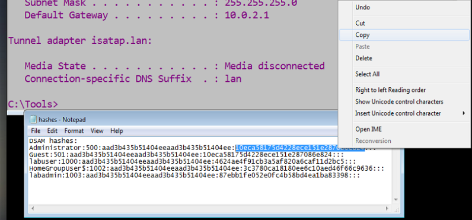

Lab: Pass the Hash with Mimikatz
================================

Overview
--------

Mimikatz is a common attack tool that leverages PowerShell code to perform nefarious operations.

Today, you will perform a “pass the hash” attack using Mimikatz.

The name “mimikatz” comes from the French slang “mimi,” which means cute; thus, “cute cats.”

Scenario
--------

It’s 2 am, and you’ve broken into your client company, Dubious Defenses LLC, as part of the agreed-upon full-scope pentest. Your reconnaissance efforts paid off; using tools like social media platforms, drive-by observations, search engines, and Maltego, you were able to determine the most opportune time to break in as well as useful information about all the employees. The rules of engagement are simple: Everything is fair game; just don’t disrupt the computer systems. You have gained access to the front receptionist’s computer and have managed to establish a foothold on this Windows 7 endpoint as a local administrator after some social engineering techniques were successfully applied. You want to continue taking over additional systems on the network and establishing administrator controls over them. You notice this network does not have a domain, even though it is mostly Windows OS. There’s no employees around at this time of night, so it’s going to be all technical skills from here on in. You’re wondering what tools and techniques are going to be most effective for taking over these kinds of systems? The accounting computer, “lab2,” looks to be a good next target.

Objectives
----------

* Use the hash of a local user on target1 to gain remote access to target2
* Same accounts on both sides with the same password
* Write a blog post about your experience. It doesn’t need to be published… but doing so is recommended.

Resources
---------

* [Pass the Hash Tutorial](https://www.google.com/url?q=https://cqureacademy.com/blog/identity-theft-protection/pass-hash-attack-tutorial&sa=D&source=editors&ust=1710195711616285&usg=AOvVaw1nQFiyFbeoBDs563ddDcVV)
* [5 Security Writing Tips to Know](https://www.google.com/url?q=https://www.articlecity.com/blog/what-is-content-writing-for-a-security-company-5-security-writing-tips-to-know/&sa=D&source=editors&ust=1710195711616693&usg=AOvVaw0vmGK6yr30RO1xzKmxgksX)
* Completed Labs by fellow students (Juan Cano, Wil Baur, Etc.)
* ChatGPT

Tasks
-----

### Part 1: Staging

You will need two target systems for this exercise.

* class-42-target1-win7.ova (credentials are labuser/labuser)
* class-42-target2-win7.ova (credentials are labuser/labuser)

Import both systems into a NAT Network on Virtualbox. Note that class-42-target1-win7 does contain the malware Mimikatz.

### Part 2: Someone Pass the Hash!

* Follow the [Pass the Hash Tutorial](https://www.google.com/url?q=https://cqureacademy.com/blog/identity-theft-protection/pass-hash-attack-tutorial&sa=D&source=editors&ust=1710195711618023&usg=AOvVaw1coAWjVsCfvpjlUgHzVOXi) to achieve an administrator shell from target1 to target2.
* Dump the hashes of local user accounts and identify the hash of the secret NT Administrator user.

Target 1 Computers IP below:

* Using the included tools in C:\Tools, create a local terminal that assumes the identity of the secret NT Administrator user.

* Abuse your newfound powers to establish a persistent administrator shell to class-42-target2-win7.

* Create a file on target2’s desktop. Once you’re able to remotely manipulate the target computer as the Administrator user, this portion of the lab is complete.

At this point in a cyber attack or pentest, you could use Mimikatz to “pivot” from computer to computer, or deliver a custom malware payload that opens up additional opportunities to infiltrate the organization’s systems.

* Document the process and include screenshots of key steps taken.
1. I logged in as the administrator on the target1 Windows 7 machine, as confirmed by the command ‘whoami’, which returned ‘lab2/administrator’.
2. I navigated to the ‘C:\Users’ directory and listed all the user directories using the ‘dir’ command. This is to identify potential user accounts for lateral movement or privilege escalation.
3. Next, I changed the directory to the Administrator’s desktop by using ‘cd Administrator\Desktop’.
4. I created a new text file named ‘file42.txt’ on the desktop using the command ‘echo null > file42.txt’. The ‘echo’ command in Windows creates files with or without content.
5. I again displayed the contents of the Desktop directory using ‘dir’ to confirm the creation of ‘file42.txt.
6. I added content to ‘file42.txt’, with ‘ echo this is test input. > file42.txt’,  This writes “this is test input.” to the ‘file42.txt’ file, overwriting its content.
7. I executed the ‘type file42.txt’ command to display the contents of ‘file42.txt’, confirming that the text “this is text input.” was successfully written to the file.

### Part 3: Blogging

Writing blog articles is a common practice in the security world. Making useful or interesting contributions to the community is a great way to get your name out there! In this segment, try your hand at writing a blog article about the lab today. Answer the following and include screenshots of key steps taken/challenges faced.

* What is Mimikatz?
* How does the “pass the hash” attack technique work?
* What conditions are required in order for this attack to succeed?
* What steps did you take?
* What challenges did you face in learning this attack technique?
* What are some concluding thoughts on hacking Windows after your learned Mimikatz?

Here’s an outline you can follow.

* Introduction
* Synopsis
* Terms
* Tools used
* Attack scenario
* Attack vector
* Conclusion

You don’t have to post this on the internet if you don’t want to. Do write this in the voice of a security blogger and submit it as your Google Doc today.

Demystifying Mimikatz and “Pass the Hash” in a Pentest Scenario

Introduction

Welcome to the world of ethical hacking! Today’s topic is a deep dive into a tool that’s as notorious as it is powerful: Mimikatz. This utility has become a staple in the arsenal of both cyber adversaries and penetration testers.

Synopsis

Mimikatz is a well-known software that retrieves passwords from memory and performs a host of other more advanced functions, like “pass the hash” attacks. In this lab, we leveraged Mimikatz to simulate an attack on a Windows 7 system in a controlled environment.

Terms

* Mimikatz: A tool that extracts plaintext passwords, hash, PIN code, and Kerberos tickets from memory.
* Pass the Hash is a technique that allows an attacker to authenticate to a remote server or service using the underlying NTLM or LanMan hash of a user’s password instead of requiring the associated plaintext password.
* NTLM: New Technology LAN Manager- a Microsoft security protocol suite intended to provide users authentication, integrity, and confidentiality.

Tools Used

* VirtualBox
* Two Windows 7 virtual machines
* Mimikatz

Attack Scenario

Our scenario involved two machines: target1 and target2, both on a simulated network. The goal was to execute a “pass the hash” attack from target1 to target2 using the Mimikatz tool.

Attack Vector

The attack vector involved several steps:

1. Establishing a foothold on target1 as the local administrator.
2. Using Mimikatz to dump local user account hashes.
3. Executing a “pass the hash” attack to gain unauthorized access to target2.

Challenges

The main challenge was the meticulous nature of command syntax in Minikatz and understanding the nuances of Windows authentication mechanisms. A small typo could mean the difference between success and failure.

Concluding Thoughts

Hacking Windows systems with Mimikatz powerfully demonstrates why password hygiene and system updates are critical. As defenders, staying ahead of the curve is imperative, as tools like Mimikatz are constantly evolving to bypass security measures.

Conclusion

In summary, while Mimikatz is a formidable tool in the wrong hands, it also serves as an invaluable educational resource for cybersecurity professionals. Understanding its capabilities not only aids in offensive security testing but also in fortifying defensive strategies. Remember, the line between black hat and white hat is not the knowledge itself, but how one chooses to use it.

