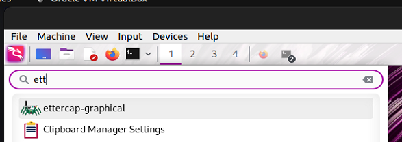
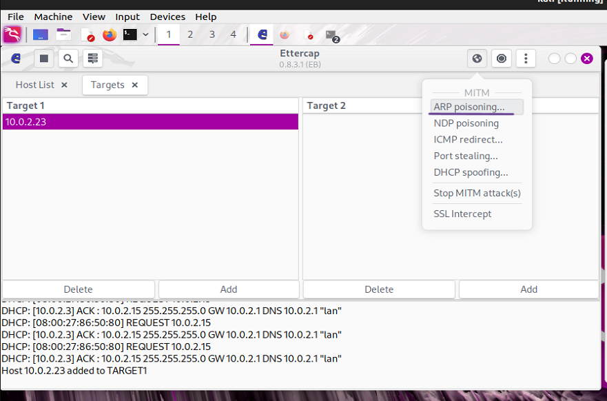
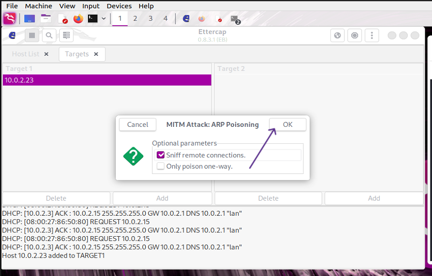
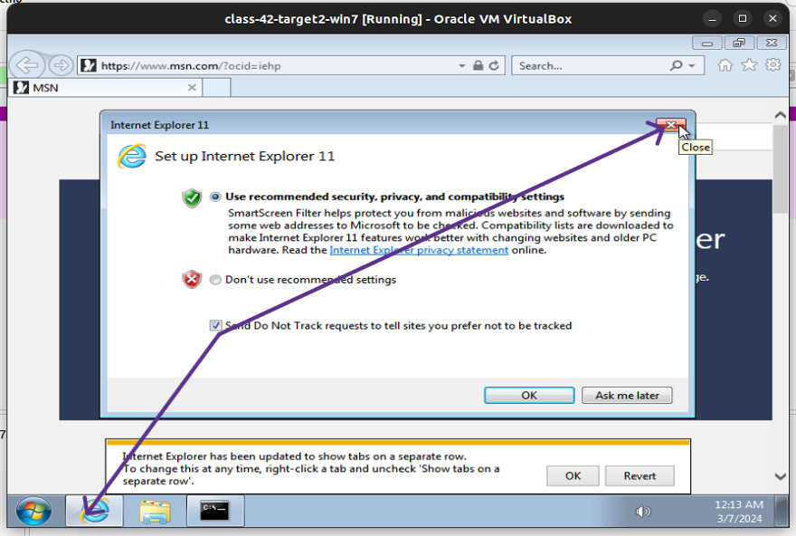

Lab: Traffic Sniffing with Ettercap
===================================

Overview
--------

ARP poisoning can be used in tandem with traffic sniffing to create a man-in-the-middle (MITM) attack on a targeted network.

Today, you will perform a man-in-the-middle (MITM) attack using Ettercap and also get some additional practice with Wireshark.

Objectives
----------

* Perform offensive network traffic capture using Ettercap
* Decrypt HTTPS packets using Wireshark
* Perform ARP spoofing with the Ettercap command line

Resources
---------

* [Ettercap Linux Man Page](https://www.google.com/url?q=https://linux.die.net/man/8/ettercap&sa=D&source=editors&ust=1710195772649422&usg=AOvVaw1Tp1H8tbpz-_sL-5nAO5Bg)
* [MITM/Wired/ARP Poisoning with Ettercap](https://www.google.com/url?q=https://charlesreid1.com/wiki/Man_in_the_Middle/Wired/ARP_Poisoning_with_Ettercap&sa=D&source=editors&ust=1710195772649650&usg=AOvVaw060lL8zrvXqrXDXadwxr_I)
* [Pentest Tips: ARP Spoofing](https://www.google.com/url?q=https://pentestfreak.blogspot.com/2013/05/redirect-someone-to-different-website.html&sa=D&source=editors&ust=1710195772649826&usg=AOvVaw2GFFK5U6XGkKeYXP52Wv3V)
* Fellow students completed labs (Juan Cano, Wil Baur, etc.)

Tasks
-----

### Part 1: Staging

Deploy two VMs to a NAT Network:

* One Kali VM
* class-42-target2-win7.ova

Feel free to use a different target VM if you prefer, instead of class-42-target2-win7.ova.

Confirm Ettercap is installed and operational on your Kali machine using the ettercap --version command on a terminal window. If Ettercap is installed, the command will display the version information. You will see output similar to: Ettercap v0.8.3 (IPv6) …

When I clicked on the check mark, the Ettercap disappeared.

* Download [PCAP and log key](https://www.google.com/url?q=https://github.com/pan-unit42/wireshark-tutorial-decrypting-HTTPS-traffic&sa=D&source=editors&ust=1710195772651392&usg=AOvVaw0dPtg7kgEuDffmcPboEP_n) that will be used in Part 3 to your Kali box.
* Skip this till Part 3.

### Part 2: MITM and ARP Cache Poisoning with Ettercap GUI

First, let’s practice some basics by having Ettercap capture network traffic transmitted between class-42-target2-win7.ova and the internet. To do this, we’ll need to perform a simple ARP poisoning attack and then analyze the sniffed packets with Wireshark.

* Set packets to automatically forward from Kali Linux’s eth0 interface using the terminal command sysctl -w net.ipv4.ip\_forward=1.
* In Kali, launch Ettercap and select a sniffing mode.

I already had ettercap open, so when I ran the ‘ettercap -G’ command, a second one appeared so I erased the new one.

* Designate your targets.

* On Windows PC, grab a screenshot of the ARP cache.

* Perform an ARP poisoning attack to grant Ettercap access to a Windows PC.

* On a Windows PC, grab a screenshot of the poisoned ARP cache. How can you tell it’s poisoned?

* Initialize live sniffing in Ettercap, then launch Wireshark. Have Wireshark perform live packet capture on the sniffer interface.

Below is how you stop sniffing:

Below is how you start sniffing:

* Perform a ping from the Windows PC to any valid destination IP or URL. If you have successfully performed an MITM attack, you’ll see these ping packets.

* Have Wireshark filter down the view to only ICMP packets. Take a screenshot of this successful outcome.

* On the Windows PC, navigate a web browser to [http://www.wikidot.com](https://www.google.com/url?q=http://www.wikidot.com/&sa=D&source=editors&ust=1710195772653933&usg=AOvVaw0CRvqAddQO9w5rwhWWckiy), then navigate to the “Pricing” link at the top.

* Have Wireshark filter down the view to only HTTP packets. Take a screenshot of the HTTP GET request for the Pricing page.

Look for plans located at the end of the http in the browser.

* Save a PCAP of the captured data to your desktop > Class 43 folder and take a screenshot of the PCAP.

Nice work! You’ve now achieved foundational proficiency with offensive network traffic capture using Ettercap. That’s some useful network traffic you’ve captured, but what about encrypted HTTPS traffic?

### Part 3: Decrypting HTTPS with Wireshark

Let’s get some more Wireshark practice; in this part of the lab, we’re going to figure out how to deal with pesky encryption protocols like HTTPS that are getting between us and the precious data we’re wanting to capture. Access the [Wireshark Tutorial: Decrypting HTTPS Traffic](https://www.google.com/url?q=https://unit42.paloaltonetworks.com/wireshark-tutorial-decrypting-https-traffic/&sa=D&source=editors&ust=1710195772655467&usg=AOvVaw18ZD5IQM65BW6aevxi-EUT).

* If you have not done so in staging, download the [PCAP and log key used in this exercise](https://www.google.com/url?q=https://github.com/pan-unit42/wireshark-tutorial-decrypting-HTTPS-traffic&sa=D&source=editors&ust=1710195772655718&usg=AOvVaw0aUGXK9PtN6wfM9BZ9x4gl) to your Kali system.

* Complete the tutorial. Document in your submission today your thoughts and screenshots of key milestones achieved during the tutorial.

Right-click on the purple bar.

2nd Attempt:

Nice work! It looks like there’s quite a few approaches we can take to decrypting SSL traffic. Next, let’s take a look at some other capabilities of Ettercap.

### Part 4: ARP Spoofing with Ettercap Command Line

Now that you’re familiar with the Ettercap GUI let’s delve into a more advanced operation: ARP spoofing. Let’s redirect the Windows PC to a different website every time it tries to access apache.org.

* For this part of the lab, use all resources at your disposal to determine how this attack is performed with Ettercap.
* For the website, you redirect the Windows user to, try setting up a quick Apache web server on Kali. Alternatively, redirect it to an entirely different website on the internet.
* When the successful outcome is achieved, capture a screenshot of Ettercap’s terminal performing the redirect, as well as a screen of the site you sent the unsuspecting user to.

That’s some impressive work you did there! I wonder what a cybercriminal could use this for?

### Part 5: Reporting

Answer the discussion prompts below:

* What is ARP poisoning, and how does it work?
* ARP poisoning is a technique that misleads a network by associating an attacker’s MAC address with the IP address of another host, such as the default gateway. This allows the attacker to intercept data.
* How is ARP spoofing different from DNS poisoning?
* Arp spoofing tricks a local network into sending data to an attacker, while DNS poisoning misleads devices about the IP address associated with a domain name, affecting web traffic.
* Why might a penetration tester utilize Ettercap on a targeted subnet?
* A penetration tester might use Ettercap to assess the network’s vulnerability to man-in-the-middle attacks, disrupt network services, or redirect traffic to fraudulent or malicious sites.
* For what purposes would a malicious attacker use these techniques?
* Attackers might use ARP spoofing and DNS poisoning to intercept and manipulate data, perform man-in-the-middle attacks, disrupt network services, or redirect traffic to fraudulent or malicious sites.

