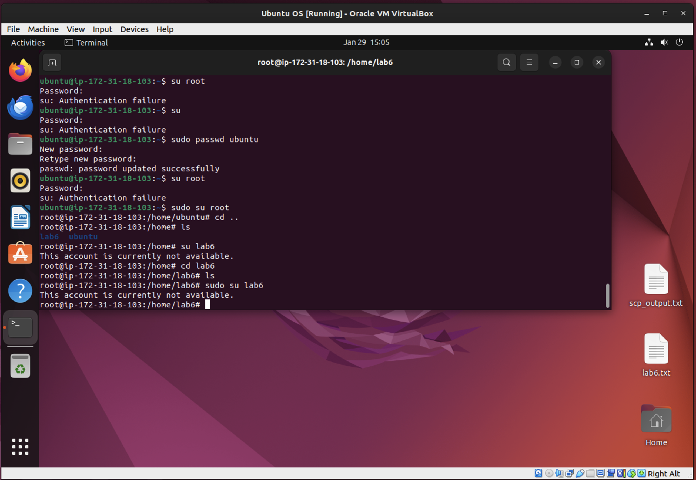
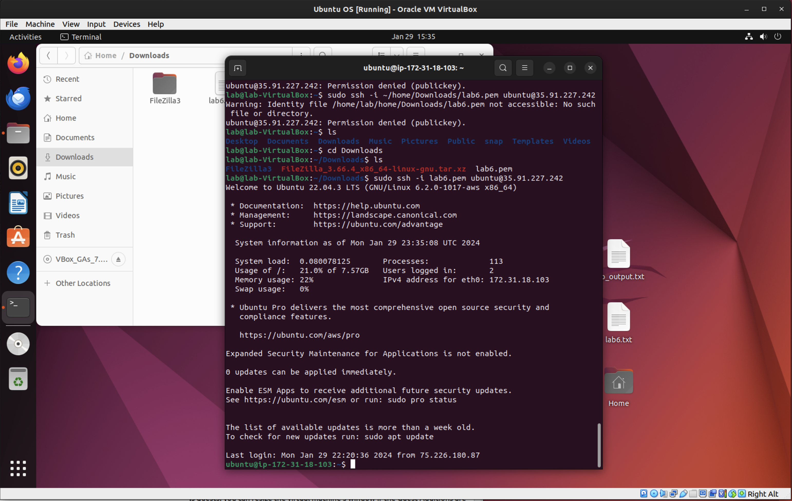

# Lab: Data File Encryption and Hashing

## Overview

Encryption plays a vital role in the securing of data on computer systems and can serve many purposes. Sometimes, encryption is used for good: Keeping confidential data out of the hands of criminals. Other times, encryption is used for more nefarious deeds, such as locking files with ransomware. If the organization needs to protect sensitive information, the security professional should be prepared with solutions to facilitate the confidentiality and integrity of a given data both at rest and in motion.

## Objectives

- Host a SFTP server in AWS and securely share a file with a classmate.
- Use SCP via terminal to copy a file from your local PC to the AWS instance.
- Dump the hash of your Linux instance’s user credentials.

## Resources

- [Linux SFTP Command](https://www.computerhope.com/unix/sftp.htm)
- [How to set up an SFTP server on Linux](https://www.techrepublic.com/article/how-to-set-up-an-sftp-server-on-linux/)
- [SSH public key authentication on AWS EC2](https://repost.aws/knowledge-center/new-user-accounts-linux-instance)
- [How to Use Linux SCP Command](https://linuxhint.com/linux_scp_command/)
- [How to Un-shadow the file and dump Linux password Beginner’s Guide](https://www.cyberpratibha.com/unshadow-the-file-and-dump-linux-password/)
- [How to Crack Passwords with John the Ripper](https://medium.com/@sc015020/how-to-crack-passwords-with-john-the-ripper-fdb98449ff1)

## Tasks

### Part 1: Staging

Prepare the following operating systems for today’s lab:

- Deploy a Linux EC2 instance in AWS. A recent version of Ubuntu works fine for this.
  - Note: Make sure your EC2 instance is assigned a public IP address; otherwise, you won’t be able to complete this lab.
  - Public IP Address: ec2-35-88-242-22.us-west-2.compute.amazonaws.com
- In your Linux VM, install OpenSSH.

### Part 2: Secure File Transmission with SCP and SFTP on Linux

User: share
password:
Deploy an SFTP server on your cloud Linux instance, carefully following these instructions: [How to set up an SFTP server on Linux](https://www.techrepublic.com/article/how-to-set-up-an-sftp-server-on-linux/).

- Successfully perform a file upload and download from your local computer to your Linux cloud VM using the `scp` command.
- Upload some cybersecurity meme images to the SFTP directory to share with your classmate.

Critical commands from part 2:
`home/lab/Downloads/lab6.pem`: the path to the private key
`sudo cat /etc/passwd | less`: displays all users on the system
`sudo find / -type d -name upload`: finds the upload directory
`sudo useradd -g sftp_users -d /upload -s /sbin/nologin -m lab6`: creates a new user
`/data/lab6/upload`: the directory where the files are stored
`ssh -i "lab6.pem" ubuntu@ec2-35-88-242-22.us-west-2.compute.amazonaws.com`: connects to the instance
`sftp -i ~/Downloads/lab6.pem ubuntu@ec2-35-88-242-22.us-west-2.compute.amazonaws.com`: connects to the instance with a filepath for the key

Connect to the SFTP server using the `sftp` command.
`sftp -i lab6.pem ubuntu@ec2-35-88-242-22.us-west-2.compute.amazonaws.com`: connects to the instance
`scp -i /path/to/your/private-key.pem /path/to/local/file username@ec2-instance-ip:/path/to/remote/directory/`: uploads a file to the instance
`scp -i ~/Downloads/lab6.pem ~/Desktop/lab6.txt ubuntu@ec2-35-88-242-22.us-west-2.compute.amazonaws.com:/data/lab6/upload/`: uploads a file to the instance

Trouble:
`rsync -avz -e "ssh -i ~/Downloads/lab6.pem" lab6.txt ubuntu@ec2-35-88-242-22.us-west-2.compute.amazonaws.com:/data/lab6/upload/`: uploads a file to the instance using rsync instead of scp.

SFTP Setup & Use Attempts:

### Part 3: SSH Public Key Authentication on Linux

On your Linux VM in the cloud:

- Install OpenSSH.
- Ask a classmate to authenticate into your server using SSH keys. Steps:
  - Your classmate needs to generate a pair of SSH keys if they do not have one already.
  - Ask your classmate to provide you with their public key.
  - Connect to the instance using your existing private key (.pem key).
  - Navigate to the home directory of the user you created in Part 2. Example: `/home/USERNAME`.
  - Using a text editor of your choice, open the `.ssh/authorized_keys` file on the instance. Paste the public key your classmate provided underneath the existing public key information. Save the file.
  - If the `.ssh/authorized_keys` file does not exist, create both the `.ssh` directory and the `authorized_keys` (no file extension) file.
  - Disconnect from your instance, and test that your classmate can connect to your instance using their private key.
  - Confirm that they have SFTP access, by having them prove they can download an image from your SFTP server.
  - Confirm that they do NOT have full SSH shell access.
- Document your setup and file transmission process and confirmations with screenshots and descriptions.

[Resource Steps](https://chat.openai.com/share/d564e0e0-e90b-4eb7-9e75-186fb4b284b5)

### Part 4: Encryption and Decryption on Linux

Let’s take a look at where Linux stores user credentials.

- As the administrator of the Ubuntu Linux VM, dump the password hash file or strings.
- Document your setup and process with screenshots and descriptions.

### Part 5: Report Via End-User Training

Your CISO asked you to present what you learned at an all-team meeting, so all the employees who send files frequently can learn to do so safely. Conclude your submission with some brief end-user training to address the following:

- Explain the need for secure data transmission as it relates to confidentiality.

## Importance of Secure Data Transmission (Confidentiality)

Secure data transmission is crucial to maintaining confidentiality. When files are sent insecurely, there's a risk of unauthorized access, interception, or tampering. Encrypting data during transmission ensures that only authorized parties can access and understand the information.

## FTP vs. SFTP

**Difference:**

- FTP (File Transfer Protocol) is insecure as it transmits data in plain text, while SFTP (Secure File Transfer Protocol) encrypts the data for secure transmission.

**Ports:**

- FTP typically uses ports 20 and 21, while SFTP uses port 22.

**Software:**

- FTP and SFTP use different software. Common FTP clients include FileZilla and WinSCP, while SFTP is often integrated into SSH-enabled tools.

## Examples of Software for FTP and SFTP Servers

**FTP:**

- FileZilla
- Cyberduck
- WinSCP

**SFTP (SSH):**

- OpenSSH
- WinSCP
- Bitvise SSH Client

## How SCP Protects Data

SCP (Secure Copy Protocol) encrypts data during transmission, ensuring the confidentiality and integrity of the transferred files. It uses the same authentication and security mechanisms as SSH.

## Exfiltration of Credentials from Linux System Files

Exfiltrating credentials from Linux system files can be challenging if proper security measures are in place. Regularly updating and patching systems, using strong passwords, and implementing multi-factor authentication significantly reduce the risk.

## Threats Associated with Insecure FTP Access

Threat actors or pentesters may exploit insecure FTP access by:

- Intercepting sensitive data during transmission.
- Gaining unauthorized access to confidential files.
- Conducting brute force attacks to obtain login credentials.
- Tampering with files in transit.

## End-User Training

1. **Use SFTP Instead of FTP:** Always prefer SFTP over FTP for secure file transfer.

2. **Secure Passwords:** Choose strong, unique passwords and consider multi-factor authentication where available.

3. **Regularly Update Software:** Keep your FTP/SFTP client and operating system updated to patch security vulnerabilities.

4. **Be Cautious with Email Links:** Avoid clicking on links in emails. Instead, use secure channels to share file transfer details.

5. **Encrypt Sensitive Files:** Before transmission, consider encrypting sensitive files using tools like GPG.

### Stretch Goal

Password Cracking
Attempt to crack the Linux user hashes with Kali Linux tools like John the Ripper.

- Reporting: What performance limitations are you observing with password cracking tools?

## Wrapup

Terminate any cloud systems you no longer need to avoid incurring unexpected charges.
