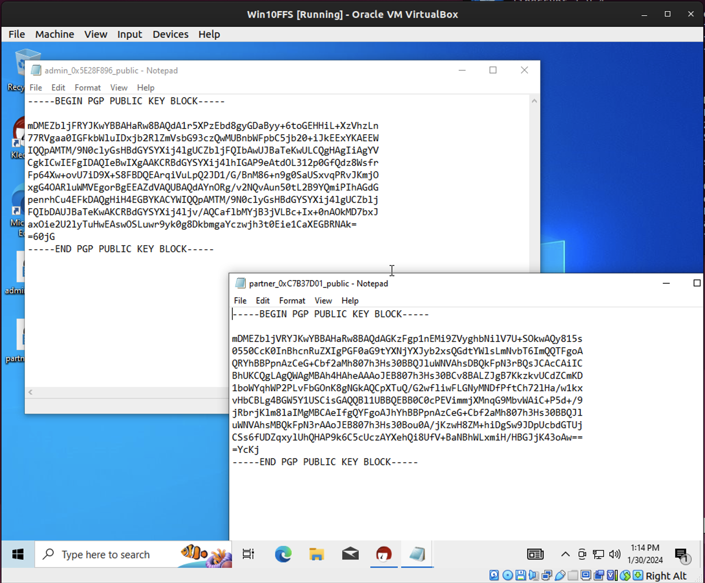
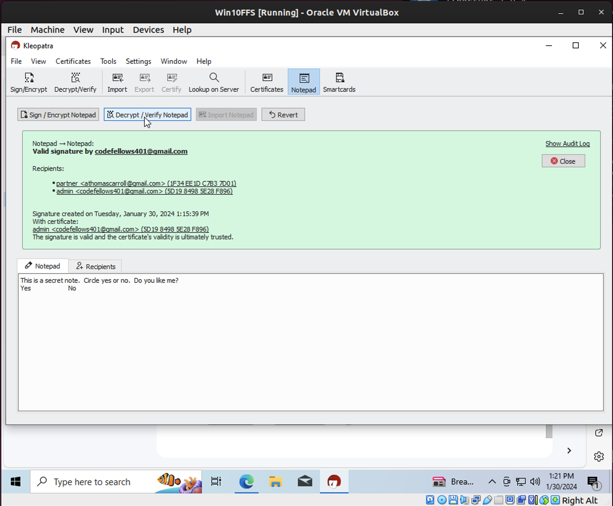

# Lab: Public Key Infrastructure (PKI)

## Overview
Public key encryption is something you use on a daily basis, although you may not know it! Useful for various authentication processes, Public Key Infrastructure (PKI) facilitates confidentiality at a technical level in the form of end-to-end TLS and SSL encryption, a staple of email and web servers alike. Public key encryption can also help us send trustworthy and confidential data in the form of PGP.

Today you will practice using OpenPGP, an asymmetric encryption solution for text, email, files, directories, and disk partitions. You will also utilize OpenSSL to practice PKI operations.

## Objectives
- Use PKI in Windows and Linux to send and decrypt messages with your lab partner

## Resources

### Downloads
- [Win10 VM](https://codefellows.github.io/ops-401-cybersecurity-guide/curriculum/#downloads-table)
- [Gpg4win 3.1.13 Download](https://www.gpg4win.org/)

### References
- [OpenPGP](https://www.openpgp.org/)
- [GnuPG](https://gnupg.org/)
- [Real World OpenSSL](https://prefetch.net/articles/realworldssl.html)
- [OpenSSL Certificate Tutorial](https://pki-tutorial.readthedocs.io/en/latest/)
- [Testing HTTPS with OpenSSL](https://blog.yimingliu.com/2008/02/04/testing-https-with-openssl/)
- [Introduction to AWS Key Management Service](https://amazon.qwiklabs.com/focuses/10388?catalog_rank=%7B%22rank%22%3A3%2C%22num_filters%22%3A1%2C%22has_search%22%3Atrue%7D&parent=catalog&search_id=5201321)

## Tasks

For this lab, a partner will help you complete Part 2 and Part 3 of this lab. Use the same partner you have for today’s interview assignment.

### Part 1: Staging
You will need two VMs for today’s lab:
- Windows 10
- Ubuntu Linux Desktop

First prepare the Windows 10 environment.
1. Download and install Gpg4win 3.1.13.

Next prepare the Ubuntu Linux Desktop environment.
1. Download and install gnupg2 and gpa.

### Part 2: Message Encryption with Gpg4win on Windows 10
OpenPGP is usable in Windows environments as Gpg4win. You’ll need a partner for Part 2 and Part 3 of today’s lab. If you still don’t have a partner, contact your instructor.

Each partner will perform the following operations on their own system:
1. Create a key pair in Kleopatra.
2. Export the public key to your desktop as an OpenPGP Certificate (include your name in the file name to differentiate between your public key and your partner’s) and view it with a text editor.
3. Send this public key to your partner and receive theirs.
4. Load your partner’s key into Kleopatra and associate it with their name.
5. Use the “Notepad” feature in Kleopatra to encrypt a secret message with your partner as the recipient.
6. Copy the complete message text (including the complete header and footer designating the beginning and end of the key block) into an email and send it to your partner.
7. Receive their message, copy it into the “Notepad” feature, and use Kleopatra to decrypt the message using your private key.
8. Once you have successfully decrypted your partner’s message into cleartext, this part of today’s lab is complete. Include in your lab submission a screenshot of the ciphertext and cleartext.

Raw Message

Encrypted Message

### Part 3: Email Encryption with GPG on Ubuntu Linux Desktop
OpenPGP is usable in Linux environments as GNU Privacy Guard (GPG). Each partner will perform the following operations on their own system:
1. Perform a full key pair generation operation in GPG:
- `gpg --gen-key`
   - RSA and RSA
   - 4096 key size
   - Key should not expire
   
2. Launch GNU Privacy Assistant (GPA) GUI key manager application. Your new key pair from GPG should appear here.
3. Export your public key to your Ubuntu Linux desktop with a .txt file extension as “public_key”.
4. Share your public key with your lab partner. If you like, publish your public key or through a service like keybase.io.
5. Import your partner’s public key into GPA.
6. Compose a cleartext secret message.
7. Encrypt the secret message with your recipient’s public key and sign it.
8. Send the encrypted message to your lab partner.
9. When you receive the encrypted message from your lab partner, decrypt it.
10. Once you have successfully decrypted your partner’s message into cleartext, this part of today’s lab is complete. Include in your lab submission a screenshot of the ciphertext and cleartext.

### Part 4: Certificates and SSL with OpenSSL
OpenSSL can help us with handling digital certificates. In this part of the lab you will create a CA, sign and issue certificates using OpenSSL certificate tutorial.

The tutorial consists of three labs. Complete the Simple lab first. The subsequent Advanced and Expert labs are stretch goals.

### Part 5: Reporting
Answer the below discussion prompts in your submission today.
1. How can public key encryption utilities ensure integrity and confidentiality of data between two parties?
2. Is PGP a secure protocol to be using?
3. Why is PGP not very popular among casual computer users?
4. Identify a website on the internet that does NOT have HTTPS (SSL) encryption in place.
5. Why do you think the website lacks SSL encryption?
6. What steps should the web administrator take in order to reconfigure the site to use SSL encryption?
