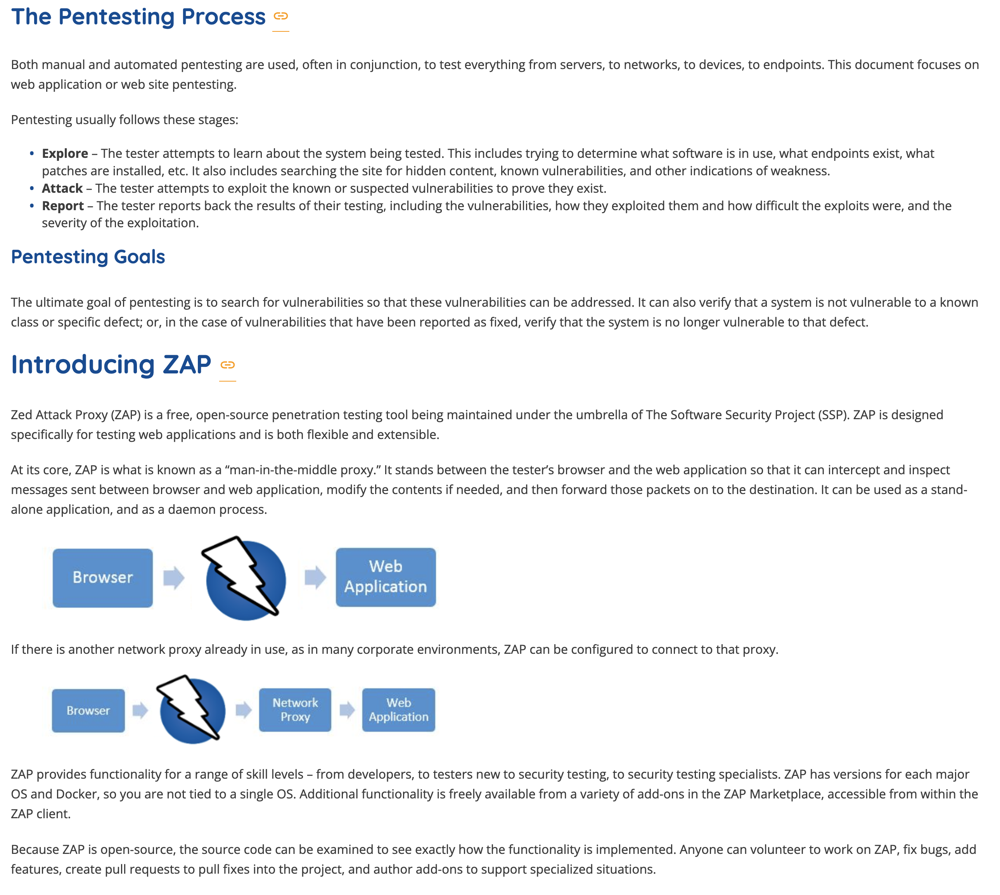

# Reading 37: Getting Started With Zed Attack Proxy

[Resource: Getting Started With Zed Attack Proxy](https://zaproxy.org/getting-started/)

**1. What are the three common stages of the Penetration Testing process and what tasks are performed at each one?**
- The three common stages of the Penetration Testing process are:
  1. Explore: In this stage, the tester attempts to learn about the system being tested, including identifying software, endpoints, patches, etc. It involves searching for hidden content, known vulnerabilities, and weaknesses.
  2. Attack: The tester attempts to exploit known or suspected vulnerabilities to prove they exist.
  3. Report: The tester reports back the results of their testing, including vulnerabilities, how they exploited them, the difficulty of the exploits, and the severity of the exploitation.

**2. Explain a “man-in-the-middle proxy” in non-technical terms.**
- A "man-in-the-middle proxy" is like a security guard positioned between you and a store. When you go to make a purchase, the security guard checks every item you buy, ensuring they're safe to use. Similarly, in the digital world, a man-in-the-middle proxy (like ZAP) sits between your web browser and the website you're visiting. It intercepts and inspects all messages sent between your browser and the website, making sure they're safe. If it detects any threats, it can modify or block them before they reach your browser.

**3. What are the 2 spiders available for use in ZAP? What situations are they best suited for?**
- The two spiders available in ZAP are:
  1. Traditional ZAP spider: This spider discovers links by examining the HTML in responses from the web application. It's fast but may not be as effective for exploring AJAX web applications that generate links using JavaScript.
  2. AJAX ZAP spider: This spider explores the web application by invoking browsers, which then follow the links generated. It's slower but more effective for AJAX applications.
  
  These spiders are best suited for crawling web applications to identify all accessible pages and functionality. The traditional spider is suitable for standard web applications, while the AJAX spider is better for AJAX-heavy web applications.
